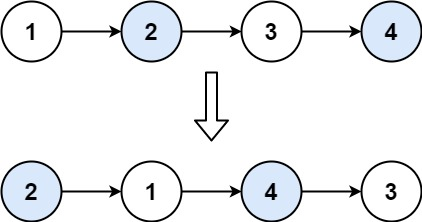

# LeetCode热题100

## 哈希

### *两数之和（简单）

> [1. 两数之和 - 力扣（LeetCode）](https://leetcode.cn/problems/two-sum/description/?envType=study-plan-v2&envId=top-100-liked)
>
> 给定一个整数数组 `nums` 和一个整数目标值 `target`，请你在该数组中找出 **和为目标值** *`target`* 的那 **两个** 整数，并返回它们的数组下标。
>
> 你可以假设每种输入只会对应一个答案，并且你不能使用两次相同的元素。
>
> 你可以按任意顺序返回答案。
>
>  
>
> **示例 1：**
>
> ```
> 输入：nums = [2,7,11,15], target = 9
> 输出：[0,1]
> 解释：因为 nums[0] + nums[1] == 9 ，返回 [0, 1] 。
> ```
>
> **示例 2：**
>
> ```
> 输入：nums = [3,2,4], target = 6
> 输出：[1,2]
> ```
>
> **示例 3：**
>
> ```
> 输入：nums = [3,3], target = 6
> 输出：[0,1]
> ```

```java
class Solution {
    public int[] twoSum(int[] nums, int target) {
        Map<Integer, Integer> hashMap = new HashMap<Integer, Integer>();
        for(int i=0; i<nums.length; i++){
            if(hashMap.containsKey(target-nums[i])){
                return new int[]{hashMap.get(target-nums[i]), i};
            }
            hashMap.put(nums[i], i);
        }
        return new int[0];
    }
}
```


### 字母异位词分组（中等）

> [49. 字母异位词分组 - 力扣（LeetCode）](https://leetcode.cn/problems/group-anagrams/description/?envType=study-plan-v2&envId=top-100-liked)
>
> 给你一个字符串数组，请你将 字母异位词 组合在一起。可以按任意顺序返回结果列表。
>
> **示例 1:**
>
> **输入:** strs = ["eat", "tea", "tan", "ate", "nat", "bat"]
>
> **输出:** [["bat"],["nat","tan"],["ate","eat","tea"]]
>
> **解释：**
>
> - 在 strs 中没有字符串可以通过重新排列来形成 `"bat"`。
> - 字符串 `"nat"` 和 `"tan"` 是字母异位词，因为它们可以重新排列以形成彼此。
> - 字符串 `"ate"` ，`"eat"` 和 `"tea"` 是字母异位词，因为它们可以重新排列以形成彼此。
>
> **示例 2:**
>
> **输入:** strs = [""]
>
> **输出:** [[""]]
>
> **示例 3:**
>
> **输入:** strs = ["a"]
>
> **输出:** [["a"]]


```java
class Solution {
    public List<List<String>> groupAnagrams(String[] strs) {
        Map<String, List<String>> hashMap = new HashMap<>();
        for(String str: strs){
            // 将String转化为数组排序再转为String
            char[] charArray = str.toCharArray();
            Arrays.sort(charArray);
            String sortedKey = new String(charArray);
            List<String> list = hashMap.getOrDefault(sortedKey, new ArrayList<String>());
            list.add(str);
            hashMap.put(sortedKey, list);
        }
        // .values()返回一个Collection集合，ArrayList​ 提供了一个接受 Collection<? extends E>​ 的构造器
        return new ArrayList<List<String>>(hashMap.values());
        // List<List<String>> list = new ArrayList<>();
        // for( List<String> value: hashMap.values()){
        //     list.add(value);
        // }
        // return list;
    }
}
```

### x最长连续序列（中等）

> [128. 最长连续序列 - 力扣（LeetCode）](https://leetcode.cn/problems/longest-consecutive-sequence/description/?envType=study-plan-v2&envId=top-100-liked)
>
> 给定一个未排序的整数数组 `nums` ，找出数字连续的最长序列（不要求序列元素在原数组中连续）的长度。
>
> 请你设计并实现时间复杂度为 `O(n)` 的算法解决此问题。
>
>  
>
> **示例 1：**
>
> ```
> 输入：nums = [100,4,200,1,3,2]
> 输出：4
> 解释：最长数字连续序列是 [1, 2, 3, 4]。它的长度为 4。
> ```
>
> **示例 2：**
>
> ```
> 输入：nums = [0,3,7,2,5,8,4,6,0,1]
> 输出：9
> ```
>
> **示例 3：**
>
> ```java
> 输入：nums = [1,0,1,2]
> 输出：3
> ```

```java
class Solution {
    public int longestConsecutive(int[] nums) {
        Set<Integer> set = new HashSet<>();
        for(int num: nums){
            set.add(num);
        }

        int result = 0;

        for(int num: set){
            // 判断num是否为所在连续序列的起点（他前面一个数是否存在）
            if( !set.contains(num-1) ){
                int currentNum = num;
                int currentLen = 1;
                while(set.contains(currentNum+1)){
                    currentNum++;
                    currentLen++;
                }
                result = Math.max(result, currentLen);
            }
        }
        return result;
    }
}
```

## 双指针

### *移动零（简单）

> 给定一个数组 `nums`，编写一个函数将所有 `0` 移动到数组的末尾，同时保持非零元素的相对顺序。
>
> **请注意** ，必须在不复制数组的情况下原地对数组进行操作。
>
>  
>
> **示例 1:**
>
> ```
> 输入: nums = [0,1,0,3,12]
> 输出: [1,3,12,0,0]
> ```
>
> **示例 2:**
>
> ```
> 输入: nums = [0]
> 输出: [0]
> ```
>
>  
>
> **提示**:
>
> - `1 <= nums.length <= 104`
> - `-231 <= nums[i] <= 231 - 1`

```java
// 自己写的，用新的列表记录非零的值
class Solution {
    public void moveZeroes(int[] nums) {
        List<Integer> list = new ArrayList<>();
        for(int num: nums){
            if(num!=0){
                list.add(num);
            }
        }
        for(int i=0; i<list.size(); i++){
            nums[i] = list.get(i);
        }
        for(int i=list.size(); i<nums.length; i++){
            nums[i] = 0;
        }
    }
}

// 题解：使用双指针，左指针指向当前已经处理好的序列的尾部，右指针指向待处理序列的头部。
// 右指针不断向右移动，每次右指针指向非零数，则将左右指针对应的数交换，同时左指针右移。
class Solution {
    public void moveZeroes(int[] nums) {
        int n = nums.length, left=0,right=0;
        while(right<n){
            if(nums[right]!=0)  nums[left++] = nums[right];
            right++;
        }
        while(left<n){
            nums[left++] = 0;
        }
    }
}
```

### 盛最多的水（中等）

> [11. 盛最多水的容器 - 力扣（LeetCode）](https://leetcode.cn/problems/container-with-most-water/description/?envType=study-plan-v2&envId=top-100-liked)
>
> 给定一个长度为 `n` 的整数数组 `height` 。有 `n` 条垂线，第 `i` 条线的两个端点是 `(i, 0)` 和 `(i, height[i])` 。
>
> 找出其中的两条线，使得它们与 `x` 轴共同构成的容器可以容纳最多的水。
>
> 返回容器可以储存的最大水量。
>
> **说明：**你不能倾斜容器。
>
> **示例 1：**
>
> 
>
> ```
> 输入：[1,8,6,2,5,4,8,3,7]
> 输出：49 
> 解释：图中垂直线代表输入数组 [1,8,6,2,5,4,8,3,7]。在此情况下，容器能够容纳水（表示为蓝色部分）的最大值为 49。
> ```
>
> **示例 2：**
>
> ```
> 输入：height = [1,1]
> 输出：1
> ```

```java
class Solution {
    public int maxArea(int[] height) {
        int left = 0, right = height.length - 1;
        int result = 0;
        int curr = 0; // 当前容器容量
        while(left < right){
            curr = (right-left) * Math.min(height[left], height[right]);
            result = Math.max(curr, result);
            if(height[left] < height[right])    left++;
            else    right--;
        }
        return result;
    }
}
```

为什么**双指针**的做法是正确的？

双指针代表了什么？

双指针代表的是 可以作为容器边界的所有位置的范围。在一开始，双指针指向数组的左右边界，表示 数组中所有的位置都可以作为容器的边界，因为我们还没有进行过任何尝试。在这之后，我们每次**将 对应的数字较小的那个指针 往 另一个指针 的方向移动一个位置，就表示我们认为 这个指针不可能再作为容器的边界了**。

### xx三数之和（中等）

> [15. 三数之和 - 力扣（LeetCode）](https://leetcode.cn/problems/3sum/description/?envType=study-plan-v2&envId=top-100-liked)
>
> https://leetcode.cn/problems/3sum/solutions/11525/3sumpai-xu-shuang-zhi-zhen-yi-dong-by-jyd
>
> 给你一个整数数组 `nums` ，判断是否存在三元组 `[nums[i], nums[j], nums[k]]` 满足 `i != j`、`i != k` 且 `j != k` ，同时还满足 `nums[i] + nums[j] + nums[k] == 0` 。请你返回所有和为 `0` 且**不重复**的三元组。
>
> **注意：**答案中不可以包含重复的三元组。
>
> **示例 1：**
>
> ```
> 输入：nums = [-1,0,1,2,-1,-4]
> 输出：[[-1,-1,2],[-1,0,1]]
> 解释：
> nums[0] + nums[1] + nums[2] = (-1) + 0 + 1 = 0 。
> nums[1] + nums[2] + nums[4] = 0 + 1 + (-1) = 0 。
> nums[0] + nums[3] + nums[4] = (-1) + 2 + (-1) = 0 。
> 不同的三元组是 [-1,0,1] 和 [-1,-1,2] 。
> 注意，输出的顺序和三元组的顺序并不重要。
> ```
>
> **示例 2：**
>
> ```
> 输入：nums = [0,1,1]
> 输出：[]
> 解释：唯一可能的三元组和不为 0 。
> ```
>
> **示例 3：**
>
> ```
> 输入：nums = [0,0,0,0,0,0]
> 输出：[[0,0,0]]
> 解释：唯一可能的三元组和为 0，且三元组不能重复 。
> ```

```java
class Solution {
    public List<List<Integer>> threeSum(int[] nums) {
        List<List<Integer>> result = new ArrayList<>();
        Arrays.sort(nums);

	    // 找出a + b + c = 0
        // a = nums[i], b = nums[left], c = nums[right]
        for(int i=0; i<nums.length-2; i++){  // i<nums.length也行，越界时left<right会不成立
            // 如果a（三元组中最小的元素）>0，那么无论如何三元组之和不可能为0，直接返回结果
            if(nums[i]>0){
                return result;  // break;
            }
            if(i>0 && nums[i]==nums[i-1]){ 
                // 如果a不是第一次遇到，需要去重
                continue;
            }
            int left = i+1;
            int right = nums.length-1;
            while(left<right){
                int sum = nums[i]+nums[left]+nums[right];
                if(sum>0){
                    right--; // while(left<right && nums[right]==nums[--right]);
                }else if(sum<0){
                    left++;  // while(left<right && nums[left]==nums[++left]);
                }else{
                    result.add(Arrays.asList(nums[i],nums[left],nums[right]));
                     // 去重逻辑应该放在找到一个三元组之后，对b 和 c去重
                    while(left<right && nums[left]==nums[left+1])   left++;
                    while(left<right && nums[right]==nums[right-1])   right--;
                    right--;
                    left++;
                }
            }
            
        }
        return result;
    }
}
```

### 接雨水（困难）

> [42. 接雨水 - 力扣（LeetCode）](https://leetcode.cn/problems/trapping-rain-water/description/?envType=study-plan-v2&envId=top-100-liked)
>
> 给定 `n` 个非负整数表示每个宽度为 `1` 的柱子的高度图，计算按此排列的柱子，下雨之后能接多少雨水。
>
> **示例 1：**
>
> 
>
> ```
> 输入：height = [0,1,0,2,1,0,1,3,2,1,2,1]
> 输出：6
> 解释：上面是由数组 [0,1,0,2,1,0,1,3,2,1,2,1] 表示的高度图，在这种情况下，可以接 6 个单位的雨水（蓝色部分表示雨水）。 
> ```
>
> **示例 2：**
>
> ```
> 输入：height = [4,2,0,3,2,5]
> 输出：9
> ```

```java
// 动态规划
class Solution {
    public int trap(int[] height) {
        int n = height.length;
        if(n==0)    return 0;
        // leftMax[i]表示下标i及其左边的位置中，height的最大高度
        int[] leftMax = new int[n];
        int[] rightMax = new int[n];
        leftMax[0] = height[0];
        rightMax[n-1] = height[n-1];

        for(int i=1; i<n; i++){
            leftMax[i] = Math.max(leftMax[i-1], height[i]);
        }
        for(int i=n-2; i>=0; i--){
            rightMax[i] = Math.max(rightMax[i+1], height[i]);
        }
        int result = 0;
        for(int i=0; i<n; i++){
            result += Math.min(leftMax[i], rightMax[i]) - height[i];
        }
        return result;
    }
}

// 双指针法（没学）
class Solution {
    public int trap(int[] height) {
        int ans = 0;
        int left = 0, right = height.length - 1;
        int leftMax = 0, rightMax = 0;
        while (left < right) {
            leftMax = Math.max(leftMax, height[left]);
            rightMax = Math.max(rightMax, height[right]);
            if (height[left] < height[right]) {
                ans += leftMax - height[left];
                ++left;
            } else {
                ans += rightMax - height[right];
                --right;
            }
        }
        return ans;
    }
}

```

## 滑动窗口

### *无重复字符的最长子串（中等）

> [3. 无重复字符的最长子串 - 力扣（LeetCode）](https://leetcode.cn/problems/longest-substring-without-repeating-characters/description/?envType=study-plan-v2&envId=top-100-liked)
>
> 给定一个字符串 `s` ，请你找出其中不含有重复字符的 **最长 子串** 的长度。
>
>  
>
> **示例 1:**
>
> ```
> 输入: s = "abcabcbb"
> 输出: 3 
> 解释: 因为无重复字符的最长子串是 "abc"，所以其长度为 3。注意 "bca" 和 "cab" 也是正确答案。
> ```
>
> **示例 2:**
>
> ```
> 输入: s = "bbbbb"
> 输出: 1
> 解释: 因为无重复字符的最长子串是 "b"，所以其长度为 1。
> ```
>
> **示例 3:**
>
> ```
> 输入: s = "pwwkew"
> 输出: 3
> 解释: 因为无重复字符的最长子串是 "wke"，所以其长度为 3。
>      请注意，你的答案必须是 子串 的长度，"pwke" 是一个子序列，不是子串。
> ```
>
>  
>
> **提示：**
>
> - `0 <= s.length <= 5 * 104`
> - `s` 由英文字母、数字、符号和空格组成

```java
class Solution {
    public int lengthOfLongestSubstring(String s) {
        // int[] charArr = new int[26]; // 记录滑动窗口中字符出现的次数
        Set<Character> set = new HashSet<>();
        int left = 0, right = 0;
        int result = 0;
        while(right<s.length()){
            // 计算以right结尾的最长子串长度
            
            // 判断right所指的字符是否在窗口中出现过
            if(!set.contains(s.charAt(right))){
                // 若未出现过
                set.add(s.charAt(right));
            }else{
                while(s.charAt(left) != s.charAt(right) ){
                    set.remove(s.charAt(left));
                    left++;
                }
                left++;
            }
            //System.out.println(left+" "+right);
            //System.out.println(Arrays.toString(charArr));
            result = Math.max(result, right-left+1);
            right++;
        }
        return result;
    }
}
```

### *找到字符中的所有字母异位词（中等）

> [438. 找到字符串中所有字母异位词 - 力扣（LeetCode）](https://leetcode.cn/problems/find-all-anagrams-in-a-string/description/?envType=study-plan-v2&envId=top-100-liked)
>
> 给定两个字符串 `s` 和 `p`，找到 `s` 中所有 `p` 的 **异位词** 的子串，返回这些子串的起始索引。不考虑答案输出的顺序。
>
>  
>
> **示例 1:**
>
> ```
> 输入: s = "cbaebabacd", p = "abc"
> 输出: [0,6]
> 解释:
> 起始索引等于 0 的子串是 "cba", 它是 "abc" 的异位词。
> 起始索引等于 6 的子串是 "bac", 它是 "abc" 的异位词。
> ```
>
>  **示例 2:**
>
> ```
> 输入: s = "abab", p = "ab"
> 输出: [0,1,2]
> 解释:
> 起始索引等于 0 的子串是 "ab", 它是 "ab" 的异位词。
> 起始索引等于 1 的子串是 "ba", 它是 "ab" 的异位词。
> 起始索引等于 2 的子串是 "ab", 它是 "ab" 的异位词。
> ```
>
>  
>
> **提示:**
>
> - `1 <= s.length, p.length <= 3 * 104`
> - `s` 和 `p` 仅包含小写字母

```java
class Solution {
    public List<Integer> findAnagrams(String s, String p) {
        int m = s.length(), n = p.length();
        List<Integer> result = new ArrayList<>();
        if(m<n) return result;

        int[] sCount = new int[26];
        int[] pCount = new int[26];

        for(int i=0; i<n; i++){
            pCount[p.charAt(i)-'a']++;
            sCount[s.charAt(i)-'a']++;
        }
        if(Arrays.equals(sCount, pCount))   result.add(0);

        for(int i=n; i<m; i++){
            sCount[s.charAt(i)-'a']++;
            sCount[s.charAt(i-n)-'a']--;
            if(Arrays.equals(sCount, pCount))   result.add(i-n+1);
        }
        return result;
    }
}
```

## 子串

### ⭐️前缀和思想

> [303. 区域和检索 - 数组不可变 - 力扣（LeetCode）](https://leetcode.cn/problems/range-sum-query-immutable/description/)
>
> https://leetcode.cn/problems/range-sum-query-immutable/solutions/2693498/qian-zhui-he-ji-qi-kuo-zhan-fu-ti-dan-py-vaar

### x和为k的子数组（中等）

> [560. 和为 K 的子数组 - 力扣（LeetCode）](https://leetcode.cn/problems/subarray-sum-equals-k/description/?envType=study-plan-v2&envId=top-100-liked)
>
> 给你一个整数数组 `nums` 和一个整数 `k` ，请你统计并返回 *该数组中和为 `k` 的子数组的个数* 。
>
> 子数组是数组中元素的连续非空序列。
>
>  
>
> **示例 1：**
>
> ```
> 输入：nums = [1,1,1], k = 2
> 输出：2
> ```
>
> **示例 2：**
>
> ```
> 输入：nums = [1,2,3], k = 3
> 输出：2
> ```
>
>  
>
> **提示：**
>
> - `1 <= nums.length <= 2 * 104`
> - `-1000 <= nums[i] <= 1000`
> - `-107 <= k <= 107`

```java
// 暴力解法
class Solution {
    public int subarraySum(int[] nums, int k) {
     
        int n = nums.length;
        int count = 0;
        for(int i=0; i<n; i++){
            int sum = 0;
            for(int j=i; j<n; j++){
                sum += nums[j];
                if(sum==k)  count++;
            }
        }
        return count;
    }
}

// 前缀和+哈希表
class Solution {
    public int subarraySum(int[] nums, int k) {
        if (nums.length == 0) {
            return 0;
        }
        HashMap<Integer,Integer> map = new HashMap<>();
        //细节，这里需要预存前缀和为 0 的情况，会漏掉前几位就满足的情况
        //例如输入[1,1,0]，k = 2 如果没有这行代码，则会返回0,漏掉了1+1=2，和1+1+0=2的情况
        //输入：[3,1,1,0] k = 2时则不会漏掉
        //因为presum[3] - presum[0]表示前面 3 位的和，所以需要map.put(0,1),垫下底
        map.put(0, 1);
        int count = 0;
        int presum = 0;
        for (int x : nums) {
            presum += x;
            // 当前前缀和已知，判断是否含有 presum - k的前缀和，如果有，那么前缀和之后的部分到x这一区间的和就为 k 了
            if (map.containsKey(presum - k)) {
                count += map.get(presum - k);//获取次数
            }
            //更新
            map.put(presum,map.getOrDefault(presum,0) + 1);
        }
        return count;
    }
}

作者：程序厨
链接：https://leetcode.cn/problems/subarray-sum-equals-k/solutions/562174/de-liao-yi-wen-jiang-qian-zhui-he-an-pai-yhyf/
来源：力扣（LeetCode）
著作权归作者所有。商业转载请联系作者获得授权，非商业转载请注明出处。

    
// 自己解答
class Solution {

    public int subarraySum(int[] nums, int k){
        Map<Integer, Integer> map = new HashMap<>(nums.length+1);  // 保存已遍历的i个元素中所有的前缀和[0,i]及出现的次数
        int res = 0, preSum = 0; // 结果和前缀和
        map.put(0,1); // preSum=0的，防止出现nums[i]==k的情况
        for(int num: nums){
            preSum += num;
            //当前前缀和已知，判断是否含有 presum - k的前缀和，如果有，那么前缀和之后的部分到num这一区间的和就为 k 了
            if(map.containsKey(preSum-k)){
                res += map.get(preSum-k);
            }
            map.merge(preSum, 1, Integer::sum);
        }
        return res;
    }
}
```

### 滑动窗口最大值（困难）

> [239. 滑动窗口最大值 - 力扣（LeetCode）](https://leetcode.cn/problems/sliding-window-maximum/description/?envType=study-plan-v2&envId=top-100-liked)
>
> [代码随想录：单调队列](https://www.bilibili.com/video/BV1XS4y1p7qj?vd_source=8b64a620a3ee0b077147ede5438b3398&spm_id_from=333.788.videopod.sections)
>
> 给你一个整数数组 `nums`，有一个大小为 `k` 的滑动窗口从数组的最左侧移动到数组的最右侧。你只可以看到在滑动窗口内的 `k` 个数字。滑动窗口每次只向右移动一位。
>
> 返回 *滑动窗口中的最大值* 。
>
> 
>
> **示例 1：**
>
> ```
> 输入：nums = [1,3,-1,-3,5,3,6,7], k = 3
> 输出：[3,3,5,5,6,7]
> 解释：
> 滑动窗口的位置                最大值
> ---------------               -----
> [1  3  -1] -3  5  3  6  7       3
> 1 [3  -1  -3] 5  3  6  7       3
> 1  3 [-1  -3  5] 3  6  7       5
> 1  3  -1 [-3  5  3] 6  7       5
> 1  3  -1  -3 [5  3  6] 7       6
> 1  3  -1  -3  5 [3  6  7]      7
> ```
>
> **示例 2：**
>
> ```
> 输入：nums = [1], k = 1
> 输出：[1]
> ```
>
> 
>
> **提示：**
>
> - `1 <= nums.length <= 105`
> - `-104 <= nums[i] <= 104`
> - `1 <= k <= nums.length`


```java
class Solution {
    public int[] maxSlidingWindow(int[] nums, int k) {
        // 单调减少队列
        int n = nums.length;
        if(n == 0 || k==0) return new int[0];
        Deque<Integer> deque = new LinkedList<>();  // 队列中保存的是窗口中最大的元素及其之后的元素
        // 不需要记录元素下标以判断是否滑出窗口，因为可以根据滑动窗口移动时滑出的元素和当前队首元素是否相同进行判断
        int[] result = new int[n-k+1];
        // 先生成窗口
        for(int i=0; i<k; i++){
            while(!deque.isEmpty() && deque.peekLast() < nums[i]){
                // 新加入的元素要排掉队列中小于他的元素（从后排出）
                // 新加的元素比前面的元素大，而且更靠后，那么前面的元素就没有意义了
                deque.removeLast();
            }
            deque.addLast(nums[i]);
        }
        result[0] = deque.peekFirst();

        // 生成窗口后，继续往后遍历
        for(int i=k; i<nums.length; i++){
            if(deque.peekFirst() == nums[i-k]){
                // 如果脱离窗口的是最大的元素，直接去除该元素
                deque.removeFirst();
            }
            // 如果脱离窗口的不是最大元素，那么该元素一定是在最大元素之前，因此已经被排出队列了，不需要操作队列
            // 再新加入元素
            while(!deque.isEmpty() && deque.peekLast() < nums[i]){
                deque.removeLast();
            }
            deque.addLast(nums[i]);
            result[i-k+1] = deque.peekFirst();
        }
        return result;

    }
}
```


### 最小覆盖子串（困难）

> [76. 最小覆盖子串 - 力扣（LeetCode）](https://leetcode.cn/problems/minimum-window-substring/description/?envType=study-plan-v2&envId=top-100-liked)
>
> 给定两个字符串 `s` 和 `t`，长度分别是 `m` 和 `n`，返回 s 中的 **最短窗口 子串**，使得该子串包含 `t` 中的每一个字符（**包括重复字符**）。如果没有这样的子串，返回空字符串 `""`。
>
> 测试用例保证答案唯一。
>
>  
>
> **示例 1：**
>
> ```
> 输入：s = "ADOBECODEBANC", t = "ABC"
> 输出："BANC"
> 解释：最小覆盖子串 "BANC" 包含来自字符串 t 的 'A'、'B' 和 'C'。
> ```
>
> **示例 2：**
>
> ```
> 输入：s = "a", t = "a"
> 输出："a"
> 解释：整个字符串 s 是最小覆盖子串。
> ```
>
> **示例 3:**
>
> ```
> 输入: s = "a", t = "aa"
> 输出: ""
> 解释: t 中两个字符 'a' 均应包含在 s 的子串中，
> 因此没有符合条件的子字符串，返回空字符串。
> ```
>
>  
>
> **提示：**
>
> - `m == s.length`
> - `n == t.length`
> - `1 <= m, n <= 105`
> - `s` 和 `t` 由英文字母组成

```java
class Solution {
    int[] cntS = new int[128];  // 记录s中滑动窗口字母出现的次数
    int[] cntT = new int[128];  // 记录t中字母的出现次数
    public String minWindow(String s, String t) {
        for(char c: t.toCharArray()){
            cntT[c]++;
        }
        char[] sArray = s.toCharArray();
        int m = sArray.length;
        int resL = -1, resR = m;
        int left=0, right=0;

        while(right<m){  // 移动右指针
            cntS[sArray[right]]++;  // 右端点字母移入子串
            while(isCovered() && left<=right){
                if(right-left < resR-resL){  // 找到更短的子串
                    resL = left;
                    resR = right;
                }
                // 左端点字母移出子串
                cntS[sArray[left]]--;
                left++;
            }
            right++;
        }

        return resL==-1 ? "": s.substring(resL, resR+1);
    }

    // 判断窗口是否覆盖子串
    private boolean isCovered(){
        for(int i='A'; i<='Z'; i++){ // 别忘了"="号
            if(cntS[i]<cntT[i]) return false;
        }

        for(int i='a'; i<='z'; i++){
            if(cntS[i]<cntT[i]) return false;
        }
        return true;
    }
}
```

## 普通数组

### 最大子数组和（中等）

> [53. 最大子数组和 - 力扣（LeetCode）](https://leetcode.cn/problems/maximum-subarray/description/?envType=study-plan-v2&envId=top-100-liked)
>
> 给你一个整数数组 `nums` ，请你找出一个具有最大和的连续子数组（子数组最少包含一个元素），返回其最大和。
>
> **子数组**是数组中的一个连续部分。
>
>  
>
> **示例 1：**
>
> ```
> 输入：nums = [-2,1,-3,4,-1,2,1,-5,4]
> 输出：6
> 解释：连续子数组 [4,-1,2,1] 的和最大，为 6 。
> ```
>
> **示例 2：**
>
> ```
> 输入：nums = [1]
> 输出：1
> ```
>
> **示例 3：**
>
> ```
> 输入：nums = [5,4,-1,7,8]
> 输出：23
> ```
>
>  
>
> **提示：**
>
> - `1 <= nums.length <= 105`
> - `-104 <= nums[i] <= 104`
>
>  
>
> **进阶：**如果你已经实现复杂度为 `O(n)` 的解法，尝试使用更为精妙的 **分治法** 求解。

#### 方法一：动态规划

```java
class Solution {
    public int maxSubArray(int[] nums) {
        int n = nums.length;
        int[] f = new int[n];
        f[0] = nums[0];
        int maxAns = nums[0];
        for(int i=1; i<n; i++){
            f[i] = Math.max(f[i-1]+nums[i], nums[i]);
            maxAns = Math.max(maxAns, f[i]);
        }
        return maxAns;
    }
    
}
```


#### 方法二：前缀和

```java
class Solution {
    public int maxSubArray(int[] nums) {
        int ans = Integer.MIN_VALUE;
        int minPreSum = 0;
        int preSum = 0;
        for (int x : nums) {
            preSum += x; // 当前的前缀和
            ans = Math.max(ans, preSum - minPreSum); // 减去前缀和的最小值
            minPreSum = Math.min(minPreSum, preSum); // 维护前缀和的最小值
        }
        return ans;
    }
}

作者：灵茶山艾府
链接：https://leetcode.cn/problems/maximum-subarray/solutions/2533977/qian-zhui-he-zuo-fa-ben-zhi-shi-mai-mai-abu71/
来源：力扣（LeetCode）
著作权归作者所有。商业转载请联系作者获得授权，非商业转载请注明出处。
```

### 合并区间（中等）

> [56. 合并区间 - 力扣（LeetCode）](https://leetcode.cn/problems/merge-intervals/description/?envType=study-plan-v2&envId=top-100-liked)
>
> 以数组 `intervals` 表示若干个区间的集合，其中单个区间为 `intervals[i] = [starti, endi]` 。请你合并所有重叠的区间，并返回 *一个不重叠的区间数组，该数组需恰好覆盖输入中的所有区间* 。
>
>  
>
> **示例 1：**
>
> ```
> 输入：intervals = [[1,3],[2,6],[8,10],[15,18]]
> 输出：[[1,6],[8,10],[15,18]]
> 解释：区间 [1,3] 和 [2,6] 重叠, 将它们合并为 [1,6].
> ```
>
> **示例 2：**
>
> ```
> 输入：intervals = [[1,4],[4,5]]
> 输出：[[1,5]]
> 解释：区间 [1,4] 和 [4,5] 可被视为重叠区间。
> ```
>
> **示例 3：**
>
> ```
> 输入：intervals = [[4,7],[1,4]]
> 输出：[[1,7]]
> 解释：区间 [1,4] 和 [4,7] 可被视为重叠区间。
> ```
>
>  
>
> **提示：**
>
> - `1 <= intervals.length <= 104`
> - `intervals[i].length == 2`
> - `0 <= starti <= endi <= 104`

```java
class Solution {
    public int[][] merge(int[][] intervals) {
        if(intervals.length == 0)   return new int[0][2]; // 返回空数组
        Arrays.sort(intervals, new Comparator<int[]>(){
            public int compare(int[] interval1, int[] interval2){
                return interval1[0] - interval2[0]; // 左端点升序排序
            }
        });
        List<int[]>merged = new ArrayList<>();
        for(int i=0; i<intervals.length; i++){
            int L = intervals[i][0], R = intervals[i][1];
            if(merged.size() == 0 || merged.get(merged.size()-1)[1] < L){
                // 若结果集为空，或者当前区间左端点大于上一个结果集区间右端点，则该区间为结果集新区间
                merged.add(new int[]{L, R});
            }else{
                merged.get(merged.size()-1)[1] = Math.max(merged.get(merged.size()-1)[1], R);
            }
        }
        return merged.toArray(new int[merged.size()][]);
    }

}
```

### *轮转数组（中等）

> [189. 轮转数组 - 力扣（LeetCode）](https://leetcode.cn/problems/rotate-array/description/?envType=study-plan-v2&envId=top-100-liked)
>
> 给定一个整数数组 `nums`，将数组中的元素向右轮转 `k` 个位置，其中 `k` 是非负数。
>
>  
>
> **示例 1:**
>
> ```
> 输入: nums = [1,2,3,4,5,6,7], k = 3
> 输出: [5,6,7,1,2,3,4]
> 解释:
> 向右轮转 1 步: [7,1,2,3,4,5,6]
> 向右轮转 2 步: [6,7,1,2,3,4,5]
> 向右轮转 3 步: [5,6,7,1,2,3,4]
> ```
>
> **示例 2:**
>
> ```
> 输入：nums = [-1,-100,3,99], k = 2
> 输出：[3,99,-1,-100]
> 解释: 
> 向右轮转 1 步: [99,-1,-100,3]
> 向右轮转 2 步: [3,99,-1,-100]
> ```
>
>  
>
> **提示：**
>
> - `1 <= nums.length <= 105`
> - `-231 <= nums[i] <= 231 - 1`
> - `0 <= k <= 105`

```java
class Solution {
    public void rotate(int[] nums, int k) {
        int n = nums.length;
        k = k%n; //k可能>=n
        reverse(nums, 0, n-1);
        reverse(nums, 0, k-1);
        reverse(nums, k, n-1);
    }


    // 翻转数组
    private void reverse(int[] nums, int l, int r){
        while(l<r){
            int temp = nums[l];
            nums[l] = nums[r];
            nums[r] = temp;
            l++;
            r--;
        }
    }
}
```

### *除了自身以外数组的乘积（中等）

> [238. 除了自身以外数组的乘积 - 力扣（LeetCode）](https://leetcode.cn/problems/product-of-array-except-self/description/?envType=study-plan-v2&envId=top-100-liked)
>
> 给你一个整数数组 `nums`，返回 数组 `answer` ，其中 `answer[i]` 等于 `nums` 中除了 `nums[i]` 之外其余各元素的乘积 。
>
> 题目数据 **保证** 数组 `nums`之中任意元素的全部前缀元素和后缀的乘积都在 **32 位** 整数范围内。
>
> 请 **不要使用除法，**且在 `O(n)` 时间复杂度内完成此题。
>
>  
>
> **示例 1:**
>
> ```
> 输入: nums = [1,2,3,4]
> 输出: [24,12,8,6]
> ```
>
> **示例 2:**
>
> ```
> 输入: nums = [-1,1,0,-3,3]
> 输出: [0,0,9,0,0]
> ```
>
>  
>
> **提示：**
>
> - `2 <= nums.length <= 105`
> - `-30 <= nums[i] <= 30`
> - 输入 **保证** 数组 `answer[i]` 在 **32 位** 整数范围内
>
>  
>
> **进阶：**你可以在 `O(1)` 的额外空间复杂度内完成这个题目吗？（ 出于对空间复杂度分析的目的，输出数组 **不被视为** 额外空间。）

```java
// 分别计算左右两边元素的乘积
class Solution {
    public int[] productExceptSelf(int[] nums) {
        int n = nums.length;
        int[] res = new int[n];
        int pre = 1;
        for(int i=0; i<n; i++){
            res[i] = pre;
            pre = pre*nums[i];
        }
        int post = 1;
        for(int i=n-1; i>=0; i--){
            res[i] = res[i]*post;
            post = post*nums[i];
        }
        return res;
    }
}
```

### x缺失的第一个正数（困难）

> [41. 缺失的第一个正数 - 力扣（LeetCode）](https://leetcode.cn/problems/first-missing-positive/description/?envType=study-plan-v2&envId=top-100-liked)
>
> https://leetcode.cn/problems/first-missing-positive/solutions/304743/que-shi-de-di-yi-ge-zheng-shu-by-leetcode-solution
>
> 给你一个未排序的整数数组 `nums` ，请你找出其中没有出现的最小的正整数。
>
> 请你实现时间复杂度为 `O(n)` 并且只使用常数级别额外空间的解决方案。
>
>  
>
> **示例 1：**
>
> ```
> 输入：nums = [1,2,0]
> 输出：3
> 解释：范围 [1,2] 中的数字都在数组中。
> ```
>
> **示例 2：**
>
> ```
> 输入：nums = [3,4,-1,1]
> 输出：2
> 解释：1 在数组中，但 2 没有。
> ```
>
> **示例 3：**
>
> ```
> 输入：nums = [7,8,9,11,12]
> 输出：1
> 解释：最小的正数 1 没有出现。
> ```
>
>  
>
> **提示：**
>
> - `1 <= nums.length <= 105`
> - `-231 <= nums[i] <= 231 - 1`

#### 方法一：哈希表标记

```java
class Solution {
    public int firstMissingPositive(int[] nums) {
        // 哈希表打标记（若索引i的元素被标记为负数，则表示i+1这个元素存在于数组中）
        int n = nums.length;
        for(int i=0; i<n; i++){
            // <=0的元素无意义，全部置为n+1
            if(nums[i]<=0){
                nums[i] = n+1;
            }
        }

        for(int i=0; i<n; i++){
            int absNum = Math.abs(nums[i]); // nums[i]可能已经被标记了，因此需要取绝对值，表明absNum这个正数存在
            if(absNum<=n){
                nums[absNum-1] = -Math.abs(nums[absNum-1]);  // absNum这个数存在在数组中，因此需要将nums[absNum-1]标记为负数
            }
        }

        for(int i=0; i<n; i++){
            if(nums[i]>0) // 未被标记
                return i+1;
        }
        return n+1;
    }
}
```

#### 方法二：换座位思想

> [O(n) 换座位，通过例子理解算法思想](https://leetcode.cn/problems/first-missing-positive/solutions/3655377/huan-zuo-wei-tong-guo-li-zi-li-jie-suan-qa94e)

```java

class Solution {
    public int firstMissingPositive(int[] nums) {
        // 数组的下标代表座位号，nums[i]代表每个学生的学号，要求学号1-n的学生学号坐到对应的座位号中
        int n = nums.length;
        for(int i=0; i<n; i++){
            while(nums[i]>=1 && nums[i]<=n && nums[i]!=nums[nums[i]-1]){
                swap(nums, nums[i]-1, i);
            }
        }

        for(int i=0; i<n; i++){
            if(nums[i] != i+1){
                return i+1;
            } 
        }
        return n+1;
    }

    private void swap(int[] nums, int i, int j){
        int temp = nums[i];
        nums[i] = nums[j];
        nums[j] = temp;
    }
}
```


## 矩阵

### *矩阵置零（中等）

> [73. 矩阵置零 - 力扣（LeetCode）](https://leetcode.cn/problems/set-matrix-zeroes/description/?envType=study-plan-v2&envId=top-100-liked)
>
> 给定一个 `*m* x *n*` 的矩阵，如果一个元素为 **0** ，则将其所在行和列的所有元素都设为 **0** 。请使用 **[原地](http://baike.baidu.com/item/原地算法)** 算法**。**
>
>  
>
> **示例 1：**
>
> 
>
> ```
> 输入：matrix = [[1,1,1],[1,0,1],[1,1,1]]
> 输出：[[1,0,1],[0,0,0],[1,0,1]]
> ```
>
> **示例 2：**
>
> 
>
> ```
> 输入：matrix = [[0,1,2,0],[3,4,5,2],[1,3,1,5]]
> 输出：[[0,0,0,0],[0,4,5,0],[0,3,1,0]]
> ```
>
>  
>
> **提示：**
>
> - `m == matrix.length`
> - `n == matrix[0].length`
> - `1 <= m, n <= 200`
> - `-231 <= matrix[i][j] <= 231 - 1`

#### 方法一：使用额外数组

```java
// 使用额外数组保存应当置零的行和列
class Solution {
    public void setZeroes(int[][] matrix) {
        int m = matrix.length;
        int n = matrix[0].length;
        boolean[] rowHasZero = new boolean[m]; // 行是否包含 0
        boolean[] colHasZero = new boolean[n]; // 列是否包含 0

        for (int i = 0; i < m; i++) {
            for (int j = 0; j < n; j++) {
                if (matrix[i][j] == 0) {
                    rowHasZero[i] = colHasZero[j] = true;
                }
            }
        }

        for (int i = 0; i < m; i++) {
            for (int j = 0; j < n; j++) {
                if (rowHasZero[i] || colHasZero[j]) { // i 行或 j 列有 0
                    matrix[i][j] = 0; // 题目要求原地修改，无返回值
                }
            }
        }
    }
}

作者：灵茶山艾府
链接：https://leetcode.cn/problems/set-matrix-zeroes/solutions/3799648/yi-bu-bu-you-hua-cong-omn-dao-o1-kong-ji-fdgt/
来源：力扣（LeetCode）
著作权归作者所有。商业转载请联系作者获得授权，非商业转载请注明出处。
```

#### 方法二：不使用额外数组

> https://leetcode.cn/problems/set-matrix-zeroes/solutions/3799648/yi-bu-bu-you-hua-cong-omn-dao-o1-kong-ji-fdgt
>
> 把数据保存到 *matrix* 的第一行和第一列中，同时在一开始，额外用两个布尔变量分别记录第一行是否包含 0，第一列是否包含 0。最后，如果第一行在一开始就包含 0，那么把第一行全变成 0；如果第一列在一开始就包含 0，那么把第一列全变成 0。
>
> 既然最后会单独修改第一行和第一列，那么在修改 matrix[i][j] 时，跳过第一行和第一列。这也避免了一个 bug：如果提前把 `matrix[i][0]`变成 0，我们会误认为 i 行要全部变成 0。
>

```java
class Solution {
    public void setZeroes(int[][] matrix) {
        int m = matrix.length, n = matrix[0].length;
        // 记录第一行是否包含0
        boolean firstRowHasZero = false;
        for(int x: matrix[0]){
            if(x==0){
                firstRowHasZero = true;
                break;
            }
        }
        // 记录第一列是否包含 0
        boolean firstColHasZero = false; 
        for (int i = 0; i < m; i++) {
            if (matrix[i][0] == 0) {
                firstColHasZero = true;
                break;
            }
        }

        // 用第一列 matrix[i][0] 保存 rowHasZero[i]
        // 用第一行 matrix[0][j] 保存 colHasZero[j]
        for (int i = 1; i < m; i++) { // 无需遍历第一行，如果 matrix[0][j] 本身是 0，那么相当于 colHasZero[j] 已经是 true
            for (int j = 1; j < n; j++) { // 无需遍历第一列，如果 matrix[i][0] 本身是 0，那么相当于 rowHasZero[i] 已经是 true
                if (matrix[i][j] == 0) {
                    matrix[i][0] = 0; // 相当于 rowHasZero[i] = true
                    matrix[0][j] = 0; // 相当于 colHasZero[j] = true
                }
            }
        }

        for (int i = 1; i < m; i++) { // 跳过第一行，留到最后修改
            for (int j = 1; j < n; j++) { // 跳过第一列，留到最后修改
                if (matrix[i][0] == 0 || matrix[0][j] == 0) { // i 行或 j 列有 0
                    matrix[i][j] = 0;
                }
            }
        }

        // 如果第一列一开始就包含 0，那么把第一列全变成 0
        if (firstColHasZero) {
            for (int[] row : matrix) {
                row[0] = 0;
            }
        }

        // 如果第一行一开始就包含 0，那么把第一行全变成 0
        if (firstRowHasZero) {
            Arrays.fill(matrix[0], 0);
        }
    }
}
```

### *螺旋矩阵（中等）

> [54. 螺旋矩阵 - 力扣（LeetCode）](https://leetcode.cn/problems/spiral-matrix/?envType=study-plan-v2&envId=top-100-liked)
>
> 给你一个 `m` 行 `n` 列的矩阵 `matrix` ，请按照 **顺时针螺旋顺序** ，返回矩阵中的所有元素。
>
>  
>
> **示例 1：**
>
> 
>
> ```
> 输入：matrix = [[1,2,3],[4,5,6],[7,8,9]]
> 输出：[1,2,3,6,9,8,7,4,5]
> ```
>
> **示例 2：**
>
> 
>
> ```
> 输入：matrix = [[1,2,3,4],[5,6,7,8],[9,10,11,12]]
> 输出：[1,2,3,4,8,12,11,10,9,5,6,7]
> ```
>
>  
>
> **提示：**
>
> - `m == matrix.length`
> - `n == matrix[i].length`
> - `1 <= m, n <= 10`
> - `-100 <= matrix[i][j] <= 100`

#### 方法一：使用辅助数组

```java
class Solution {
    // 使用辅助矩阵visited记录元素是否被访问过
    public List<Integer> spiralOrder(int[][] matrix) {
        List<Integer> result = new ArrayList<Integer>();
        // 矩阵为空，直接返回
        if(matrix==null || matrix.length==0 || matrix[0].length==0){
            return result;
        }
        int m = matrix.length, n = matrix[0].length;
        boolean[][] visited = new boolean[m][n];
        int total = m*n;
        int row=0, col=0;  // 当前指针指向的位置
        int[][] directions ={{0,1},{1,0},{0,-1},{-1,0}};  // 指针移动的四个方向
        int dirIndex = 0;  // 当前应该移动方向的索引
        for(int i=0; i<total; i++){
            result.add(matrix[row][col]);
            visited[row][col] = true;
            int nextRow = row+directions[dirIndex][0], nextCol = col+directions[dirIndex][1];  // 当前方向下一个位置
            if (nextRow < 0 || nextRow >= m || nextCol < 0 || nextCol >= n || visited[nextRow][nextCol]) {
                // 越界或已被访问
                dirIndex = (dirIndex + 1) % 4;
            }
            // 真正下一个位置
            row += directions[dirIndex][0];
            col += directions[dirIndex][1];
        }
        return result;
    }
}
```

#### 方法二：不使用辅助数组

```java
class Solution {
    // 使用四个变量记录边界
    public List<Integer> spiralOrder(int[][] matrix) {
        // 矩阵为空，直接返回
        if(matrix==null || matrix.length==0 || matrix[0].length==0){
            return new ArrayList<Integer>();
        }
        int m = matrix.length, n = matrix[0].length;
        List<Integer> result = new ArrayList<Integer>(m*n);
        int l=0, r = n-1, t = 0, b = m-1;  // 分别代表左边界、右边界、上边界、下边界
        int total = m*n;
        int row=0, col=0;  // 当前指针指向的位置
        int[][] directions ={{0,1},{1,0},{0,-1},{-1,0}};  // 指针移动的四个方向
        int dirIndex = 0;  // 当前应该移动方向的索引
        for(int i=0; i<total; i++){
            result.add(matrix[row][col]);
            int nextRow = row+directions[dirIndex][0], nextCol = col+directions[dirIndex][1];  // 当前方向下一个位置
            if (nextRow < t || nextRow > b || nextCol < l || nextCol > r ) {
                // 越界或已被访问
                dirIndex = (dirIndex + 1) % 4;
                if(nextRow<t)   l++;
                else if(nextRow>b)  r--;
                else if(nextCol<l)  b--;
                else                t++;
            }
            // 真正下一个位置
            row += directions[dirIndex][0];
            col += directions[dirIndex][1];
        }
        return result;
    }
}
```

#### 方法三：按层遍历

> 对于每层，从左上方开始以顺时针的顺序遍历所有元素。假设当前层的左上角位于 (top,left)，右下角位于 (bottom,right)，按照如下顺序遍历当前层的元素。
>
> 从左到右遍历上侧元素，依次为 (top,left) 到 (top,right)。
>
> 从上到下遍历右侧元素，依次为 (top+1,right) 到 (bottom,right)。
>
> 如果 left<right 且 top<bottom，则从右到左遍历下侧元素，依次为 (bottom,right−1) 到 (bottom,left+1)，以及从下到上遍历左侧元素，依次为 (bottom,left) 到 (top+1,left)。
>
> 遍历完当前层的元素之后，将 left 和 top 分别增加 1，将 right 和 bottom 分别减少 1，进入下一层继续遍历，直到遍历完所有元素为止。
>
> 作者：力扣官方题解
> 链接：https://leetcode.cn/problems/spiral-matrix/solutions/275393/luo-xuan-ju-zhen-by-leetcode-solution/
> 来源：力扣（LeetCode）
> 著作权归作者所有。商业转载请联系作者获得授权，非商业转载请注明出处。

```java
class Solution {
    public List<Integer> spiralOrder(int[][] matrix) {
        List<Integer> order = new ArrayList<Integer>();
        if (matrix == null || matrix.length == 0 || matrix[0].length == 0) {
            return order;
        }
        int rows = matrix.length, columns = matrix[0].length;
        int left = 0, right = columns - 1, top = 0, bottom = rows - 1;
        while (left <= right && top <= bottom) {
            for (int column = left; column <= right; column++) {
                order.add(matrix[top][column]);
            }
            for (int row = top + 1; row <= bottom; row++) {
                order.add(matrix[row][right]);
            }
            if (left < right && top < bottom) {
                for (int column = right - 1; column > left; column--) {
                    order.add(matrix[bottom][column]);
                }
                for (int row = bottom; row > top; row--) {
                    order.add(matrix[row][left]);
                }
            }
            left++;
            right--;
            top++;
            bottom--;
        }
        return order;
    }
}

作者：力扣官方题解
链接：https://leetcode.cn/problems/spiral-matrix/solutions/275393/luo-xuan-ju-zhen-by-leetcode-solution/
来源：力扣（LeetCode）
著作权归作者所有。商业转载请联系作者获得授权，非商业转载请注明出处。
```

### *旋转图像（中等）

> [48. 旋转图像 - 力扣（LeetCode）](https://leetcode.cn/problems/rotate-image/description/?envType=study-plan-v2&envId=top-100-liked)
>
> 给定一个 *n* × *n* 的二维矩阵 `matrix` 表示一个图像。请你将图像顺时针旋转 90 度。
>
> 你必须在**[ 原地](https://baike.baidu.com/item/原地算法)** 旋转图像，这意味着你需要直接修改输入的二维矩阵。**请不要** 使用另一个矩阵来旋转图像。
>
>  
>
> **示例 1：**
>
> 
>
> ```
> 输入：matrix = [[1,2,3],[4,5,6],[7,8,9]]
> 输出：[[7,4,1],[8,5,2],[9,6,3]]
> ```
>
> **示例 2：**
>
> 
>
> ```
> 输入：matrix = [[5,1,9,11],[2,4,8,10],[13,3,6,7],[15,14,12,16]]
> 输出：[[15,13,2,5],[14,3,4,1],[12,6,8,9],[16,7,10,11]]
> ```
>
>  
>
> **提示：**
>
> - `n == matrix.length == matrix[i].length`
> - `1 <= n <= 20`
> - `-1000 <= matrix[i][j] <= 1000`

矩阵转置+左右镜像反转，需遍历两次
参考博客：https://cloud.tencent.com/developer/article/1649537

- **右旋90度：矩阵转置+左右镜像反转**

- **左旋90度：矩阵转置+上下镜像反转**
- **旋转180度：上下镜像反转+左右镜像反转**

```java
class Solution {
    public void rotate(int[][] matrix) {
        // 矩阵转置+镜像反转，需遍历两次
        int n = matrix.length;
        // 转置
        for(int i=0; i<n; i++){
            for(int j=0; j<i; j++){
                int temp = matrix[i][j];
                matrix[i][j] = matrix[j][i];
                matrix[j][i] = temp;
            }
        }
        // 镜像
        for(int i=0; i<n; i++){
            for(int j=0; j<n/2; j++){
                int temp = matrix[i][j];
                matrix[i][j] = matrix[i][n-j-1];
                matrix[i][n-j-1] = temp;
            }
        }
    }

}
```

### *搜索二维矩阵II（中等）

> [240. 搜索二维矩阵 II - 力扣（LeetCode）](https://leetcode.cn/problems/search-a-2d-matrix-ii/description/?envType=study-plan-v2&envId=top-100-liked)
>
> 编写一个高效的算法来搜索 `*m* x *n*` 矩阵 `matrix` 中的一个目标值 `target` 。该矩阵具有以下特性：
>
> - 每行的元素从左到右升序排列。
> - 每列的元素从上到下升序排列。
>
>  
>
> **示例 1：**
>
> 
>
> ```
> 输入：matrix = [[1,4,7,11,15],[2,5,8,12,19],[3,6,9,16,22],[10,13,14,17,24],[18,21,23,26,30]], target = 5
> 输出：true
> ```
>
> **示例 2：**
>
> 
>
> ```
> 输入：matrix = [[1,4,7,11,15],[2,5,8,12,19],[3,6,9,16,22],[10,13,14,17,24],[18,21,23,26,30]], target = 20
> 输出：false
> ```
>
>  
>
> **提示：**
>
> - `m == matrix.length`
> - `n == matrix[i].length`
> - `1 <= n, m <= 300`
> - `-109 <= matrix[i][j] <= 109`
> - 每行的所有元素从左到右升序排列
> - 每列的所有元素从上到下升序排列
> - `-109 <= target <= 109`

```java
// 从右上角逐步排除该行或该列
class Solution {
    public boolean searchMatrix(int[][] matrix, int target) {
        int m = matrix.length, n = matrix[0].length;
        int row = 0, col = n-1;
        // 当还有元素可以搜索时
        while(row<m && col>=0){
            int c = matrix[row][col];
            if(target<c)    col--;  // 该列剩余元素全部大于 target，排除该列 （该列剩余元素一定比该元素大）
            else if(target>c)   row++;  // 该行剩余元素全部小于 target，排除该行
            else    return true;
        }
        return false;
    }
}
```

## 链表

### *相交链表（简单）

### *反转链表（简单）

### *回文链表（简单）

> [234. 回文链表 - 力扣（LeetCode）](https://leetcode.cn/problems/palindrome-linked-list/description/?envType=study-plan-v2&envId=top-100-liked)
>
> 给你一个单链表的头节点 `head` ，请你判断该链表是否为回文链表。如果是，返回 `true` ；否则，返回 `false` 。
>
>  
>
> **示例 1：**
>
> 
>
> ```
> 输入：head = [1,2,2,1]
> 输出：true
> ```
>
> **示例 2：**
>
> 
>
> ```
> 输入：head = [1,2]
> 输出：false
> ```
>
>  
>
> **提示：**
>
> - 链表中节点数目在范围`[1, 105]` 内
> - `0 <= Node.val <= 9`
>
>  
>
> **进阶：**你能否用 `O(n)` 时间复杂度和 `O(1)` 空间复杂度解决此题？

```java
/**
 * Definition for singly-linked list.
 * public class ListNode {
 *     int val;
 *     ListNode next;
 *     ListNode() {}
 *     ListNode(int val) { this.val = val; }
 *     ListNode(int val, ListNode next) { this.val = val; this.next = next; }
 * }
 */
class Solution {
    // 快慢指针法并使用头插法翻转链表
    public boolean isPalindrome(ListNode head) {
        if(head==null){
            return true;
        }

        // 找到前半部分链表的尾节点
        ListNode firstHalfEnd = endOfFirstHalf(head);
        // 反转后半部分链表
        ListNode secondHalfStart = reverseList(firstHalfEnd.next);

        // 判断是否回文
        ListNode p1 = head;
        ListNode p2 = secondHalfStart;
        boolean result = true;
        while(result && p2!=null){
            if(p1.val != p2.val){
                result=false;
            }
            p1 = p1.next;
            p2 = p2.next;
        }
        // 还原链表
        firstHalfEnd.next = reverseList(secondHalfStart);
        return result;
    }

    private ListNode endOfFirstHalf(ListNode head){
        ListNode fast = head;
        ListNode slow = head;
        while(fast.next!=null && fast.next.next!=null){
            fast = fast.next.next;
            slow = slow.next;
        }
        return slow;
    }

    private ListNode reverseList(ListNode head){
        ListNode dummyHead = new ListNode(-1);
        dummyHead.next = null;
        ListNode curr = head;
        while(curr != null){
            ListNode nextTemp = curr.next;
            curr.next = dummyHead.next;
            dummyHead.next = curr;
            curr = nextTemp;
        }
        return dummyHead.next;
    }
}
```

### *环形链表（简单）

> [141. 环形链表 - 力扣（LeetCode）](https://leetcode.cn/problems/linked-list-cycle/submissions/697737112/?envType=study-plan-v2&envId=top-100-liked)
>
> 给你一个链表的头节点 `head` ，判断链表中是否有环。
>
> 如果链表中有某个节点，可以通过连续跟踪 `next` 指针再次到达，则链表中存在环。 为了表示给定链表中的环，评测系统内部使用整数 `pos` 来表示链表尾连接到链表中的位置（索引从 0 开始）。**注意：`pos` 不作为参数进行传递** 。仅仅是为了标识链表的实际情况。
>
> *如果链表中存在环* ，则返回 `true` 。 否则，返回 `false` 。
>
>  
>
> **示例 1：**
>
> 
>
> ```
> 输入：head = [3,2,0,-4], pos = 1
> 输出：true
> 解释：链表中有一个环，其尾部连接到第二个节点。
> ```
>
> **示例 2：**
>
> 
>
> ```
> 输入：head = [1,2], pos = 0
> 输出：true
> 解释：链表中有一个环，其尾部连接到第一个节点。
> ```
>
> **示例 3：**
>
> 
>
> ```
> 输入：head = [1], pos = -1
> 输出：false
> 解释：链表中没有环。
> ```
>
>  
>
> **提示：**
>
> - 链表中节点的数目范围是 `[0, 104]`
> - `-105 <= Node.val <= 105`
> - `pos` 为 `-1` 或者链表中的一个 **有效索引** 。
>
>  
>
> **进阶：**你能用 `O(1)`（即，常量）内存解决此问题吗？

```java
/**
 * Definition for singly-linked list.
 * class ListNode {
 *     int val;
 *     ListNode next;
 *     ListNode(int x) {
 *         val = x;
 *         next = null;
 *     }
 * }
 */
public class Solution {
    public boolean hasCycle(ListNode head) {
        // 快慢指针法
        if(head == null)    return false;
        ListNode slow = head, fast = head;
        while(fast!=null && fast.next!=null){
            slow = slow.next;
            fast = fast.next.next;
            if(slow==fast){
                return true;
            }
        }
        return false;
    }
}

// 使用while(fast!=null && fast.next!=null)而不是while(fast.next!=null && fast.next.next!=null)，避免判断head是否为空
```

### 环形链表II（中等）

>  [142. 环形链表 II - 力扣（LeetCode）](https://leetcode.cn/problems/linked-list-cycle-ii/description/?envType=study-plan-v2&envId=top-100-liked)
>
> 给定一个链表的头节点  `head` ，返回链表开始入环的第一个节点。 *如果链表无环，则返回 `null`。*
>
> 如果链表中有某个节点，可以通过连续跟踪 `next` 指针再次到达，则链表中存在环。 为了表示给定链表中的环，评测系统内部使用整数 `pos` 来表示链表尾连接到链表中的位置（**索引从 0 开始**）。如果 `pos` 是 `-1`，则在该链表中没有环。**注意：`pos` 不作为参数进行传递**，仅仅是为了标识链表的实际情况。
>
> **不允许修改** 链表。
>
>  
>
> **示例 1：**
>
> 
>
> ```
> 输入：head = [3,2,0,-4], pos = 1
> 输出：返回索引为 1 的链表节点
> 解释：链表中有一个环，其尾部连接到第二个节点。
> ```
>
> **示例 2：**
>
> 
>
> ```
> 输入：head = [1,2], pos = 0
> 输出：返回索引为 0 的链表节点
> 解释：链表中有一个环，其尾部连接到第一个节点。
> ```
>
> **示例 3：**
>
> 
>
> ```
> 输入：head = [1], pos = -1
> 输出：返回 null
> 解释：链表中没有环。
> ```
>
>  
>
> **提示：**
>
> - 链表中节点的数目范围在范围 `[0, 104]` 内
> - `-105 <= Node.val <= 105`
> - `pos` 的值为 `-1` 或者链表中的一个有效索引
>
>  
>
> **进阶：**你是否可以使用 `O(1)` 空间解决此题？

```java
/**
 * Definition for singly-linked list.
 * class ListNode {
 *     int val;
 *     ListNode next;
 *     ListNode(int x) {
 *         val = x;
 *         next = null;
 *     }
 * }
 */
public class Solution {
    public ListNode detectCycle(ListNode head) {
        ListNode fast = head;
        ListNode slow = head;
        while(fast != null && fast.next != null){
            slow = slow.next;
            fast = fast.next.next;
            if(slow == fast){
                // 如果有环，从头结点和相遇结点，各走一步，直到相遇，相遇点即为环入口
                ListNode p1 = head;
                ListNode p2 = slow;
                while(p1 != p2){
                    p1 = p1.next;
                    p2 = p2.next;
                }
                return p1;
            }
        }
        return null;
    }
}
```

### *合并两个有序链表（简单）

### x两数相加（中等）

> [2. 两数相加 - 力扣（LeetCode）](https://leetcode.cn/problems/add-two-numbers/description/?envType=study-plan-v2&envId=top-100-liked)
>
> 给你两个 **非空** 的链表，表示两个非负的整数。它们每位数字都是按照 **逆序** 的方式存储的，并且每个节点只能存储 **一位** 数字。
>
> 请你将两个数相加，并以相同形式返回一个表示和的链表。
>
> 你可以假设除了数字 0 之外，这两个数都不会以 0 开头。
>
>  
>
> **示例 1：**
>
> 
>
> ```
> 输入：l1 = [2,4,3], l2 = [5,6,4]
> 输出：[7,0,8]
> 解释：342 + 465 = 807.
> ```
>
> **示例 2：**
>
> ```
> 输入：l1 = [0], l2 = [0]
> 输出：[0]
> ```
>
> **示例 3：**
>
> ```
> 输入：l1 = [9,9,9,9,9,9,9], l2 = [9,9,9,9]
> 输出：[8,9,9,9,0,0,0,1]
> ```
>
>  
>
> **提示：**
>
> - 每个链表中的节点数在范围 `[1, 100]` 内
> - `0 <= Node.val <= 9`
> - 题目数据保证列表表示的数字不含前导零

```java
/**
 * Definition for singly-linked list.
 * public class ListNode {
 *     int val;
 *     ListNode next;
 *     ListNode() {}
 *     ListNode(int val) { this.val = val; }
 *     ListNode(int val, ListNode next) { this.val = val; this.next = next; }
 * }
 */
class Solution {
    public ListNode addTwoNumbers(ListNode l1, ListNode l2) {
        // 要先把两个链表遍历完再判断是否还有进位
        ListNode dummyHead = new ListNode(-1);
        ListNode cur = dummyHead;
        int x = 0; // 进位
        while(l1!=null && l2!=null){
            int temp = l1.val+l2.val+x;
            ListNode node = new ListNode(temp%10);
            x = temp/10;
            cur.next = node;
            cur = cur.next;
            l1 = l1.next;
            l2 = l2.next;
        }

        while(l1!=null){
            int temp = l1.val+x;
            ListNode node = new ListNode(temp%10);
            x = temp/10;
            cur.next = node;
            cur = cur.next;
            l1 = l1.next;
        }

        while(l2!=null){
            int temp = l2.val+x;
            ListNode node = new ListNode(temp%10);
            x = temp/10;
            cur.next = node;
            cur = cur.next;
            l2 = l2.next;
        }
        // 最后再判断是否还有一个进位，如果先判断l1==null&&l2==null&x!=0,进行操作的话，while(l1!=null)后仍需要判断x!=0
        // 仍然有一个进位，需要再次新建一个node
        if(x!=0){
            ListNode node = new ListNode(x%10);
            cur.next = node;
            cur = cur.next;
        }
        cur.next = null;
        return dummyHead.next;
    }
}
```

### *删除链表的倒数第n个结点（中等）

> [19. 删除链表的倒数第 N 个结点 - 力扣（LeetCode）](https://leetcode.cn/problems/remove-nth-node-from-end-of-list/description/?envType=study-plan-v2&envId=top-100-liked)
>
> 给你一个链表，删除链表的倒数第 `n` 个结点，并且返回链表的头结点。
>
>  
>
> **示例 1：**
>
> 
>
> ```
> 输入：head = [1,2,3,4,5], n = 2
> 输出：[1,2,3,5]
> ```
>
> **示例 2：**
>
> ```
> 输入：head = [1], n = 1
> 输出：[]
> ```
>
> **示例 3：**
>
> ```
> 输入：head = [1,2], n = 1
> 输出：[1]
> ```
>
>  
>
> **提示：**
>
> - 链表中结点的数目为 `sz`
> - `1 <= sz <= 30`
> - `0 <= Node.val <= 100`
> - `1 <= n <= sz`

```java
/**
 * Definition for singly-linked list.
 * public class ListNode {
 *     int val;
 *     ListNode next;
 *     ListNode() {}
 *     ListNode(int val) { this.val = val; }
 *     ListNode(int val, ListNode next) { this.val = val; this.next = next; }
 * }
 */
class Solution {
    public ListNode removeNthFromEnd(ListNode head, int n) {
        // 使用快慢指针法
        ListNode dummy = new ListNode(-1);
        dummy.next = head;
        ListNode fast = dummy;
        ListNode slow = dummy;
        for(int i=0; i<n; i++){
            fast = fast.next;
        }
        while(fast.next != null){
            fast = fast.next;
            slow = slow.next;
        }
        slow.next = slow.next.next;
        return dummy.next;
        
    }
}
```

### *两两交换链表中的结点

> [24. 两两交换链表中的节点 - 力扣（LeetCode）](https://leetcode.cn/problems/swap-nodes-in-pairs/description/?envType=study-plan-v2&envId=top-100-liked)
>
> 给你一个链表，两两交换其中相邻的节点，并返回交换后链表的头节点。你必须在不修改节点内部的值的情况下完成本题（即，只能进行节点交换）。
>
>  
>
> **示例 1：**
>
> 
>
> ```
> 输入：head = [1,2,3,4]
> 输出：[2,1,4,3]
> ```
>
> **示例 2：**
>
> ```
> 输入：head = []
> 输出：[]
> ```
>
> **示例 3：**
>
> ```
> 输入：head = [1]
> 输出：[1]
> ```
>
>  
>
> **提示：**
>
> - 链表中节点的数目在范围 `[0, 100]` 内
> - `0 <= Node.val <= 100`

```java
/**
 * Definition for singly-linked list.
 * public class ListNode {
 *     int val;
 *     ListNode next;
 *     ListNode() {}
 *     ListNode(int val) { this.val = val; }
 *     ListNode(int val, ListNode next) { this.val = val; this.next = next; }
 * }
 */
class Solution {
    public ListNode swapPairs(ListNode head) {
        ListNode dummyHead = new ListNode(-1);
        dummyHead.next=head;
        ListNode firstNode;
        ListNode secondNode; // 临时结点，存放待交换的两个结点
        ListNode tmp;  // 保存两个结点后的结点
        ListNode current = dummyHead;
        
        // 交换当前节点current后面的两个结点
        while(current.next != null && current.next.next!=null){
            firstNode = current.next;
            secondNode = firstNode.next;
            tmp = secondNode.next;

            current.next = secondNode;
            secondNode.next = firstNode;
            firstNode.next = tmp;
            current = firstNode;
        }
        return dummyHead.next;
    }
}
```

### K个一组翻转链表（困难）

> [25. K 个一组翻转链表 - 力扣（LeetCode）](https://leetcode.cn/problems/reverse-nodes-in-k-group/description/?envType=study-plan-v2&envId=top-100-liked)
>
> 给你链表的头节点 `head` ，每 `k` 个节点一组进行翻转，请你返回修改后的链表。
>
> `k` 是一个正整数，它的值小于或等于链表的长度。如果节点总数不是 `k` 的整数倍，那么请将最后剩余的节点保持原有顺序。
>
> 你不能只是单纯的改变节点内部的值，而是需要实际进行节点交换。
>
>  
>
> **示例 1：**
>
> 
>
> ```
> 输入：head = [1,2,3,4,5], k = 2
> 输出：[2,1,4,3,5]
> ```
>
> **示例 2：**
>
> 
>
> ```
> 输入：head = [1,2,3,4,5], k = 3
> 输出：[3,2,1,4,5]
> ```
>
>  
>
> **提示：**
>
> - 链表中的节点数目为 `n`
> - `1 <= k <= n <= 5000`
> - `0 <= Node.val <= 1000`
>
>  
>
> **进阶：**你可以设计一个只用 `O(1)` 额外内存空间的算法解决此问题吗？

```java
/**
 * Definition for singly-linked list.
 * public class ListNode {
 *     int val;
 *     ListNode next;
 *     ListNode() {}
 *     ListNode(int val) { this.val = val; }
 *     ListNode(int val, ListNode next) { this.val = val; this.next = next; }
 * }
 */
class Solution {
    public ListNode reverseKGroup(ListNode head, int k) {
        ListNode dummyHead = new ListNode(-1);
        dummyHead.next = head;
        ListNode pre = dummyHead;  // pre为逆序的k个结点的前一个结点
        ListNode end = dummyHead;  // end为逆序的k个结点的最后一个结点
        while(end.next != null){
            // 查看剩余部分长度是否>=k
            for(int i=0; i<k; i++){
                end = end.next;
                if(end == null){
                    // 长度不够，直接返回头结点
                    return dummyHead.next;
                }
            }
            ListNode start = pre.next, nextStart = end.next;  // 本次逆序的头结点和下一次逆序的头结点
            end.next = null;  // 断开第k个结点之后的连接，方便while循环逆序
            // 如果长度够，使用尾插法逆序
            pre.next = reverse(start);
            end = start; // 逆序后原来的start就相当于k个结点的最后一个结点了
            end.next = nextStart;  // 与nextStart建立连接
            pre = end;  // 更新pre作为下一次逆序的前驱

        }
        return dummyHead.next;
    }

    private ListNode reverse(ListNode start){
        ListNode curr = start;
        ListNode pre = new ListNode(-1);
        pre.next = null;
        while(curr != null){
            ListNode temp = curr.next;
            curr.next = pre.next;
            pre.next = curr;
            curr = temp;
        }
        return pre.next;
    }
}
```

### *随机链表的复制（中等）

> [138. 随机链表的复制 - 力扣（LeetCode）](https://leetcode.cn/problems/copy-list-with-random-pointer/?envType=study-plan-v2&envId=top-100-liked)
>
> 给你一个长度为 `n` 的链表，每个节点包含一个额外增加的随机指针 `random` ，该指针可以指向链表中的任何节点或空节点。
>
> 构造这个链表的 **[深拷贝](https://baike.baidu.com/item/深拷贝/22785317?fr=aladdin)**。 深拷贝应该正好由 `n` 个 **全新** 节点组成，其中每个新节点的值都设为其对应的原节点的值。新节点的 `next` 指针和 `random` 指针也都应指向复制链表中的新节点，并使原链表和复制链表中的这些指针能够表示相同的链表状态。**复制链表中的指针都不应指向原链表中的节点** 。
>
> 例如，如果原链表中有 `X` 和 `Y` 两个节点，其中 `X.random --> Y` 。那么在复制链表中对应的两个节点 `x` 和 `y` ，同样有 `x.random --> y` 。
>
> 返回复制链表的头节点。
>
> 用一个由 `n` 个节点组成的链表来表示输入/输出中的链表。每个节点用一个 `[val, random_index]` 表示：
>
> - `val`：一个表示 `Node.val` 的整数。
> - `random_index`：随机指针指向的节点索引（范围从 `0` 到 `n-1`）；如果不指向任何节点，则为 `null` 。
>
> 你的代码 **只** 接受原链表的头节点 `head` 作为传入参数。
>
>  
>
> **示例 1：**
>
> 
>
> ```
> 输入：head = [[7,null],[13,0],[11,4],[10,2],[1,0]]
> 输出：[[7,null],[13,0],[11,4],[10,2],[1,0]]
> ```
>
> **示例 2：**
>
> 
>
> ```
> 输入：head = [[1,1],[2,1]]
> 输出：[[1,1],[2,1]]
> ```

```java
/*
// Definition for a Node.
class Node {
    int val;
    Node next;
    Node random;

    public Node(int val) {
        this.val = val;
        this.next = null;
        this.random = null;
    }
}
*/

class Solution {
    public Node copyRandomList(Node head){
        // 创建新链表，并将对应的新旧链表节点放入哈希表中
        Node dummyHead = new Node(-1);
        dummyHead.next = null;
        Node tail = dummyHead, oldNode = head, newNode;
        Map<Node, Node> hashMap = new HashMap<>();
        while(oldNode != null){
            newNode = new Node(oldNode.val);
            tail.next = newNode;
            tail = newNode;
            hashMap.put(oldNode, newNode);
            oldNode = oldNode.next;
        }

        tail.next = null;
        oldNode = head;
        newNode = dummyHead.next;

        // 将random指针指向对应新节点
        while(oldNode != null){
            if(oldNode.random == null){
                newNode.random = null;
            }else{
                newNode.random = hashMap.get(oldNode.random);
            }
            oldNode = oldNode.next;
            newNode = newNode.next;
        }
        return dummyHead.next;
    }


}
```

### x排序链表（中等）

> [148. 排序链表 - 力扣（LeetCode）](https://leetcode.cn/problems/sort-list/description/?envType=study-plan-v2&envId=top-100-liked)

## 动态规划

### x完全平方数

> [279. 完全平方数 - 力扣（LeetCode）](https://leetcode.cn/problems/perfect-squares/description/?envType=study-plan-v2&envId=top-100-liked)
>
>  https://leetcode.cn/problems/perfect-squares/solutions/823248/gong-shui-san-xie-xiang-jie-wan-quan-bei-nqes
>
> 给你一个整数 `n` ，返回 *和为 `n` 的完全平方数的最少数量* 。
>
> **完全平方数** 是一个整数，其值等于另一个整数的平方；换句话说，其值等于一个整数自乘的积。例如，`1`、`4`、`9` 和 `16` 都是完全平方数，而 `3` 和 `11` 不是。
>
>  
>
> **示例 1：**
>
> ```
> 输入：n = 12
> 输出：3 
> 解释：12 = 4 + 4 + 4
> ```
>
> **示例 2：**
>
> ```
> 输入：n = 13
> 输出：2
> 解释：13 = 4 + 9
> ```
>
>  
>
> **提示：**
>
> - `1 <= n <= 104`

```java
class Solution {
    public int numSquares(int n) {
        int[] f = new int[n+1];  //f[j]表示和为j的完全平方数的最少数量
        // for(int j=1; j<=n; j++) f[j] = Integer.MAX_VALUE; // 注意初始化，求的是最少数量，非法情况的值应为最大值
        Arrays.fill(f, Integer.MAX_VALUE); 
        f[0] = 0;
        for(int i=1; i*i<=n; i++){
            int x = i*i;
            // 判断是否选x, x一定是完全平方数
            for(int j=x; j<=n; j++){
                f[j] = Math.min(f[j], f[j-x]+1);
            }
        }
        return f[n];
    }

}
```


### x单词拆分

> [139. 单词拆分 - 力扣（LeetCode）](https://leetcode.cn/problems/word-break/description/?envType=study-plan-v2&envId=top-100-liked)
>
> 给你一个字符串 `s` 和一个字符串列表 `wordDict` 作为字典。如果可以利用字典中出现的一个或多个单词拼接出 `s` 则返回 `true`。
>
> **注意：**不要求字典中出现的单词全部都使用，并且字典中的单词可以重复使用。
>
>  
>
> **示例 1：**
>
> ```
> 输入: s = "leetcode", wordDict = ["leet", "code"]
> 输出: true
> 解释: 返回 true 因为 "leetcode" 可以由 "leet" 和 "code" 拼接成。
> ```
>
> **示例 2：**
>
> ```
> 输入: s = "applepenapple", wordDict = ["apple", "pen"]
> 输出: true
> 解释: 返回 true 因为 "applepenapple" 可以由 "apple" "pen" "apple" 拼接成。
>      注意，你可以重复使用字典中的单词。
> ```
>
> **示例 3：**
>
> ```
> 输入: s = "catsandog", wordDict = ["cats", "dog", "sand", "and", "cat"]
> 输出: false
> ```
>
>  
>
> **提示：**
>
> - `1 <= s.length <= 300`
> - `1 <= wordDict.length <= 1000`
> - `1 <= wordDict[i].length <= 20`
> - `s` 和 `wordDict[i]` 仅由小写英文字母组成
> - `wordDict` 中的所有字符串 **互不相同**

```java
class Solution {
    public boolean wordBreak(String s, List<String> wordDict) {
        Set<String> wordDictSet = new HashSet(wordDict);
        boolean[] f = new boolean[s.length()+1];  // f[i]表示s前i个字符组成的字符串能否被空格拆分成若干个字典中出现的单词
        
        f[0] = true; // 空串合法

        for(int i=1; i<=s.length(); i++){  // 当前处理的是 s 的前 i 个字符（s[0...i-1]）
            for(int j=0; j<i; j++){  // 尝试将前 i 个字符拆分成：0~j-1字符 + 子串 s[j...i-1]
                if(f[j] && wordDictSet.contains(s.substring(j,i))){  // f[j]表示前j个字符(0~j-1)能否被拆分
                    f[i] = true;
                    break;
                }
            }
        }
        return f[s.length()];
    }
}
```

### x最长递增子序列

> [300. 最长递增子序列 - 力扣（LeetCode）](https://leetcode.cn/problems/longest-increasing-subsequence/description/?envType=study-plan-v2&envId=top-100-liked)
>
> 给你一个整数数组 `nums` ，找到其中最长严格递增子序列的长度。
>
> **子序列** 是由数组派生而来的序列，删除（或不删除）数组中的元素而不改变其余元素的顺序。例如，`[3,6,2,7]` 是数组 `[0,3,1,6,2,2,7]` 的子序列。
>
>  
>
> **示例 1：**
>
> ```
> 输入：nums = [10,9,2,5,3,7,101,18]
> 输出：4
> 解释：最长递增子序列是 [2,3,7,101]，因此长度为 4 。
> ```
>
> **示例 2：**
>
> ```
> 输入：nums = [0,1,0,3,2,3]
> 输出：4
> ```
>
> **示例 3：**
>
> ```
> 输入：nums = [7,7,7,7,7,7,7]
> 输出：1
> ```
>
>  
>
> **提示：**
>
> - `1 <= nums.length <= 2500`
> - `-104 <= nums[i] <= 104`

- **不要用二维数组，一维就行！！！**

```java
class Solution {
    public int lengthOfLIS(int[] nums) {
        int n = nums.length;
        int[] f = new int[n+1]; //f[i]表示以i结尾的严格递增子序列最大长度(不能设二维数组)
        int res = 0;
        for(int i=1; i<=n; i++){
            f[i] = 1;
            for(int j=1; j<i; j++){
                if(nums[i-1]>nums[j-1]){
                    f[i] = Math.max(f[j]+1, f[i]);
                }
            }
            res = Math.max(res, f[i]);
        }
        return res;
    }
}
```

### x乘积最大子数组

> [152. 乘积最大子数组 - 力扣（LeetCode）](https://leetcode.cn/problems/maximum-product-subarray/description/?envType=study-plan-v2&envId=top-100-liked)
>
> 给你一个整数数组 `nums` ，请你找出数组中乘积最大的非空连续 子数组（该子数组中至少包含一个数字），并返回该子数组所对应的乘积。
>
> 测试用例的答案是一个 **32-位** 整数。
>
> **请注意**，一个只包含一个元素的数组的乘积是这个元素的值。
>
>  
>
> **示例 1:**
>
> ```
> 输入: nums = [2,3,-2,4]
> 输出: 6
> 解释: 子数组 [2,3] 有最大乘积 6。
> ```
>
> **示例 2:**
>
> ```
> 输入: nums = [-2,0,-1]
> 输出: 0
> 解释: 结果不能为 2, 因为 [-2,-1] 不是子数组。
> ```
>
>  
>
> **提示:**
>
> - `1 <= nums.length <= 2 * 104`
> - `-10 <= nums[i] <= 10`
> - `nums` 的任何子数组的乘积都 **保证** 是一个 **32-位** 整数

- 不能用区间乘积除法运算，考虑到有0的情况

- **记录以i结尾的最大子数组乘积和最小子数组乘积**

```java
class Solution {
    public int maxProduct(int[] nums) {
        int n = nums.length;
        int[] minDp = new int[n+1];  //minDp[i]表示以i结尾的最小子数组乘积
        int[] maxDp = new int[n+1]; 
        minDp[0] = 1; 
        maxDp[0] = 1;
        // int[] multi = new int[n+1];不能计算前i个数乘积，考虑到有0的情况
        int res = Integer.MIN_VALUE;
        for(int i=1; i<=n; i++){
            int c = nums[i-1];
            minDp[i] = c;
            maxDp[i] = c;
            minDp[i] = Math.min(minDp[i], Math.min(minDp[i-1]*c, maxDp[i-1]*c));
            maxDp[i] = Math.max(maxDp[i], Math.max(minDp[i-1]*c, maxDp[i-1]*c));
            res = Math.max(res, maxDp[i]);
        }
        return res;
    }
}
```

### x最长有效括号 

> [最长有效括号](https://leetcode.cn/problems/longest-valid-parentheses/)
>
> 题解：https://leetcode.cn/problems/longest-valid-parentheses/solutions/206995/dong-tai-gui-hua-si-lu-xiang-jie-c-by-zhanganan042
>
> 给你一个只包含 `'('` 和 `')'` 的字符串，找出最长有效（格式正确且连续）括号 子串 的长度。
>
> 左右括号匹配，即每个左括号都有对应的右括号将其闭合的字符串是格式正确的，比如 `"(()())"`。
>
>  
>
> **示例 1：**
>
> ```
> 输入：s = "(()"
> 输出：2
> 解释：最长有效括号子串是 "()"
> ```
>
> **示例 2：**
>
> ```
> 输入：s = ")()())"
> 输出：4
> 解释：最长有效括号子串是 "()()"
> ```
>
> **示例 3：**
>
> ```
> 输入：s = ""
> 输出：0
> ```
>
>  
>
> **提示：**
>
> - `0 <= s.length <= 3 * 104`
> - `s[i]` 为 `'('` 或 `')'`

- **根据i的前一个字符结尾的有效子串数找到理应与i匹配的左括号位置**

```java
class Solution {
    public int longestValidParentheses(String s) {
        char[] strArray = s.toCharArray();
        int n = strArray.length;
        int[] f = new int[n+1];  //f[i]表示以i结尾的最长有效括号子串长度， 必须+1，因为可能有s=""的情况，这时f无法初始化了
        f[0] = 0;  //第一个字符一定无法构成子串
        int res = 0;
        for(int i=1; i<n; i++){
            if(strArray[i]=='(')    f[i] = 0;
            else{
                int idx = i-f[i-1]-1;  // 根据i的前一个字符结尾的有效子串数找到理应与i匹配的左括号位置
                if(idx>=0 && strArray[idx]=='('){
                    f[i] = f[i-1] +2;
                    // 判断左括号之前是否有有效子串
                    if(idx-1>=0)    f[i] += f[idx-1];
                }
            }
            res = Math.max(res, f[i]);
        }
        return res;
    }
}
```

