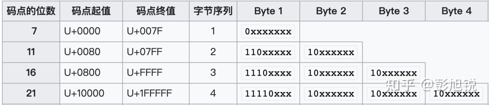

# Java中的编码

## Unicode字符集和UTF编码

> 参考文章: [计算机基础：今天一次把 Unicode 和 UTF-8 说清楚 - 知乎](https://zhuanlan.zhihu.com/p/546806312)

Unicode字符集是一种**统一的字符编码标准**， **仅仅提供字符与编号(码点)之间的映射关系**， 即每种字符有一个特定的编号， 但是Unicode并未声明编码方式， 计算机存储字符需要将Unicode编号转换成特定的编码格式。

> **码点（Code Point）：**Unicode码点从0开始编号，每个字符分配唯一的码点，完整的十六进制格式是 `U+[XX]XXXX`，具体可表示的范围为 `U+0000 ~ U+10FFFF` （所需要的空间最大为 3 个字节的空间），例如 `U+0011` 。这个范围可以容纳超过 100 万个字符，足够容纳目前全世界已创造的字符。
>
> **字符平面（Plane）：** 这么多字符并不是一次性定义完成的，而是采用了分组的方式。每一个组称为一个**平面，**每个平面能够容纳 216=65536216=65536 个字符。Unicode 一共定义了 17 个平面：
>
> - **基本多文种平面（Basic Multilingual Plane, BMP）：** 第一个平面包含最常用的通用字符`U+0000 ~ U+FFFF`。
> - **辅助平面（Supplementary Plane）：** 剩下的 16 个平面`U+010000~U+10FFFF`，包含多种语言的字符。

常见的编码格式有：UTF-8、UTF-16 和 UTF-32。UTF是英文 Unicode Transformation Format 的缩写， 是英文 Unicode Transformation Format 的缩写。

UTF的各种编码只是对Unicode字符标准使用不同的编码方式。举个例子，字符 A 的 Unicode 码点和编码如下：

- 1、图像：A
- 2、码点：U+0041
- 3、UTF-8 编码：0X41
- 4、UTF-16 编码：0X0041
- 5、UTF-32 编码：0X00000041

对UTF-8、UTF-16 和 UTF-32 的编码规则进行解码后，得到的结果都是0x41。

### UTF-32编码

UTF-32使用**4字节的定长编码**，足以容纳所有的Unicode码点，虽然编解码规则简单，效率快，但是太浪费存储空间

### UTF-16编码

**UTF-16 是 2 个字节或 4 个字节的变长编码**，结合了 UTF-8 和 UTF-32 两者的特点

**基本平面的码点**（编号范围在 `U+0000 ~ U+FFFF`）使用 **2 个字节**表示。辅助平面的码点（编号范围在 `U+10000 ~ U+10FFFF` 的码点）使用 4 个字节表示。

### UTF-8编码

**UTF-8 是 1~4 个字节的变长编码，相对来说最节省空间**。

- **规则 1：** 不同范围的码点值使用不同长度的编码；
- **规则 2：** 字节编码总长度为 1 时前缀为 `0`、总长度为 2 时前缀为 `110`、总长度为 3 时前缀为 `1110`、总长度为 4 时前缀为 `11110` ；
- **规则 3：** 除了首个字节，字符编码中其余字节的前缀为 `10`。

这种编码方式是不会存在前缀歧义的，也比较好理解。UTF8编码中，英文字符占用一个字节，绝大多数汉字占用三个字节，个别汉字占用四个字节。

UTF-8编码举例

因为 UTF-8 编码相对来说是最节省空间的，因此在很多存储和传输的场景中，都会选择使用 UTF-8 编码。

## 内码和外码

> 参考文章: [java的char类型，只有两个字节，为什么可以存储汉字？java中 char详解 - del88 - 博客园](https://www.cnblogs.com/del88/p/12918993.html)

1. **内码（Internal Encoding）**：某种**语言运行时**，其char和string**在内存中的编码方式**
2. **外码（External Encoding）**：除了内码，皆是外码。

> 源代码编译产生的目标代码文件（可执行文件或class文件）中的编码方式属于外码。

JVM中内码采用UTF-16编码，采用了2字节或4字节的方式来完成编码。一个char占两个字节，对于大部分常用的字符（包括英文字符和绝大多数汉字）可以用一个char（2字节）表示，部分字符需要两个char（4字节）表示。

Java的class文件采用UTF8来存储字符，也就是说，class中字符占1～6个字节