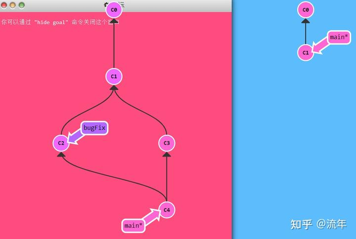
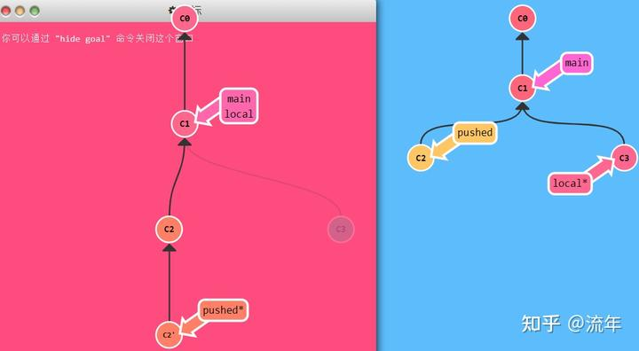
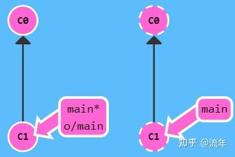
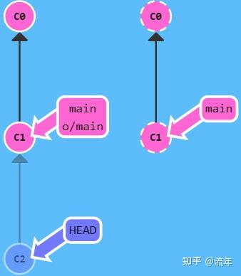
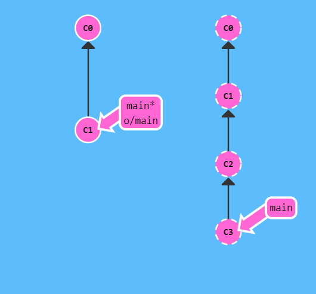
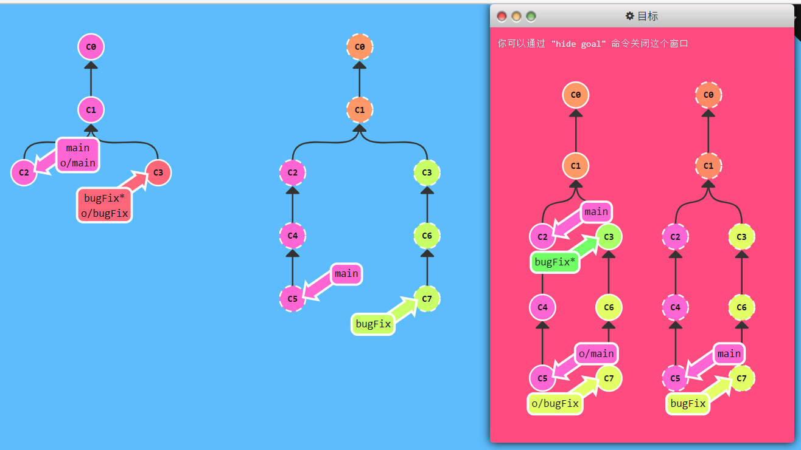
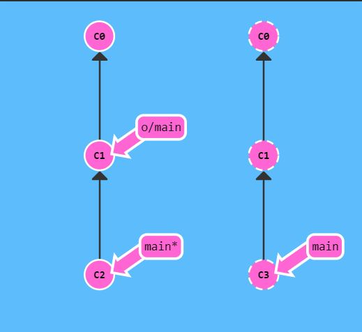

# Learn Git Branching

> 学习网站: [Learn Git Branching](https://learngitbranching.js.org/?locale=zh_CN)
>
> 参考笔记: [git学习笔记 - 知乎](https://www.zhihu.com/column/c_1561431080028381184)

## 主要

### 基础篇

> 循序渐进地介绍Git主要命令：git commit; git branch; git merge; git rebase
>
> **红图是目标结果, 蓝图是初始状态**

#### 1.git commit

`git commit`**修改了代码库, 把这些修改保存成了一个提交记录**C2。C2的父节点是C1，父节点是当前提交中变更的基础。

**题目:提交两次修改**


```bash
git commit //生成C2节点 
git commit //生成C3节点
```

#### 2.git branch

`git branch <newImage>`**新建一个名为newImage的分支指向当前提交记录**

Git的分支也非常轻量。它们只是简单地指向某个提交记录

`git checkout <newImage>`**切换到分支newImage上**

`git checkout -b <branch name>`**创建一个新分支并切换过去**

**题目：**创建一个名为bugFix的新分支，然后切换过去。（有更简洁的方式：想创建一个新的分支同时切换到新创建的分支的话，可以通过`git checkout -b <your branch name>`来实现）


```bash
git branch bugFix   //生成分支bugFix 
git checkout bugFix //切换到bugFix分支上 // 
git checkout -b bugFix
```

#### 3.git merge

`git merge <bugFix>`(当前分支为main)把bugFix**合并到当前分支**(main)中, 并生成新的提交记录, 该提交记录以上面两个提交记录为父节点

**题目：**




```bash
git checkout -b bugFix //创建并切换分支bugFix 
git commit             //在bugFix分支增加C2节点 
git checkout main      //切换到main上 
git commit             //在main分支增加C3节点 
git merge bugFix       //将bugFix分支的内容合并到main上 
```

#### 4.git rebase

第二种合并方法：`git rebase `。rebase实际上就是取出一系列的提交记录，“复制”题目，然后再另外一个地方逐个的放下去。

rebase的优势就是可以创造更线性的提交历史，如果只允许使用rebase的话，代码库的提交历史将会变得异常清晰。

(当前分支为bugFix)输入`git rebase <main>`**将bugFix记录的副本复制到main下面**, 原本的提交记录仍存在

`git checkout main; git rebase bugFix`将main分支rebase到bugFix上(**main和bugFix此时指向同一个提交记录, 即原bugFix的副本**)

**题目:**


```bash
git checkout -b bugFix //创建并切换分支bugFix 
git commit             //在bugFix上增加C2节点 
git checkout main      //切换到main上 
git commit             //在main上增加C3节点 
git checkout bugFix    //切换到bugFix分支上 
git rebase main        //将bugFix分支上的内容合并到main上 `
```

### 高级篇

> - 使用`git checkout`移动HEAD指针
> - 使用`git branch -f` 来移动分支指针
> - 相对引用^和`~<num>`
> - `git reset HEAD~`和`git revert HEAD`撤销当前提交

#### 1.HEAD指针和分支指针

> [git基础教程(12) 理解HEAD指针和分支指针_git head分支-CSDN博客](https://blog.csdn.net/HandsomeHong/article/details/112759075)

##### HEAD指针

使用`git checkout` 来**移动HEAD指针**，移动的对象可以是**分支指针也可以是快照。**

HEAD是一个对当前检出记录的符号引用——也就是指向正在其基础上工作的提交记录。**HEAD指针可以指向快照也可以指向branch**。当指向branch时提交后会和branch指针一起向后移动，当不指向branch提交时则会在一个detached状态。

1. HEAD指针默认指向当前的分支指针，用星号表示，如master*
2. 移动HEAD指针，`git checkout C1` 这个时候HEAD指针指向的是快照，这个时候指针的状态称之为**游离状态，detached**，可以理解为没有和任何分支绑定。

游离的HEAD就是让其指向了某个具体的提交记录而不是分支名。在命令执行之前的状态如下所示：

HEAD -> main -> C1（HEAD指向main，main指向C1）

##### 分支指针

使用`git branch -f` 来**移动分支指针**，**移动的对象(方向)只能是快照。当且仅当HEAD指针指向分支指针的时候，提交才会有效**

```bash
git branch -f main HEAD~3 //这条命令会将main分支强制指向HEAD的第3级父提交。
```

#### 2.相对引用`^`和`~`

使用相对引用的话，可以从一个易于记忆的地方（比如bugFix分支或者HEAD）开始计算。

两种简单的用法：

1.使用`^`向上移动1个提交记录

2.使用`~<num>`向上移动多个提交记录，如~3

**题目: **要完成此关，移动HEAD，main和bugFix到目标所示的位置。


```bash
// 三条命令的顺序不重要 
$ git branch -f main C6 
$ git checkout HEAD^   // 或者git checkout C1 
$ git branch -f bugFix HEAD^ 
```

#### 3.版本回退(reset&revert)

在git里撤销变更的方法很多，和提交一样，撤销变更由底层部分（暂存区的独立文件或者片段）和上层部门（变更到底是通过哪种方式被撤销的）组成。我们这个应用主要关注的是后者。

主要有两种方法用来撤销变更——一是`git reset`，还有就是`git revert`，接下来咱们逐个进行讲解。

**Git Reset**

git reset通过把分支记录回退几个提交记录来实现撤销改动。你可以将这想象成“改写历史”。**git reset向上移动分支**，原来指向的提交记录就跟从来没有提交过一样。

```bash
git reset HEAD~  // 撤销当前提交(即向上移动分支) 
```

Git把main分支移回到C1；现在我们的本地代码库根本就不知道有C2这个提交了。（在reset后，C2所做的变更还在，但是处于未加入暂存区状态。）

**Git Revert**

**git reset对远程分支无效**, **git revert在要撤销的记录C2后多出一个新提交记录C2’, 该记录表示的就是撤销上一个提交记录C2**, 也就是说 C2’ 的状态与 C1 是相同的. 如果C2后边还有C3,C4等等提交，C3,C4的修改不会动，仅仅是撤销C2的这次提交修改的内容！并在C4后边生成新的提交（撤销C2的修改）。

```bash
git revert HEAD // 撤销当前提交
```

**题目：**

要完成此关，分别撤销 local 分支和 pushed 分支上的最近一次提交。共需要撤销两个提交（每个分支一个）。 记住 pushed 是远程分支，local 是本地分支。



```bash
git reset HEAD^     //撤销本地分支用reset  
git checkout pushed   
git revert HEAD     //撤销远程分支用revert
```

## 远程

### Push&Pull–Git远程仓库

#### 1.git clone

git clone 命令在真实的环境下的作用是在本地创建一个远程仓库的拷贝（比如从 [http://github.com](http://link.zhihu.com/?target=http%3A//github.com)）。(但在learn git branching模拟的场景中是在远程仓库创建一个本地仓库的拷贝)

#### 2.远程分支

在我们的本地仓库多了一个名为 origin/master 的分支, 这种类型的分支就叫远程分支。远程分支有一个特别的属性，在你检出时自动进入分离 HEAD 状态。 Git 这么做是出于不能直接在这些分支上进行操作的原因, 你必须在别的地方完成你的工作, （更新了远程分支之后）再用远程分享你的工作成果。

你可能想问这些远程分支的前面的o/是什么意思呢？好吧，远程分支有一个命名规范——它们的格式是： /

因此，如果你看到一个名为 o/main的分支，那么这个分支就叫 main，远程仓库的名称就是o。大多数的开发人员会将它们主要的远程仓库命名为origin，并不是o。这是因为当你用 git clone某个仓库时，Git 已经帮你把远程仓库的名称设置为 origin了。

说了这么多，让我们看看实例。




如果检出远程分支会怎么样呢？

输入`git checkout origin/master、git commit`





正如你所见，Git 变成了分离 HEAD 状态，当添加新的提交时 origin/master 也不会更新。这是因为 origin/master 只有在远程仓库中相应的分支更新了以后才会更新。(好像需要git push origin/master才会更新)

**题目：**

要通过本关，在main分支上做一次提交，然后检出o/main，再做一次提交，这有助于理解远程分支的不同，他们的更新只是反映了远程的状态。


```bash
git commit  
git checkout o/main  
git commit 
```

#### 3.git fetch

Git 远程仓库相当的操作实际可以归纳为两点：向远程仓库传输数据以及从远程仓库获取数据。既然我们能与远程仓库同步，那么就可以分享任何能被 Git 管理的更新（因此可以分享代码、文件、想法、情书等等）。

本节课我们将学习如何从远程仓库获取数据－命令如其名，它就是 `git fetch`

你会看到当我们从远程仓库获取数据时，远程分支也会更新以反映最新的远程仓库。在上一节课程中我们已经提及过这一点了。

在解释 git fetch前，我们先看看实例。这里我们有一个远程仓库，它有两个我们本地仓库中没有的提交。



输入 `git fetch`

`C2`,`C3` 被下载到了本地仓库，同时远程分支 `o/main` 也被更新，反映到了这一变化


##### git fetch 做了些什么

`git fetch` 完成了仅有的但是很重要的两步:

- 从远程仓库下载本地仓库中缺失的提交记录
- 更新远程分支指针(如 `o/main`)

`git fetch` 实际上将本地仓库中的远程分支更新成了远程仓库相应分支最新的状态。

如果你还记得上一节课程中我们说过的，远程分支反映了远程仓库在你**最后一次与它通信时**的状态，`git fetch` 就是你与远程仓库通信的方式了！希望我说的够明白了，你已经了解 `git fetch` 与远程分支之间的关系了吧。

`git fetch` 通常通过互联网（使用 `http://` 或 `git://` 协议) 与远程仓库通信

##### git fetch 不会做的事

`git fetch` 并不会改变你本地仓库的状态。它不会更新你的 `main` 分支，也不会修改你磁盘上的文件。

理解这一点很重要，因为许多开发人员误以为执行了 `git fetch` 以后，他们本地仓库就与远程仓库同步了。它可能已经将进行这一操作所需的所有数据都下载了下来，但是**并没有**修改你本地的文件。我们在后面的课程中将会讲解能完成该操作的命令 :D

所以, 你可以将 `git fetch` 的理解为单纯的下载操作。

##### 题目




```bash
git fetch 
```

#### 4.git pull

既然我们已经知道了如何**用 `git fetch` 获取远程的数据**, 现在我们学习**如何将这些变化更新到我们的工作当中。**

其实有很多方法的 —— 当远程分支中有新的提交时，你可以像合并本地分支那样来合并远程分支。也就是说就是你可以执行以下命令:

- `git cherry-pick o/main`
- `git rebase o/main`
- `git merge o/main`
- 等等

实际上，由于先抓取更新再合并到本地分支这个流程很常用，因此 Git 提供了一个专门的命令来完成这两个操作。它就是我们要讲的 `git pull`。

我们先来看看 `fetch`、`merge` 依次执行的效果



`git fetch; git merge o/main`


> 我们用 `fetch` 下载了 `C3`, 然后通过 `git merge o/main` 合并了这一提交记录。现在我们的 `main` 分支包含了远程仓库中的更新（在本例中远程仓库名为 `origin`）

**`git pull` 就是 git fetch 和 git merge 的缩写！**

##### 题目


```bash
git pull
```

#### 5.模拟团队合作

克隆一个远程仓库（用 `git clone`），再在刚创建的远程仓库中模拟一些修改，然后在你自己的本地分支上做一些提交，再拉取远程仓库的变更。这看起来像是包含了好几节的课程。


```bash
git clone   //local branch "master" set to track remote branch "o/master"  
git fakeTeamwork main 2 // 模拟环境虚构的命令, 在远程仓库的main分支上做n次提交。 
git commit  
git fetch  
git merge o/main // 最后两行可以直接用git pull替换 
```

#### 6.git push

`git push` 负责将**你的**变更上传到指定的远程仓库，并在远程仓库上合并你的新提交记录。一旦 `git push` 完成, 你的朋友们就可以从这个远程仓库下载你分享的成果了！

你可以将 `git push` 想象成发布你成果的命令。它有许多应用技巧，稍后我们会了解到，但是咱们还是先从基础的开始吧……

*注意 —— `git push` 不带任何参数时的行为与 Git 的一个名为 `push.default` 的配置有关。它的默认值取决于你正使用的 Git 的版本，但是在教程中我们使用的是 `upstream`。 这没什么太大的影响，但是在你的项目中进行推送之前，最好检查一下这个配置。*

这里我们准备了一些远程仓库中没有的提交记录, 咱们开始先上传吧!


```bash
git push
```


> 过去了, 远程仓库接收了 `C2`，远程仓库中的 `main` 分支也被更新到指向 `C2` 了，我们的远程分支 (o/main) 也同样被更新了。所有的分支都同步了

##### 题目


```bash
git commit 
git commit 
git push
```

