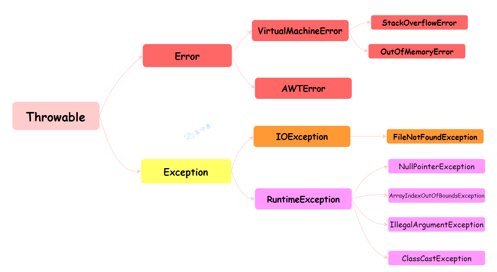
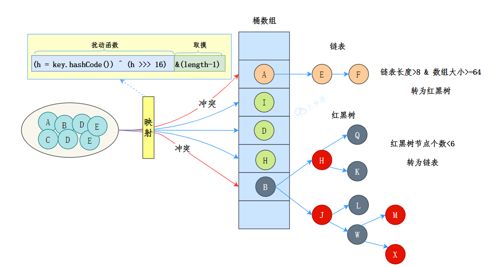
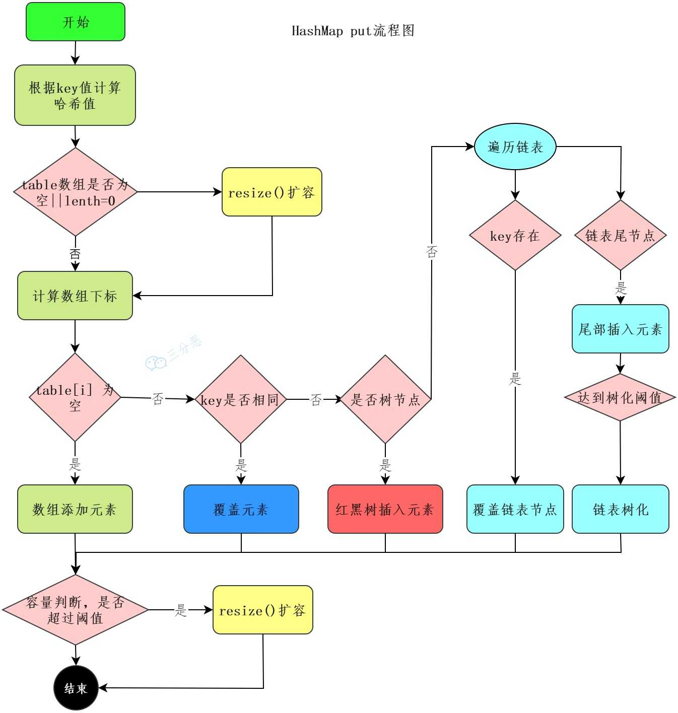
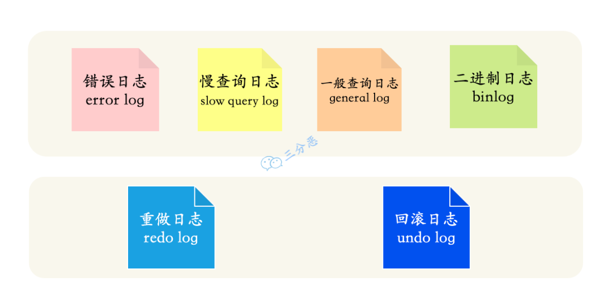
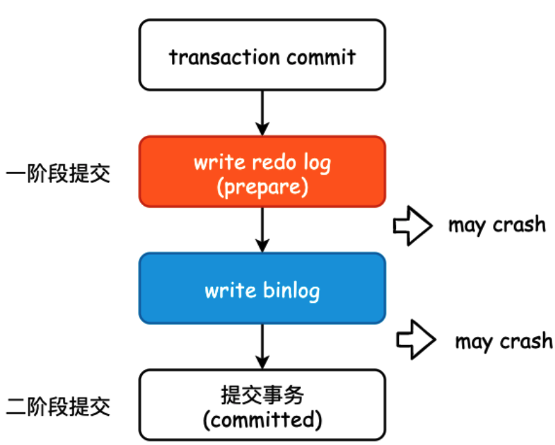
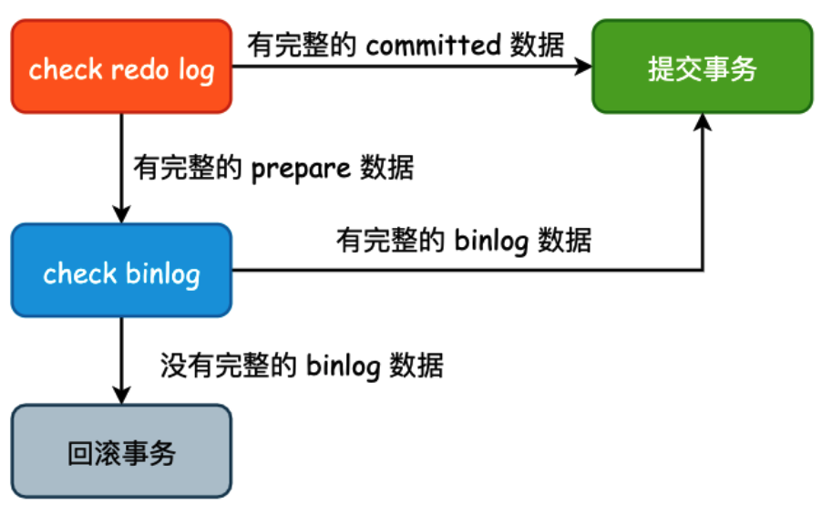
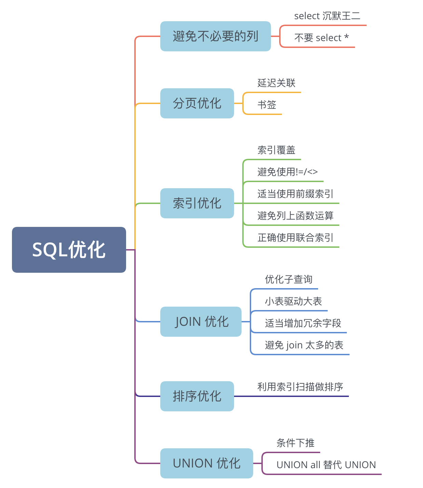

# Java SE

## Java概述

### 1.⭐️什么是Java（有哪些特点）

Java是一门面向对象的编程语言，吸收了C++中大量优点，又抛弃了C++的缺点，如垃圾回收，指针

Java是一门平台无关的编程语言，即一次编译，处处运行

1. 简单易学
2. 面向对象（封装、继承、多态）
3. 平台无关性（Java虚拟机实现）
4. 支持多线程
5. 安全性（提供多重安全防护机制比如访问权限修饰符，限制程序直接访问操作系统资源）

## 基础语法

### 7.⭐️Java有哪些数据类型

java 的数据类型可以分为两种：**基本数据类型**和**引用数据类型**。

Java有8种基本类型：byte(8), short(16), int(32), long(64), float(32), double(64), char(16), boolean，这些基本类型有对应的封装类，基本数据类型（作为局部变量）直接存放在栈内存中。

其他类型都是引用类型：类，接口，数组，String等，引用类型变量存放的值是指向堆内存的地址，堆中存放的才是真正的值。

## 面向对象

### 18.⭐️面向对象编程有哪些特点

#### 封装

封装就是把一个对象的属性隐藏在对象内容，不允许外部对象直接访问对象的内部信息。但是可以提供一些可以被外部访问的方法来操作对象。

#### 继承

继承就是用已经存在的类作为基础建立新类的技术，新类的定义可以增加新的属性或者方法，也可以使用父类的功能，但不能选择性继承父类 。通过继承可以快速创建新类，提高代码的可重用性，程序的可维护性，节省创建新类的时间，提高开发效率。

继承有三个注意点：

1. 子类拥有父类的所有属性和方法，包括私有属性和私有方法，但是无法访问父类的私有属性和私有方法，只是拥有。
2. 子类可以拥有自己的属性和方法，即子类可以对父类进行扩展。
3. 子类可以用自己的方式实现父类的方法

#### 多态

多态就是一个对象具有多种状态（不同类的对象对同一消息作出响应），具体表现为父类的引用指向子类的实例。

多态的特点：

- 多态不能调用“只在子类存在但在父类不存在”的方法
- 如果子类重写了父类的方法，真正执行的是子类的方法；如果子类没有重写父类的方法，执行的是父类方法
- 引用类型调用的方法到底是哪个类中的方法，必须在程序运行期间才可以确定

### 20.⭐️重载和重写的区别

重载就是同一个类中，多个方法名相同的方法根据输入参数的不同做出不同的处理。

重写就是子类修改从父类继承过来的方法，要求方法名相同，参数列表也相同。同时返回值类型小于父类返回值类型，抛出的异常小于父类，访问修饰符需要大于等于父类方法。如果父类的方法修饰符为private，则子类中不能对该方法进行重写。

> 构造方法不能重写，因为构造方法需要保持与类名相同，而重写的需求子类保持与父类同名，如果重写构造方法，那么子类将会存在与类名不同的构造方法。

### 21.⭐️抽象类和接口有什么区别

#### 接口和抽象类的共同点

- **实例化：**接口和抽象类都不能实例化，只能被实现（接口）或者继承（抽象类）后才能创建具体的对象
- **抽象方法：**接口和抽象类都可以包含抽象方法，抽象方法没有方法体，只能在子类或者实现类中实现

#### 区别

- **设计目的：**接口主要是对**类的行为进行约束**，接口定义了一套行为规范，实现了某个接口就具有了对应的行为；抽象类主要是用于**描述事物的共性**，为多个相关的类提供一个共同的基础框架（包括状态的初始化）
- **继承和实现：**Java不支持类的多继承，一个类只能继承一个类（包括抽象类）；但是一个类可以实现多个接口，一个接口也可以继承多个其他接口。
- **成员变量：**接口中的成员变量必须是`public static final`类型（常量）的，不能被修改且必须有初始值。抽象类的成员变量可以有任何修饰符（`private`, `protected`, `public`），可以在子类中被重新定义或赋值
- 方法：抽象类可以有构造方法，接口不可以有构造方法。
  - Java 8 之前，**接口**中的方法默认是 `public abstract` ，也就是只能有方法声明。自 Java 8 起，可以在接口中定义 `default`（默认） 方法和 `static` （静态）方法。 自 Java 9 起，接口可以包含 `private` 方法。
  - 抽象类可以包含抽象方法和非抽象方法(普通方法)。抽象方法没有方法体必须在子类中实现；非抽象方法有具体的实现，可以在抽象类中实现或者在子类中重写。

### 29.⭐️为什么重写 equals 时必须重写 hashCode方法

hashCode()用于获取对象的哈希码，equals()用于比较两个对象是否相等。二者之间有约定：如果两个对象相等，那么他们必须有相同的哈希码；如果两个对象哈希码相等，但他们不一定相等（哈希碰撞）。

如果equals方法判断两个对象相等，那么他们的哈希码也必须相等。因此重写equals时也要重写hashCode方法，防止equals判断两对象相等，但是他们的哈希值不同。

## String

### 34.⭐️String、StringBuilder、StringBuffer有什么区别？

String，StringBuilder和StringBuffer都是java中用于处理字符串的，他们的区别是String的不可变的，平时开发用的最多；当遇到大量字符串拼接时，就需要用StringBuilder，他是可变的，不会生成很多新的对象；StringBuffer和StringBuilder类似，但是每个方法上都加了synchronized关键字，所以是线程安全的。

- **String**：适用于字符串内容不会改变的场景，比如说作为 HashMap 的 key。
- **StringBuilder**：适用于单线程环境下需要频繁修改字符串内容的场景，比如在循环中拼接或修改字符串，是 String 的完美替代品。
- **StringBuffer**：现在已经不怎么用了，因为一般不会在多线程场景下去频繁的修改字符串内容。

> **记忆：**StringBuffer的 "Buffer"（缓冲区）一词常与数据同步、缓存等概念关联，暗示它处理并发操作。StringBuilder的 "Builder"（构建器）则更侧重单线程下的构建操作。

## 异常处理

### 41.⭐️Java中的异常处理体系

Java中的异常处理机制用于处理程序运行过程中可能发生的各种异常情况，通常通过try-catch-finally语句和throw关键字实现



Throwable是java中所有错误和异常的基类，它有两个主要的子类：Error和Exception，这两个子类分别代表了Java异常处理体系中的两个分支

Error类代表那些严重的错误，通常程序无法处理，比如OutOfMemoryError表示内存不足，StackOverFlowError表示栈溢出，这些错误通常与JVM的运行状态有关，一旦发生，程序通常无法恢复。

Exception类代表程序可以处理的异常，分为两大类：编译时异常（Checked Exception）和运行时异常（Runtime Exception）。

1. 编译时异常（Checked Exception）：这类异常在编译时必须被显式处理（捕获或声明抛出）。

   如果方法可能抛出某种编译时异常，但没有捕获它（try-catch）或没有在方法声明中用 throws 子句声明它，那么编译将不会通过。例如：IOException、SQLException 等。

2. 运行时异常（Runtime Exception）：这类异常在运行时抛出，它们都是 RuntimeException 的子类。对于运行时异常，Java 编译器不要求必须处理它们（即不需要捕获也不需要声明抛出）。

   运行时异常通常是由程序逻辑错误导致的，如 NullPointerException、IndexOutOfBoundsException 等

## I/O

### ？⭐️46.BIO、NIO、AIO之间的区别？

Java 常见的 IO 模型有三种：BIO、NIO 和 AIO


- BIO：采用阻塞式I/O模型，线程在执行I/O操作时被阻塞，无法处理其他任务，适用于连接数较少的场景

  

  > “每个连接一个线程”是 **BIO（同步阻塞I/O）** 模型的典型处理方式。这意味着，每当服务器接受（`accept`）一个新的客户端连接请求后，就会**为这个连接专门创建一个新的线程**，由这个线程全权负责处理该连接上的所有后续I/O操作

- NIO：采用非阻塞I/O模型，线程在等待I/O时可执行其他任务，通过Selector监控多个Channel上的事件，适用于连接数多但连接时间短的场景

  > NIO是一种同步非阻塞的IO模型，所以也可以叫NON-BLOCKINGIO。同步是指线程不断轮询IO事件是否就绪，非阻塞是指线程在等待IO的时候，可以同时做其他任务。 同步的核心就
  >
  > Selector（I/O多路复用），Selector代替了线程本身轮询IO事件，避免了阻塞同时减少了不必要的线程消耗；非阻塞的核心就是通道和缓冲区，当IO事件就绪时，可以通过写到缓冲区，保证IO的成功，而无需线程阻塞式地等待

- AIO：使用异步I/O模型，线程发起I/O请求后立即返回，当I/O操作完成时通过回调函数通知线程，适用于连接数多且连接时间长的场景

> **NIO 模型 (同步非阻塞)**：
>
> 你（应用线程）在餐厅。你想知道你的菜好了没有，**你不会一直站在出菜口等**（非阻塞）。相反，你**每隔几分钟就去出菜口问一下服务员**：“我的菜好了吗？”（`Selector.select()`轮询）。当服务员说“好了”时（事件就绪），你**需要自己走到出菜口，把菜端回座位**（同步的 `read`操作，数据拷贝）。在这个过程中，**“询问”是非阻塞的，但“端菜”这个核心动作必须由你亲自完成**。
>
> 
>
> **AIO 模型 (异步非阻塞)**：
>
> 你（应用线程）在餐厅。你点完菜后，**直接回到座位玩手机**（立即返回，线程自由）。你把你的**桌号**（回调函数）告诉了服务员。后厨（操作系统内核）会完成**做菜**（等待数据）和**上菜到你的餐桌**（数据拷贝）的所有工作。当菜上齐后，服务员**会来到你的桌边告诉你**：“先生/女士，您的菜齐了”（调用回调函数）。整个过程，你无需关心菜是怎么做的、怎么端上来的。

## 反射

### 52.⭐️什么是反射？应用？原理？

反射就是在程序运行期间动态的获取对象的属性和方法的功能。通过反射可以获取任意一个类或者对象的所有属性和方法，并调用这些方法和属性。

获取Class对象的三种方式：

- getClass()
- .class
- Class.forName()

反射的优缺点：

- 优点：运行期间能够动态获取类，提高代码的灵活性
- 缺点：性能比较慢，而且破环了java中内部细节不对外部公开的封装特性，所以滥用可能会导致一系列安全问题

反射的应用场景：

1. Spring 框架就大量使用了反射来动态加载和管理 Bean。
2. Java 的动态代理机制就使用了反射来创建代理类。代理类可以在运行时动态处理方法调用，这在实现 AOP 和拦截器时非常有用。
3. 最常见的是写通用的工具类，比如对象拷贝工具。比如说 BeanUtils、MapStruct 等等，能够自动拷贝两个对象之间的同名属性，就是通过反射来实现的。

反射的原理：

每个类加载到JVM后，都会在方法区生成一个对应的Class对象，这个对象包含了类的所有元信息，比如字段、方法、构造器、注解等。

通过这个Class对象，我们就能在运行时动态地创建对象、调用方法、访问字段。

# Java集合框架

## 引言

### 1.⭐️有哪些常见的集合框架

集合框架可以分为两条大的支线：

①、Collection 接口：最基本的集合框架表示方式，提供了添加、删除、清空等基本操作，它主要有三个子接口：

- `List`：一个有序的集合，可以包含重复的元素。实现类包括 ArrayList、LinkedList 等。
- `Set`：一个不包含重复元素的集合。实现类包括 HashSet、LinkedHashSet、TreeSet 等。
- `Queue`：一个用于保持元素队列的集合。实现类包括 PriorityQueue、ArrayDeque 等。

②、Map接口：表示键值对的集合，一个键映射到一个值。键不能重复，每个键只能对应一个值。Map 接口的实现类包括 HashMap、LinkedHashMap、TreeMap 等。

## List

### 2.⭐️ArrayList和LinkedList的区别

相同点：ArrayList和LinkedList都实现了List接口，它们都是有序集合，并且能存储重复的元素。它们都是线程不安全的 

不同点：ArrayList是数组实现，而LinkedList是双向链表实现，ArrayList是连续内存存储，适合随机访问，不适合数据的插入和删除。而LinkedList底层是链表，只能顺序访问，读写速度慢，插入删除速度快，且每个元素都要存放直接前驱和后继，每一个元素占用空间更多。

应用上：ArrayList适用于增删较少，查询多的场景，而LinkedList适用于查询少，增删较多的场景。

## Map

### 8.⭐️HashMap底层原理



jdk8之前的HashMap底层数据结构是`数组`+`链表`，jdk8之后是`数组`+`链表`+`红黑树`。

数组用于存储键值对，索引是对键的哈希值进行二次`hash()`（扰动函数）得到的，多个键通过哈希处理得到相同索引时，就需要通过链表解决哈希冲突。

但是当链表过长时，查询效率会比较低，所以当链表的长度超过8且数组长度超过64时，链表就会转化为红黑树，红黑树查询效率是 O(logn)，比链表的 O(n) 要快。

`hash()` 方法的目标是尽量减少哈希冲突，（使高位也参加运算）保证元素能够均匀地分布在数组的每个位置上。

```java
static final int hash(Object key) {
    int h;
    return (key == null) ? 0 : (h = key.hashCode()) ^ (h >>> 16);
}
```

> 如果键的哈希值已经在数组中存在，其对应的值将被新值覆盖。

HashMap 的初始容量是 16，随着元素的不断添加，HashMap 就需要进行扩容，阈值是`capacity * loadFactor`，capacity 为容量，loadFactor 为负载因子，默认为 0.75。

扩容后的新数组大小是原来的 2 倍，然后把原来的元素重新计算哈希值，放到新的数组中。

### 11.⭐️HashMap的put流程



1. 判断数组是否为空，如果为空，则对数组进行首次扩容，默认初始容量为16
2. 对key进行二次哈希得到索引值，如果索引对应的桶为空，则直接创建一个新节点放入数组中
   - 如果该位置已有元素，遍历桶内的元素检查key是否存在，如果存在，则value值覆盖旧值
   - 如果key不存在，将新的键值对插入对应的链表或红黑树中
3. 如果插入的是链表，新节点会插入到链表的末尾，插入后检查链表长度是否达到树化的阈值，如果当前链表长度>8且数组长度>64，则链表转化为红黑树，若链表长度>8且数组长度<64，数组扩容。
4. 如果插入的是红黑树，按照红黑树的规则插入新节点
5. 成功插入新节点后，判断当前元素数量是否超过扩容阈值，如果超过对数组进行扩容，并将现有的元素重新计算哈希值迁移到新数组中。

### 21.⭐️HashMap的扩容机制

扩容时，HashMap会创建一个新的数组，容量是原来的两倍，然后遍历旧哈希表中的元素，将其重新分配到新的哈希表中。

如果当前桶中只有一个元素，那么直接通过键的哈希值与数组大小取模得到新的索引位置：`e.hash & (newCap-1)`  （等价于`e.hash%newCap`)

如果当前桶是红黑树，那么会调`split`方法分裂树节点，以保证树的平衡。

如果当前桶是链表，会通过旧键的哈希值与旧的数组大小取模`(e.hash & oldCap)==0`作为判断条件，如果条件为真，元素保留在原索引位置；否则元素移动到原索引+旧数组大小位置

> #### 🔍 核心原理：2的幂次方容量带来的二进制魔法
>
> 这个优化的前提是：**HashMap的数组长度永远是2的幂次方**（如16, 32, 64...）。
>
> 当数组从 `oldCap`扩容到 `newCap`（`newCap = 2 * oldCap`）时，`newCap`在二进制表示上只是在 `oldCap`的最高位前面加了一个1。
>
> 让我们用二进制视角来看：
>
> ```markdown
> 假设 oldCap = 16 (二进制 10000)
> 则 newCap = 32 (二进制 100000)
>       oldCap-1 = 15 (二进制 01111)
>       newCap-1 = 31 (二进制 011111)
> ```
>
> **关键洞察**：`newCap-1`相比 `oldCap-1`，只是在**高位多了一个1**。这意味着，在计算新索引时，一个节点的新位置**完全取决于它的哈希值在“新增的那个比特位”上是0还是1**。
>
> #### ⚙️ `(e.hash & oldCap) == 0`的数学意义
>
> `oldCap`是2的幂，其二进制形式是 `1`后面跟若干个 `0`（例如16=`10000`）。`e.hash & oldCap`这个操作，**只检查 `e.hash`在 `oldCap`那个“1”所在的位上的值**。
>
> - 
>
>   如果 `(e.hash & oldCap) == 0`，说明 `e.hash`在那个特定位上是 **0**。
>
> - 
>
>   如果 `(e.hash & oldCap) != 0`，说明 `e.hash`在那个特定位上是 **1**。
>
> **为什么这个判断能决定新位置？**
>
> 因为新索引的计算公式是 `e.hash & (newCap-1)`。`newCap-1`比 `oldCap-1`多了一个高位的1。如果 `e.hash`在那个新增位上是0，那么 `e.hash & (newCap-1)`的结果和 `e.hash & (oldCap-1)`**完全相同**（因为高位与0相与还是0）。所以节点**留在原索引**。
>
> 如果 `e.hash`在那个新增位上是1，那么 `e.hash & (newCap-1)`的结果会比 `e.hash & (oldCap-1)`多出 `oldCap`的大小。所以节点**移动到原索引+oldCap**的位置。
>
> #### 📊 实例演算
>
> 假设 `oldCap = 16`，有两个节点，哈希值分别是 5 和 21。让我们手动计算：
>
> ```markdown
> oldCap = 16 (二进制 10000)
> newCap = 32 (二进制 100000)
> oldCap-1 = 15 (二进制 01111)
> newCap-1 = 31 (二进制 011111)
> 
> 节点A: hash = 5
> 二进制: 00101
> 原索引: 00101 & 01111 = 00101 (5)
> 判断: 00101 & 10000 = 00000 (0) -> 为真
> 新索引: 00101 & 011111 = 00101 (5) -> 留在原索引5
> 
> 节点B: hash = 21
> 二进制: 10101
> 原索引: 10101 & 01111 = 00101 (5) -> 和节点A冲突在一个桶
> 判断: 10101 & 10000 = 10000 (16) -> 不为0
> 新索引: 10101 & 011111 = 10101 (21) -> 新索引 = 5 + 16 = 21
> ```
>
> **看！** 原来在索引5的桶里的两个节点（5和21），扩容后被巧妙地拆分到了两个不同的桶：5留在索引5，21移动到了索引21（即5+16）。这个过程**不需要重新计算 `e.hash & (newCap-1)`**，只需要判断 `(e.hash & oldCap)`这一位。


> **红黑树拆分**确实比链表拆分开销大，但原因**不是索引计算**，而是**维护树结构的平衡**。主要开销在：
>
> 1. 
>
>    **遍历开销**：红黑树需要通过中序遍历来保证顺序，而链表只需要遍历next指针。
>
> 2. 
>
>    **重新树化**：拆分后的两个链表（低位和高位）如果长度仍然>8，需要**重新构建红黑树**（调用`treeify()`），这是一个O(n)的复杂操作，涉及重新平衡、着色、旋转等。
>
> 3. 
>
>    **可能退化为链表**：如果拆分后某个链表的长度<=6（`UNTREEIFY_THRESHOLD`），需要**退化成普通链表**。

### 24.⭐️HashMap是线程安全的吗

HashMap不是线程安全的，主要有以下几个问题：

1. 多线程下扩容会死循环，JDK7中的HashMap使用头插法处理链表，在多线程环境下扩容会出现环形链表，造成死循环。不过，JDK 8 时通过尾插法修复了这个问题，扩容时会保持链表原来的顺序。

   

   > 尾插法不会反转链表顺序，从而破坏了形成环形链表的必要条件——即两个线程看到并操作同一对节点时，它们的 `next`指针不会互相指向对方，形成“你指向我，我指向你”的闭环。

2. 多线程在put元素的时候，可能导致元素丢失，因为计算出来的位置可能被其他线程覆盖掉。比如说一个线程 put 3 的时候，另外一个线程 put 了 7，就把 3 给弄丢了。

3. **put和get并发时，可能导致get为null。线程 1 执行 put 时，因为元素个数超出阈值而扩容，线程 2 此时执行 get，就有可能出现这个问题。因为线程 1 执行完 table = newTab 之后（数据未完全迁移），线程 2 读取的table指向了newTable，比如说索引 3 的键值对应该移动到了索引 7 的位置但还未移动，此时线程 2 去 get 索引7的元素就 get 不到了。？？？*

### 25.⭐️怎么解决HashMap的线程不安全问题

早期的JDK版本中，可以使用HashTable保证线程安全，HashTable在其内部方法上加了synchronized关键字。

更常用的方法是使用concurrent并发包下的ConcurrentHashMap代替HashTable，它使用CAS+synchronized关键字保证线程安全

#### ConcurrentHashMap 线程安全的具体实现方式。

> 链接：https://www.nowcoder.com/questionTerminal/ca75442eb0034a8cb9ecbe6057de1f00?examPageSource=25mianshitop
> 来源：牛客网
>
> HashMap是线程不安全的，它的put操作首先是通过key和value计算出在HashMap中的下标座位，然后再将其生成的entry对象插入，那么这个时候，如果同时两个线程，都计算得到了相同的位置，那么都进行了插入操作，就会导致覆盖，也就是一个数据丢失。 而ConcurrentHashMap就是来解决这个问题的，但是它的性能会比HashTable要好。

ConcurrentHashMap是线程安全的集合，它的底层是数组+链表+红黑树实现的，采用锁定头结点（桶的第一个节点）的方式降低了锁的粒度，以较低的性能代缴实现了线程安全。

1. 初始化数组或头结点时，ConcurrentHashMap并没有加锁,而是CAS(Compare and Swap, 乐观锁的一种实现方式)的方式进行原子替换

    

   > “替换”的不是链表或树里的某个元素，而是数组槽位（或变量）里指向的整个对象头节点。

2. 插入元素时会进行加锁处理，但是锁定的不是整个数组而是桶/槽中的头结点

3. 扩容时会进行加锁处理,锁定的仍然是头节点。并且，支持多个线程同时对数组扩容,提高并发能力，在扩容的过程中,依然可以支持查找操作。

    

   > 每个线程需先以CAS操作抢任务,争抢一段连续槽位的数据转移权。抢到任务后,该线程会锁定槽内的头节点,然后将链表或树中的数据迁移到新的数组里。 
   >
   > 查找数据时并不会加锁,所以性能很好。另外,在扩容的过程中,依然可以支持查找操作。如果某个槽还未进行迁移,则直接可以从旧数组里找到数据。如果某个槽已经迁移完毕,但是整个扩容还没结束,则扩容线程会创建一个转发节点存入旧数组,届时查找线程根据转发节点的提示,从新数组中找到目标数据。  


# MYSQL

## MYSQL基础

### 1.⭐️什么是MYSQL

MYSQL是一个开源的关系型数据库，隶属于Orcale公司，是我们国内使用频率最高的一种数据库。

SQL指关系型数据库存储结构化数据。这些数据逻辑上以行列二维表的形式存在，每一列代表数据的一种属性，每一行代表一个数据实体。

NoSQL指非关系型数据库 ，主要代表：MongoDB，Redis。NoSQL 数据库逻辑上提供了不同于二维表的存储方式，存储方式可以是JSON文档、哈希表或者其他方式。

关系型数据库支持 ACID 即原子性，一致性，隔离性和持续性。相对而言，NoSQL 采用更宽松的模型 BASE ， 即基本可用，软状态和最终一致性

### 9.⭐️怎么存储emoji

因为 emoji（😊）是 4 个字节的 UTF-8 字符，而MYSQL的utf8字符集只支持三个字节的utf8字符，所以MYSQL存储emoji时，需要使用utf8mb4字符集。

```sql
ALTER TABLE mytable CONVERT TO CHARACTER SET utf8mb4 COLLATE utf8mb4_unicode_ci;
```

MySQL 8.0 已经默认支持 utf8mb4 字符集，可以通过 `SHOW VARIABLES WHERE Variable_name LIKE 'character\_set\_%' OR Variable_name LIKE 'collation%';` 查看。

## 数据库架构

### 21.⭐️一条查询语句是如何执行的

1. MYSQL服务器的连接器与客户端建立连接、获取权限、管理连接
2. 客户端发送SQL语句到MYSQL服务器
3. 解析器对SQL语句进行解析，进行语法和语义检查，生成解析树
4. 优化器对解析树进行优化，选择最优的执行计划（考虑索引、表连接顺序等）
5. 执行器调用存储引擎API进行数据的读写
6. 存储引擎负责查询数据，将执行结果返回给执行器，执行器将结果返回给客户端

## 存储引擎

### 24.⭐️MYSQL有哪些常见的存储引擎

- InnoDB支持事务、行级锁和外键约束，适合高并发场景，安全性高，是Mysql的默认引擎
- MyISAM：不支持事务，使用表级锁，不支持外键，适合读多写少场景
- Memory：使用内存存储，速度快但容易丢失数据

## 日志

### 28.⭐️MYSQL的日志文件有哪些

有六类，其中错误日志用于问题诊断，慢查询日志用于SQL性能分析，general log用于记录所有的SQL语句，binlog用于主从复制和数据恢复，redo log用于保证事务持久性，undo log用于事务回滚和MVCC



> ----这部分是帮助大家理解 start，面试中可不背----
>
> [面试官内心os：MySQL三大日志还得是你讲的好_哔哩哔哩_bilibili](https://www.bilibili.com/video/BV1hv3kzUEHQ/?spm_id_from=333.337.search-card.all.click&vd_source=8b64a620a3ee0b077147ede5438b3398)
>
> ①、错误日志（Error Log）：记录 MySQL 服务器启动、运行或停止时出现的问题。
>
> ②、慢查询日志（Slow Query Log）：记录执行时间超过 long_query_time 值的所有 SQL 语句。这个时间值是可配置的，默认情况下，慢查询日志功能是关闭的。
>
> ③、一般查询日志（General Query Log）：记录 MySQL 服务器的启动关闭信息，客户端的连接信息，以及更新、查询的 SQL 语句等。
>
> ④、**回滚日志**（Undo Log，或者叫事务日志）：记录数据被修改前的值，实现事务的**原子性**，主要用于**事务的回滚和MVCC**。
>
> 在 MySQL 中，为了提高性能，当你执行 `UPDATE` 语句时，数据库**并不会立即**把修改后的数据写回磁盘的 `.ibd` 文件。
>
> - **内存修改**：InnoDB 会先在内存的 **Buffer Pool** 中修改对应的页。此时，磁盘上的数据还是旧的，内存里的数据是新的（这被称为“脏页”）。
> - **异步刷盘**：InnoDB 会等待合适的时机，再批量将脏页刷入磁盘。
>
> **致命问题**：如果在脏页还没来得及刷入磁盘时，电源断了或进程崩了，**内存中的数据会全部丢失**。由于磁盘上还是旧数据，如果你不进行恢复，刚才那个“已提交”的事务就凭空消失了，这就违反了事务的 **持久性 (Durability)**。
>
> ⑤、**重做日志**（Redo Log）：记录的是物理页的修改（“在某个数据页做了什么修改”），主要用于实现事务的**持久性**。当数据库宕机时，依靠它进行恢复（Crash-safe），即数据库宕机后能恢复未提交的数据。
>
> redo log是磁盘顺序IO，mysql的缓存buffer pool将脏页刷盘是随机IO，速度慢得多，所以只要把redo log刷盘，即便mysql崩溃也能恢复数据。redo log也不是直接写入磁盘，它有自己的缓存redo log buffer
>
> 而redo log是**循环写**的，事务提交后redo log数据会被慢慢擦除，所以**不能用于主从复制和数据恢复**
>
> ⑥、**二进制日志**（Binary Log）：记录所有修改数据库状态的 SQL 语句，以及每个语句的执行时间，如 INSERT、UPDATE、DELETE 等，但不包括 SELECT 和 SHOW 这类的操作，主要**用于数据备份和主从复制**。是 **Server 层生成的日志，是追加写**。
>
> - redo log是物理日志，记录数据页的物理变化，如“表空间X、页Y、偏移Z处修改了N字节，旧值...新值...”；
>
> - bin log是逻辑日志，记录操作的逻辑语义，即类似于SQL语句本身
>
> ----这部分是帮助大家理解 end，面试中可不背----

### 30.？⭐️为什么redo log要两阶段提交

为了保证redo log和bin log中的数据一致性，防止主从复制和事务状态不一致



假如MYSQL在写入redo log之后（prepare阶段），写入bin log时崩溃，那么MYSQL重启后会回滚该事务。因为 redo log 不是提交状态。并且由于 binlog 中没有写入数据，所以从库也不会有该事务的数据。



加入MYSQL在写入bin log之后，redo log提交之前崩溃，那么MySQL 重启后 InnoDB 会提交该事务，因为 redo log 是完整的 prepare 状态。并且由于 binlog 中有写入数据，所以从库也会同步到该事务的数据。

> 两阶段提交，最终还是要看bin log，只要bin log刷盘，就能提交事务

> ### 只需要bin log不就能满足事务持久性和原子性了吗
>
> 不可以。仅靠 binlog 无法同时满足事务的**持久性 (Durability)** 和**原子性 (Atomicity)**。
>
> 根本原因在于 **binlog 自身不具备崩溃恢复 (crash-safe) 的能力**，而这是实现事务持久性和原子性的基石。具体来看：
>
> ------
>
> #### 🎯 角色定位：binlog 并非崩溃恢复日志
>
> - 
>
>   **binlog (二进制日志)**
>
>   - 
>
>     **层级**：MySQL **Server 层**的日志，与存储引擎无关。
>
>   - 
>
>     **内容**：记录逻辑操作，如“给某表某行加一”或“插入一行数据”。
>
>   - 
>
>     **用途**：主从复制、按时间点恢复数据 (PITR)。
>
>   - 
>
>     **致命缺陷**：它不记录数据页的物理状态，也没有“事务准备/提交”的状态标记。因此，一旦数据库宕机，binlog 无法独立判断哪些事务已完整提交、哪些需要回滚，也就无法将数据库恢复到一致状态。
>
> - 
>
>   **redo log (重做日志) & undo log (回滚日志)**
>
>   - 
>
>     **层级**：**InnoDB 存储引擎层**的日志。
>
>   - 
>
>     **核心作用**：
>
>     - 
>
>       **redo log**：保证**持久性**。采用 WAL (Write-Ahead Logging) 机制，先写日志再刷盘，确保已提交事务的修改不丢失。
>
>     - 
>
>       **undo log**：保证**原子性**和**隔离性**。记录数据修改前的旧版本，用于事务回滚和实现多版本并发控制 (MVCC)。
>
> ------
>
> #### ⚖️ 为什么 binlog 无法胜任？
>
> ##### 1. 无法满足原子性 (Atomicity)
>
> 原子性要求事务内的操作“要么全做，要么全不做”。
>
> - 
>
>   **崩溃场景**：事务执行中（部分修改已写入磁盘数据页），数据库突然宕机。
>
> - 
>
>   **binlog 的困境**：重启后，binlog 无法区分该事务哪些是已完成的操作，哪些不是。它只能机械地重放所有记录，这会导致部分修改被重复执行，破坏了原子性。
>
> - 
>
>   **InnoDB 的正确做法**：
>
>   1. 
>
>      先将修改写入 **redo log** 并标记为 `prepare`状态。
>
>   2. 
>
>      再写入 **binlog**。
>
>   3. 
>
>      最后将 redo log 状态更新为 `commit`。
>
>   崩溃恢复时，通过 **redo log** 的状态和 **binlog** 的存在性进行比对，决定是提交还是回滚事务，从而保证了原子性。
>
> ##### 2. 无法满足持久性 (Durability)
>
> 持久性要求一旦事务提交，其修改就永久保存。
>
> - 
>
>   **崩溃场景**：事务已提交，但修改的数据页仍在内存（Buffer Pool）中，未刷盘，此时宕机。
>
> - 
>
>   **binlog 的困境**：binlog 只负责记录“这个事务提交了”，但它不知道哪些数据页在内存中还未落盘。因此，它无法将这些已提交但未落盘的数据恢复，导致持久性无法保证。
>
> - 
>
>   **InnoDB 的正确做法**：
>
>   依赖 **redo log** 实现。只要事务提交时，其对应的 redo log 已强制刷盘 (`innodb_flush_log_at_trx_commit=1`)，那么即使数据页未刷盘，重启后也能通过重放 redo log 来恢复所有已提交的修改。
>
> ------
>
> #### 💡 结论：分工协作，缺一不可
>
> - 
>
>   **binlog**：是 MySQL **Server 层**的功能，用于复制和数据恢复，不保证崩溃安全。
>
> - 
>
>   **redo log + undo log**：是 **InnoDB 引擎层**的核心，共同保证了事务的 **ACID** 特性，特别是崩溃恢复能力。
>
> 因此，在 InnoDB 中，必须依赖 **redo log** 和 **undo log** 来实现事务的持久性和原子性，binlog 无法替代它们。

### 31.?⭐️Redo log的写入过程了解吗

InnoDB会现将redo log写入内存中的redo log buffer，然后以一定的频率刷入到磁盘中的redo log file中

> 哪些场景会触发redo log刷盘动作：redo log buffer空间不足时，事务提交时，触发check point时，后台线程定期刷盘时。
>
> 不过，Redo Log Buffer 刷盘到 Redo Log File 还会涉及到操作系统的磁盘缓存策略，可能不会立即刷盘，而是等待一定时间后才刷盘。

## SQL优化

### 32.⭐️什么是慢SQL

执行时间超过指定时间long_query_time的SQL叫做慢SQL，会被记录到慢查询日志中

#### 如何优化慢SQL

首先找到哪些比较慢的SQL，可以启用慢查询日志，记录那些超过指定时间的SQL

也可以使用`show processlist`命令查看当前正在执行的SQL语句，找出执行时间较长的SQL

然后使用`EXPLAIN`查看慢SQL的执行计划，看看有没有用索引，大部分情况下慢SQL的原因是没有用索引

```SQL
EXPLAIN SELECT * FROM your_table WHERE conditions;
```

最后，根据分析结果，通过添加索引、优化查询条件、减少返回字段等方式进行优化

> #### 慢sql日志怎么开启？
>
> 编辑 MySQL 的配置文件 my.cnf，设置 slow_query_log 参数为 1。
>
> ```sql
> [mysqld]
> slow_query_log = 1
> slow_query_log_file = /var/log/mysql/slow.log
> long_query_time = 2  # 记录执行时间超过2秒的查询
> ```
>
> 然后重启 MySQL 就好了。
>
> 也可以通过 set global 命令动态设置。
>
> ```sql
> SET GLOBAL slow_query_log = 'ON';
> SET GLOBAL slow_query_log_file = '/var/log/mysql/slow.log';
> SET GLOBAL long_query_time = 2;
> ```

### 33.？⭐️有哪些方法优化SQL

优化SQL的方法有很多，但本质上就是一句话：尽量少地扫描，尽快多地返回结果

最常见的做法就是加索引，改进SQL让他用上索引，比如说使用覆盖索引，让联合索引满足**最左前缀原则**（查询条件需要从索引的左侧字段开始）



#### 如何利用覆盖索引

覆盖索引的核心就是查询所需的字段都是在同一个索引中，这样就不要回表查询而是直接返回结果

实际应用中，我会优先考虑把where和select字段涉及的字段一起建立联合索引，并通过explain观察结果是否有using index，确认命中索引

#### ?如何进行分页优化

[MySQL 分页有什么性能问题？怎么优化？ | 小林coding | Java面试学习](https://xiaolincoding.com/mysql/index/limit.html)

分页优化的核心是避免深度偏移带来的全表扫描，可以通过两种方式来进行优化：延迟关联和添加书签

> “深度偏移带来的全表扫描”指的是，在使用 `LIMIT offset, size`进行分页查询时，当偏移量（`offset`）非常大，导致数据库被迫扫描海量数据行，其效率甚至可能退化到全表扫描的水平。
>
> 以典型的深度分页SQL为例：
>
> sql
>
> SELECT * FROM t_order
>
> ORDER BY id
>
> LIMIT 1000000, 10;
>
> 这句SQL的执行过程可以拆解为：
>
> 1. **定位起点**：根据 `ORDER BY id`，从索引中找到第 `1000000`条记录的位置。
> 2. **扫描与丢弃**：从该位置开始，连续读取 `1000000 + 10`条记录。
> 3. **返回结果**：将读取到的前 `1000000`条记录全部丢弃，只将最后的 `10`条返回给客户端。
>
> **核心痛点**：
>
> - **无效扫描**：为了获取最后10条数据，数据库必须“数”过前面100万条无关的记录，做了大量无用功。
> - **性能瓶颈**：随着 `offset`的增大，需要扫描和丢弃的数据量线性增长，查询耗时急剧上升，性能表现如同全表扫描 

#### 为什么分页会变慢

分页查询的效率问题主要是由于offset的存在，offset会导致数据库必须扫描offset+limit条数据，这个过程是非常耗时的

### 34.？⭐️EXPLAIN平时有用过吗


## 索引

### 35.⭐️什么是索引，有什么好处

索引类似于书的目录，可以减少扫描的数据量，提高查询效率

- 如果查询的时候没用到索引，就会全表扫描，时间复杂度为O(n)
- 如果用到了索引，那么查询的时候就可以基于二分查找算法（非叶子结点通过二分法找到符合页内范围包含查询值的页），mysql 索引的数据结构一般是 b+树，其搜索复杂度为O(logdN)

除了提高查询效率，索引还能加速排序、分组、连接等操作

### 36.⭐️介绍一下索引的分类

- **功能分类：**主键索引、唯一索引、普通索引、前缀索引、全文索引
- **数据结构分类：**B+树索引、哈希索引
- **存储位置分类：**聚簇索引、非聚簇索引
- **字段个数分类：**单列索引、联合索引

#### 功能分类

- 主键索引：是建立在主键字段的索引，用于唯一标识表中的每条记录，且其列值必须唯一且非空，通常在创建表的时候一起创建

- 唯一索引：是建立在UNIQUE字段上的索引，一张表可以有多个唯一索引，索引列必须唯一，但允许有空值

- 普通索引：就是建立在普通字段上的索引，既不要求字段为主键，也不要求字段为唯一

- 前缀索引：对字符类型的字段的前几个字符建立的索引，而不是在整个字段上建立的索引，目的是为了减少索引占用的存储空间，提高查询效率

- 全文索引：是mysql优化文本数据检索的一种特殊索引，适用于CHAR、VARCHAR 和 TEXT 等字段。使用倒排索引将字段中的文本内容进行分词，然后建立一个倒排表。性能比 `LIKE '%keyword%'` 高很多

  

  > **工作原理**
  >
  > 1. **分词 (Tokenization)**：将文本按词切分，并过滤掉“的”、“是”等停用词。
  > 2. **建立倒排索引**：为每个词建立一个索引，记录包含该词的文档ID和位置。
  > 3. **查询**：解析查询语句中的关键词，在倒排索引中快速查找匹配的文档，并按相关性排序返回。


#### 存储位置分类

在创建表时，InnoDB 存储引擎会根据不同的场景选择不同的列作为索引： 

如果有主键，默认会使用主键作为聚簇索引的索引键（key）； 

如果没有主键，就选择第一个不包含 NULL 值的唯一列作为聚簇索引的索引键（key）；

 在上面两个都没有的情况下，InnoDB 将自动生成一个隐式自增 id 列作为聚簇索引的索引键（key）； 

其它索引都属于辅助索引（Secondary Index），也被称为二级索引或非聚簇索引。创建的主键索引和二级索引默认使用的是 B+Tree 索引。
