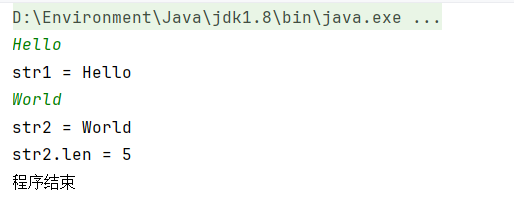

# Java Scanner类中.next()和.nextLine()方法的区别

`Scanner` 类是 `java.util` 包的一部分，用于获取基本类型的输入例如 `double`、`int` 和 `string`。

## Scanner中的next()方法

Scanner中的next()方法主要用于获取字符串的输入,它会**自动消去有效字符前的空白符**（如：空格、Tab键或者换行符），在获取有效字符之后，next()方法会**将其后输入的空白符作为结束符**，**该空白符仍保留在缓冲区中**。

```java
package com.atguigu.a_scanner;

import java.util.Scanner;

public class Demo01Scanner {
    public static void main(String[] args) {
        Scanner sc = new Scanner(System.in);
        String str1 = sc.next();
        System.out.println("str1 = " + str1);
        String str2 = sc.next();
        System.out.println("str2 = " + str2);
        String str3 = sc.next();
        System.out.println("str3 = " + str3);
    }
}

```


运行结果如图:


第一个单词Hello前输入了四个空格，一个Tab符和一个换行符，都被next()忽略了，Hello后面的换行符被next()视为结束符,第一次读取结束，并且换行符仍遗留在缓冲区中。

next()第二次读取时, 忽略缓冲区中遗留的换行符并读取第二个Hello，之后的空白符被视为结束符，第二次读取结束。

next()第三次读取时，忽略World前面的空白符并读取World。

## Scanner中的nextLine方法

nextLine()方法会**自动读取换行符之前的所有字符**（**并舍弃换行符**），因此可以得到带空格或者Tab键的字符串，但是nextLine不会忽略有效字符之前的空白符，也就是说加入输入`\nHello`，nextLine会把\n视为结束符并结束读取。

```java
package com.atguigu.a_scanner;

import java.util.Scanner;

public class Demo01Scanner {
    public static void main(String[] args) {
        Scanner sc = new Scanner(System.in);
        String str1 = sc.nextLine();
        System.out.println("str1 = " + str1);
        String str2 = sc.nextLine();
        System.out.println("str2 = " + str2);
        System.out.println("程序结束");
    }
}

```

运行结果如图：


Hello World之前有四个空格和一个Tab符都被nextLine读取了，而第二次输入时直接输入Enter，因此nextLine未读取到任何字符。

## next()和nextLine()使用

next()和nextLine()由于读取特性的不同，因此在混用时容易出现错误，如：

```java
package com.atguigu.a_scanner;

import java.util.Scanner;

public class Demo01Scanner {
    public static void main(String[] args) {
        Scanner sc = new Scanner(System.in);
        String str1 = sc.next();
        System.out.println("str1 = " + str1);
        String str2 = sc.nextLine();
        System.out.println("str2 = " + str2);
        System.out.println("str2.len = " + str2.length());
        System.out.println("程序结束");
    }
}

```

运行结果如图：


由于next()读取Hello后换行符仍保留在缓冲区，因此nextLine()检测到换行符会直接结束读取，str2的值为空白。

如果想要正确读取str2，可以在next()后面再加一个nextLine()过滤换行符：

```java
package com.atguigu.a_scanner;

import java.util.Scanner;

public class Demo01Scanner {
    public static void main(String[] args) {
        Scanner sc = new Scanner(System.in);
        String str1 = sc.next();
        sc.nextLine();
        System.out.println("str1 = " + str1);
        String str2 = sc.nextLine();
        System.out.println("str2 = " + str2);
        System.out.println("str2.len = " + str2.length());
        System.out.println("程序结束");
    }
}
```



> nextDouble() 、nextFloat()、nextInt() 等方法特性与next()方法一致

