# Java SE

## Java概述

### 1.⭐️什么是Java（有哪些特点）

Java是一门面向对象的编程语言，吸收了C++中大量优点，又抛弃了C++的缺点，如垃圾回收，指针

Java是一门平台无关的编程语言，即一次编译，处处运行

1. 简单易学
2. 面向对象（封装、继承、多态）
3. 平台无关性（Java虚拟机实现）
4. 支持多线程
5. 安全性（提供多重安全防护机制比如访问权限修饰符，限制程序直接访问操作系统资源）

## 基础语法

### 7.⭐️Java有哪些数据类型

java 的数据类型可以分为两种：**基本数据类型**和**引用数据类型**。

Java有8种基本类型：byte(8), short(16), int(32), long(64), float(32), double(64), char(16), boolean，这些基本类型有对应的封装类，基本数据类型（作为局部变量）直接存放在栈内存中。

其他类型都是引用类型：类，接口，数组，String等，引用类型变量存放的值是指向堆内存的地址，堆中存放的才是真正的值。

## 面向对象

### 18.⭐️面向对象编程有哪些特点

#### 封装

封装就是把一个对象的属性隐藏在对象内容，不允许外部对象直接访问对象的内部信息。但是可以提供一些可以被外部访问的方法来操作对象。

#### 继承

继承就是用已经存在的类作为基础建立新类的技术，新类的定义可以增加新的属性或者方法，也可以使用父类的功能，但不能选择性继承父类 。通过继承可以快速创建新类，提高代码的可重用性，程序的可维护性，节省创建新类的时间，提高开发效率。

继承有三个注意点：

1. 子类拥有父类的所有属性和方法，包括私有属性和私有方法，但是无法访问父类的私有属性和私有方法，只是拥有。
2. 子类可以拥有自己的属性和方法，即子类可以对父类进行扩展。
3. 子类可以用自己的方式实现父类的方法

#### 多态

多态就是一个对象具有多种状态（不同类的对象对同一消息作出响应），具体表现为父类的引用指向子类的实例。

多态的特点：

- 多态不能调用“只在子类存在但在父类不存在”的方法
- 如果子类重写了父类的方法，真正执行的是子类的方法；如果子类没有重写父类的方法，执行的是父类方法
- 引用类型调用的方法到底是哪个类中的方法，必须在程序运行期间才可以确定

### 20.⭐️重载和重写的区别

重载就是同一个类中，多个方法名相同的方法根据输入参数的不同做出不同的处理。

重写就是子类修改从父类继承过来的方法，要求方法名相同，参数列表也相同。同时返回值类型小于父类返回值类型，抛出的异常小于父类，访问修饰符需要大于等于父类方法。如果父类的方法修饰符为private，则子类中不能对该方法进行重写。

> 构造方法不能重写，因为构造方法需要保持与类名相同，而重写的需求子类保持与父类同名，如果重写构造方法，那么子类将会存在与类名不同的构造方法。

### 21.⭐️抽象类和接口有什么区别

#### 接口和抽象类的共同点

- **实例化：**接口和抽象类都不能实例化，只能被实现（接口）或者继承（抽象类）后才能创建具体的对象
- **抽象方法：**接口和抽象类都可以包含抽象方法，抽象方法没有方法体，只能在子类或者实现类中实现

#### 区别

- **设计目的：**接口主要是对**类的行为进行约束**，接口定义了一套行为规范，实现了某个接口就具有了对应的行为；抽象类主要是用于**描述事物的共性**，为多个相关的类提供一个共同的基础框架（包括状态的初始化）
- **继承和实现：**Java不支持类的多继承，一个类只能继承一个类（包括抽象类）；但是一个类可以实现多个接口，一个接口也可以继承多个其他接口。
- **成员变量：**接口中的成员变量必须是`public static final`类型（常量）的，不能被修改且必须有初始值。抽象类的成员变量可以有任何修饰符（`private`, `protected`, `public`），可以在子类中被重新定义或赋值
- 方法：抽象类可以有构造方法，接口不可以有构造方法。
  - Java 8 之前，**接口**中的方法默认是 `public abstract` ，也就是只能有方法声明。自 Java 8 起，可以在接口中定义 `default`（默认） 方法和 `static` （静态）方法。 自 Java 9 起，接口可以包含 `private` 方法。
  - 抽象类可以包含抽象方法和非抽象方法(普通方法)。抽象方法没有方法体必须在子类中实现；非抽象方法有具体的实现，可以在抽象类中实现或者在子类中重写。

### 29.⭐️为什么重写 equals 时必须重写 hashCode方法

hashCode()用于获取对象的哈希码，equals()用于比较两个对象是否相等。二者之间有约定：如果两个对象相等，那么他们必须有相同的哈希码；如果两个对象哈希码相等，但他们不一定相等（哈希碰撞）。

如果equals方法判断两个对象相等，那么他们的哈希码也必须相等。因此重写equals时也要重写hashCode方法，防止equals判断两对象相等，但是他们的哈希值不同。

## String

### 34.⭐️String、StringBuilder、StringBuffer有什么区别？

String，StringBuilder和StringBuffer都是java中用于处理字符串的，他们的区别是String的不可变的，平时开发用的最多；当遇到大量字符串拼接时，就需要用StringBuilder，他是可变的，不会生成很多新的对象；StringBuffer和StringBuilder类似，但是每个方法上都加了synchronized关键字，所以是线程安全的。

- **String**：适用于字符串内容不会改变的场景，比如说作为 HashMap 的 key。
- **StringBuilder**：适用于单线程环境下需要频繁修改字符串内容的场景，比如在循环中拼接或修改字符串，是 String 的完美替代品。
- **StringBuffer**：现在已经不怎么用了，因为一般不会在多线程场景下去频繁的修改字符串内容。

> **记忆：**StringBuffer的 "Buffer"（缓冲区）一词常与数据同步、缓存等概念关联，暗示它处理并发操作。StringBuilder的 "Builder"（构建器）则更侧重单线程下的构建操作。

## 异常处理

### 41.⭐️Java中的异常处理体系

Java中的异常处理机制用于处理程序运行过程中可能发生的各种异常情况，通常通过try-catch-finally语句和throw关键字实现


Throwable是java中所有错误和异常的基类，它有两个主要的子类：Error和Exception，这两个子类分别代表了Java异常处理体系中的两个分支

Error类代表那些严重的错误，通常程序无法处理，比如OutOfMemoryError表示内存不足，StackOverFlowError表示栈溢出，这些错误通常与JVM的运行状态有关，一旦发生，程序通常无法恢复。

Exception类代表程序可以处理的异常，分为两大类：编译时异常（Checked Exception）和运行时异常（Runtime Exception）。

1. 编译时异常（Checked Exception）：这类异常在编译时必须被显式处理（捕获或声明抛出）。

   如果方法可能抛出某种编译时异常，但没有捕获它（try-catch）或没有在方法声明中用 throws 子句声明它，那么编译将不会通过。例如：IOException、SQLException 等。

2. 运行时异常（Runtime Exception）：这类异常在运行时抛出，它们都是 RuntimeException 的子类。对于运行时异常，Java 编译器不要求必须处理它们（即不需要捕获也不需要声明抛出）。

   运行时异常通常是由程序逻辑错误导致的，如 NullPointerException、IndexOutOfBoundsException 等

## I/O

### ？⭐️46.BIO、NIO、AIO之间的区别？

Java 常见的 IO 模型有三种：BIO、NIO 和 AIO


- BIO：采用阻塞式I/O模型，线程在执行I/O操作时被阻塞，无法处理其他任务，适用于连接数较少的场景

  

  > “每个连接一个线程”是 **BIO（同步阻塞I/O）** 模型的典型处理方式。这意味着，每当服务器接受（`accept`）一个新的客户端连接请求后，就会**为这个连接专门创建一个新的线程**，由这个线程全权负责处理该连接上的所有后续I/O操作

- NIO：采用非阻塞I/O模型，线程在等待I/O时可执行其他任务，通过Selector监控多个Channel上的事件，适用于连接数多但连接时间短的场景

  > NIO是一种同步非阻塞的IO模型，所以也可以叫NON-BLOCKINGIO。同步是指线程不断轮询IO事件是否就绪，非阻塞是指线程在等待IO的时候，可以同时做其他任务。 同步的核心就
  >
  > Selector（I/O多路复用），Selector代替了线程本身轮询IO事件，避免了阻塞同时减少了不必要的线程消耗；非阻塞的核心就是通道和缓冲区，当IO事件就绪时，可以通过写到缓冲区，保证IO的成功，而无需线程阻塞式地等待

- AIO：使用异步I/O模型，线程发起I/O请求后立即返回，当I/O操作完成时通过回调函数通知线程，适用于连接数多且连接时间长的场景

> **NIO 模型 (同步非阻塞)**：
>
> 你（应用线程）在餐厅。你想知道你的菜好了没有，**你不会一直站在出菜口等**（非阻塞）。相反，你**每隔几分钟就去出菜口问一下服务员**：“我的菜好了吗？”（`Selector.select()`轮询）。当服务员说“好了”时（事件就绪），你**需要自己走到出菜口，把菜端回座位**（同步的 `read`操作，数据拷贝）。在这个过程中，**“询问”是非阻塞的，但“端菜”这个核心动作必须由你亲自完成**。
>
> 
>
> **AIO 模型 (异步非阻塞)**：
>
> 你（应用线程）在餐厅。你点完菜后，**直接回到座位玩手机**（立即返回，线程自由）。你把你的**桌号**（回调函数）告诉了服务员。后厨（操作系统内核）会完成**做菜**（等待数据）和**上菜到你的餐桌**（数据拷贝）的所有工作。当菜上齐后，服务员**会来到你的桌边告诉你**：“先生/女士，您的菜齐了”（调用回调函数）。整个过程，你无需关心菜是怎么做的、怎么端上来的。

## 反射

### 52.⭐️什么是反射？应用？原理？

反射就是在程序运行期间动态的获取对象的属性和方法的功能。通过反射可以获取任意一个类或者对象的所有属性和方法，并调用这些方法和属性。

获取Class对象的三种方式：

- getClass()
- .class
- Class.forName()

反射的优缺点：

- 优点：运行期间能够动态获取类，提高代码的灵活性
- 缺点：性能比较慢，而且破环了java中内部细节不对外部公开的封装特性，所以滥用可能会导致一系列安全问题

反射的应用场景：

1. Spring 框架就大量使用了反射来动态加载和管理 Bean。
2. Java 的动态代理机制就使用了反射来创建代理类。代理类可以在运行时动态处理方法调用，这在实现 AOP 和拦截器时非常有用。
3. 最常见的是写通用的工具类，比如对象拷贝工具。比如说 BeanUtils、MapStruct 等等，能够自动拷贝两个对象之间的同名属性，就是通过反射来实现的。

反射的原理：

每个类加载到JVM后，都会在方法区生成一个对应的Class对象，这个对象包含了类的所有元信息，比如字段、方法、构造器、注解等。

通过这个Class对象，我们就能在运行时动态地创建对象、调用方法、访问字段。

# Java集合框架

## 引言

### 1.⭐️有哪些常见的集合框架

集合框架可以分为两条大的支线：

①、Collection 接口：最基本的集合框架表示方式，提供了添加、删除、清空等基本操作，它主要有三个子接口：

- `List`：一个有序的集合，可以包含重复的元素。实现类包括 ArrayList、LinkedList 等。
- `Set`：一个不包含重复元素的集合。实现类包括 HashSet、LinkedHashSet、TreeSet 等。
- `Queue`：一个用于保持元素队列的集合。实现类包括 PriorityQueue、ArrayDeque 等。

②、Map接口：表示键值对的集合，一个键映射到一个值。键不能重复，每个键只能对应一个值。Map 接口的实现类包括 HashMap、LinkedHashMap、TreeMap 等。

## List

### 2.⭐️ArrayList和LinkedList的区别

相同点：ArrayList和LinkedList都实现了List接口，它们都是有序集合，并且能存储重复的元素。它们都是线程不安全的 

不同点：ArrayList是数组实现，而LinkedList是双向链表实现，ArrayList是连续内存存储，适合随机访问，不适合数据的插入和删除。而LinkedList底层是链表，只能顺序访问，读写速度慢，插入删除速度快，且每个元素都要存放直接前驱和后继，每一个元素占用空间更多。

应用上：ArrayList适用于增删较少，查询多的场景，而LinkedList适用于查询少，增删较多的场景。

## Map

### 8.⭐️HashMap底层原理


jdk8之前的HashMap底层数据结构是`数组`+`链表`，jdk8之后是`数组`+`链表`+`红黑树`。

数组用于存储键值对，索引是对键的哈希值进行二次`hash()`（扰动函数）得到的，多个键通过哈希处理得到相同索引时，就需要通过链表解决哈希冲突。

但是当链表过长时，查询效率会比较低，所以当链表的长度超过8且数组长度超过64时，链表就会转化为红黑树，红黑树查询效率是 O(logn)，比链表的 O(n) 要快。

`hash()` 方法的目标是尽量减少哈希冲突，（使高位也参加运算）保证元素能够均匀地分布在数组的每个位置上。

```java
static final int hash(Object key) {
    int h;
    return (key == null) ? 0 : (h = key.hashCode()) ^ (h >>> 16);
}
```

> 如果键的哈希值已经在数组中存在，其对应的值将被新值覆盖。

HashMap 的初始容量是 16，随着元素的不断添加，HashMap 就需要进行扩容，阈值是`capacity * loadFactor`，capacity 为容量，loadFactor 为负载因子，默认为 0.75。

扩容后的新数组大小是原来的 2 倍，然后把原来的元素重新计算哈希值，放到新的数组中。

### 11.⭐️HashMap的put流程


1. 判断数组是否为空，如果为空，则对数组进行首次扩容，默认初始容量为16
2. 对key进行二次哈希得到索引值，如果索引对应的桶为空，则直接创建一个新节点放入数组中
   - 如果该位置已有元素，遍历桶内的元素检查key是否存在，如果存在，则value值覆盖旧值
   - 如果key不存在，将新的键值对插入对应的链表或红黑树中
3. 如果插入的是链表，新节点会插入到链表的末尾，插入后检查链表长度是否达到树化的阈值，如果当前链表长度>8且数组长度>64，则链表转化为红黑树，若链表长度>8且数组长度<64，数组扩容。
4. 如果插入的是红黑树，按照红黑树的规则插入新节点
5. 成功插入新节点后，判断当前元素数量是否超过扩容阈值，如果超过对数组进行扩容，并将现有的元素重新计算哈希值迁移到新数组中。

### 21.⭐️HashMap的扩容机制

扩容时，HashMap会创建一个新的数组，容量是原来的两倍，然后遍历旧哈希表中的元素，将其重新分配到新的哈希表中。

如果当前桶中只有一个元素，那么直接通过键的哈希值与数组大小取模得到新的索引位置：`e.hash & (newCap-1)`  （等价于`e.hash%newCap`)

如果当前桶是红黑树，那么会调`split`方法分裂树节点，以保证树的平衡。

如果当前桶是链表，会通过旧键的哈希值与旧的数组大小取模`(e.hash & oldCap)==0`作为判断条件，如果条件为真，元素保留在原索引位置；否则元素移动到原索引+旧数组大小位置

> #### 🔍 核心原理：2的幂次方容量带来的二进制魔法
>
> 这个优化的前提是：**HashMap的数组长度永远是2的幂次方**（如16, 32, 64...）。
>
> 当数组从 `oldCap`扩容到 `newCap`（`newCap = 2 * oldCap`）时，`newCap`在二进制表示上只是在 `oldCap`的最高位前面加了一个1。
>
> 让我们用二进制视角来看：
>
> ```markdown
> 假设 oldCap = 16 (二进制 10000)
> 则 newCap = 32 (二进制 100000)
>       oldCap-1 = 15 (二进制 01111)
>       newCap-1 = 31 (二进制 011111)
> ```
>
> **关键洞察**：`newCap-1`相比 `oldCap-1`，只是在**高位多了一个1**。这意味着，在计算新索引时，一个节点的新位置**完全取决于它的哈希值在“新增的那个比特位”上是0还是1**。
>
> #### ⚙️ `(e.hash & oldCap) == 0`的数学意义
>
> `oldCap`是2的幂，其二进制形式是 `1`后面跟若干个 `0`（例如16=`10000`）。`e.hash & oldCap`这个操作，**只检查 `e.hash`在 `oldCap`那个“1”所在的位上的值**。
>
> - 
>
>   如果 `(e.hash & oldCap) == 0`，说明 `e.hash`在那个特定位上是 **0**。
>
> - 
>
>   如果 `(e.hash & oldCap) != 0`，说明 `e.hash`在那个特定位上是 **1**。
>
> **为什么这个判断能决定新位置？**
>
> 因为新索引的计算公式是 `e.hash & (newCap-1)`。`newCap-1`比 `oldCap-1`多了一个高位的1。如果 `e.hash`在那个新增位上是0，那么 `e.hash & (newCap-1)`的结果和 `e.hash & (oldCap-1)`**完全相同**（因为高位与0相与还是0）。所以节点**留在原索引**。
>
> 如果 `e.hash`在那个新增位上是1，那么 `e.hash & (newCap-1)`的结果会比 `e.hash & (oldCap-1)`多出 `oldCap`的大小。所以节点**移动到原索引+oldCap**的位置。
>
> #### 📊 实例演算
>
> 假设 `oldCap = 16`，有两个节点，哈希值分别是 5 和 21。让我们手动计算：
>
> ```markdown
> oldCap = 16 (二进制 10000)
> newCap = 32 (二进制 100000)
> oldCap-1 = 15 (二进制 01111)
> newCap-1 = 31 (二进制 011111)
> 
> 节点A: hash = 5
> 二进制: 00101
> 原索引: 00101 & 01111 = 00101 (5)
> 判断: 00101 & 10000 = 00000 (0) -> 为真
> 新索引: 00101 & 011111 = 00101 (5) -> 留在原索引5
> 
> 节点B: hash = 21
> 二进制: 10101
> 原索引: 10101 & 01111 = 00101 (5) -> 和节点A冲突在一个桶
> 判断: 10101 & 10000 = 10000 (16) -> 不为0
> 新索引: 10101 & 011111 = 10101 (21) -> 新索引 = 5 + 16 = 21
> ```
>
> **看！** 原来在索引5的桶里的两个节点（5和21），扩容后被巧妙地拆分到了两个不同的桶：5留在索引5，21移动到了索引21（即5+16）。这个过程**不需要重新计算 `e.hash & (newCap-1)`**，只需要判断 `(e.hash & oldCap)`这一位。


> **红黑树拆分**确实比链表拆分开销大，但原因**不是索引计算**，而是**维护树结构的平衡**。主要开销在：
>
> 1. 
>
>    **遍历开销**：红黑树需要通过中序遍历来保证顺序，而链表只需要遍历next指针。
>
> 2. 
>
>    **重新树化**：拆分后的两个链表（低位和高位）如果长度仍然>8，需要**重新构建红黑树**（调用`treeify()`），这是一个O(n)的复杂操作，涉及重新平衡、着色、旋转等。
>
> 3. 
>
>    **可能退化为链表**：如果拆分后某个链表的长度<=6（`UNTREEIFY_THRESHOLD`），需要**退化成普通链表**。

### 24.⭐️HashMap是线程安全的吗

HashMap不是线程安全的，主要有以下几个问题：

1. 多线程下扩容会死循环，JDK7中的HashMap使用头插法处理链表，在多线程环境下扩容会出现环形链表，造成死循环。不过，JDK 8 时通过尾插法修复了这个问题，扩容时会保持链表原来的顺序。

   

   > 尾插法不会反转链表顺序，从而破坏了形成环形链表的必要条件——即两个线程看到并操作同一对节点时，它们的 `next`指针不会互相指向对方，形成“你指向我，我指向你”的闭环。

2. 多线程在put元素的时候，可能导致元素丢失，因为计算出来的位置可能被其他线程覆盖掉。比如说一个线程 put 3 的时候，另外一个线程 put 了 7，就把 3 给弄丢了。

3. **put和get并发时，可能导致get为null。线程 1 执行 put 时，因为元素个数超出阈值而扩容，线程 2 此时执行 get，就有可能出现这个问题。因为线程 1 执行完 table = newTab 之后（数据未完全迁移），线程 2 读取的table指向了newTable，比如说索引 3 的键值对应该移动到了索引 7 的位置但还未移动，此时线程 2 去 get 索引7的元素就 get 不到了。？？？*

### 25.⭐️怎么解决HashMap的线程不安全问题

早期的JDK版本中，可以使用HashTable保证线程安全，HashTable在其内部方法上加了synchronized关键字。

更常用的方法是使用concurrent并发包下的ConcurrentHashMap代替HashTable，它使用CAS+synchronized关键字保证线程安全

#### ConcurrentHashMap 线程安全的具体实现方式。

> 链接：https://www.nowcoder.com/questionTerminal/ca75442eb0034a8cb9ecbe6057de1f00?examPageSource=25mianshitop
> 来源：牛客网
>
> HashMap是线程不安全的，它的put操作首先是通过key和value计算出在HashMap中的下标座位，然后再将其生成的entry对象插入，那么这个时候，如果同时两个线程，都计算得到了相同的位置，那么都进行了插入操作，就会导致覆盖，也就是一个数据丢失。 而ConcurrentHashMap就是来解决这个问题的，但是它的性能会比HashTable要好。

ConcurrentHashMap是线程安全的集合，它的底层是数组+链表+红黑树实现的，采用锁定头结点（桶的第一个节点）的方式降低了锁的粒度，以较低的性能代缴实现了线程安全。

1. 初始化数组或头结点时，ConcurrentHashMap并没有加锁,而是CAS(Compare and Swap, 乐观锁的一种实现方式)的方式进行原子替换

    

   > “替换”的不是链表或树里的某个元素，而是数组槽位（或变量）里指向的整个对象头节点。

2. 插入元素时会进行加锁处理，但是锁定的不是整个数组而是桶/槽中的头结点

3. 扩容时会进行加锁处理,锁定的仍然是头节点。并且，支持多个线程同时对数组扩容,提高并发能力，在扩容的过程中,依然可以支持查找操作。

    

   > 每个线程需先以CAS操作抢任务,争抢一段连续槽位的数据转移权。抢到任务后,该线程会锁定槽内的头节点,然后将链表或树中的数据迁移到新的数组里。 
   >
   > 查找数据时并不会加锁,所以性能很好。另外,在扩容的过程中,依然可以支持查找操作。如果某个槽还未进行迁移,则直接可以从旧数组里找到数据。如果某个槽已经迁移完毕,但是整个扩容还没结束,则扩容线程会创建一个转发节点存入旧数组,届时查找线程根据转发节点的提示,从新数组中找到目标数据。  


# MYSQL

## MYSQL基础

### 1.⭐️什么是MYSQL

MYSQL是一个开源的关系型数据库，隶属于Orcale公司，是我们国内使用频率最高的一种数据库。

SQL指关系型数据库存储结构化数据。这些数据逻辑上以行列二维表的形式存在，每一列代表数据的一种属性，每一行代表一个数据实体。

NoSQL指非关系型数据库 ，主要代表：MongoDB，Redis。NoSQL 数据库逻辑上提供了不同于二维表的存储方式，存储方式可以是JSON文档、哈希表或者其他方式。

关系型数据库支持 ACID 即原子性，一致性，隔离性和持续性。相对而言，NoSQL 采用更宽松的模型 BASE ， 即基本可用，软状态和最终一致性

### 9.⭐️怎么存储emoji

因为 emoji（😊）是 4 个字节的 UTF-8 字符，而MYSQL的utf8字符集只支持三个字节的utf8字符，所以MYSQL存储emoji时，需要使用utf8mb4字符集。

```sql
ALTER TABLE mytable CONVERT TO CHARACTER SET utf8mb4 COLLATE utf8mb4_unicode_ci;
```

MySQL 8.0 已经默认支持 utf8mb4 字符集，可以通过 `SHOW VARIABLES WHERE Variable_name LIKE 'character\_set\_%' OR Variable_name LIKE 'collation%';` 查看。

## 数据库架构

### 21.⭐️一条查询语句是如何执行的

1. MYSQL服务器的连接器与客户端建立连接、获取权限、管理连接
2. 客户端发送SQL语句到MYSQL服务器
3. 解析器对SQL语句进行解析，进行语法和语义检查，生成解析树
4. 优化器对解析树进行优化，选择最优的执行计划（考虑索引、表连接顺序等）
5. 执行器调用存储引擎API进行数据的读写
6. 存储引擎负责查询数据，将执行结果返回给执行器，执行器将结果返回给客户端

## 存储引擎

### 24.⭐️MYSQL有哪些常见的存储引擎

- InnoDB支持事务、行级锁和外键约束，适合高并发场景，安全性高，是Mysql的默认引擎
- MyISAM：不支持事务，使用表级锁，不支持外键，适合读多写少场景
- Memory：使用内存存储，速度快但容易丢失数据

## 日志

### 28.⭐️MYSQL的日志文件有哪些

有六类，其中错误日志用于问题诊断，慢查询日志用于SQL性能分析，general log用于记录所有的SQL语句，binlog用于主从复制和数据恢复，redo log用于保证事务持久性，undo log用于事务回滚和MVCC


> ----这部分是帮助大家理解 start，面试中可不背----
>
> [面试官内心os：MySQL三大日志还得是你讲的好_哔哩哔哩_bilibili](https://www.bilibili.com/video/BV1hv3kzUEHQ/?spm_id_from=333.337.search-card.all.click&vd_source=8b64a620a3ee0b077147ede5438b3398)
>
> ①、错误日志（Error Log）：记录 MySQL 服务器启动、运行或停止时出现的问题。
>
> ②、慢查询日志（Slow Query Log）：记录执行时间超过 long_query_time 值的所有 SQL 语句。这个时间值是可配置的，默认情况下，慢查询日志功能是关闭的。
>
> ③、一般查询日志（General Query Log）：记录 MySQL 服务器的启动关闭信息，客户端的连接信息，以及更新、查询的 SQL 语句等。
>
> ④、**回滚日志**（Undo Log，或者叫事务日志）：记录数据被修改前的值，实现事务的**原子性**，主要用于**事务的回滚和MVCC**。
>
> 在 MySQL 中，为了提高性能，当你执行 `UPDATE` 语句时，数据库**并不会立即**把修改后的数据写回磁盘的 `.ibd` 文件。
>
> - **内存修改**：InnoDB 会先在内存的 **Buffer Pool** 中修改对应的页。此时，磁盘上的数据还是旧的，内存里的数据是新的（这被称为“脏页”）。
> - **异步刷盘**：InnoDB 会等待合适的时机，再批量将脏页刷入磁盘。
>
> **致命问题**：如果在脏页还没来得及刷入磁盘时，电源断了或进程崩了，**内存中的数据会全部丢失**。由于磁盘上还是旧数据，如果你不进行恢复，刚才那个“已提交”的事务就凭空消失了，这就违反了事务的 **持久性 (Durability)**。
>
> ⑤、**重做日志**（Redo Log）：记录的是物理页的修改（“在某个数据页做了什么修改”），主要用于实现事务的**持久性**。当数据库宕机时，依靠它进行恢复（Crash-safe），即数据库宕机后能恢复未提交的数据。
>
> redo log是磁盘顺序IO，mysql的缓存buffer pool将脏页刷盘是随机IO，速度慢得多，所以只要把redo log刷盘，即便mysql崩溃也能恢复数据。redo log也不是直接写入磁盘，它有自己的缓存redo log buffer
>
> 而redo log是**循环写**的，事务提交后redo log数据会被慢慢擦除，所以**不能用于主从复制和数据恢复**
>
> ⑥、**二进制日志**（Binary Log）：记录所有修改数据库状态的 SQL 语句，以及每个语句的执行时间，如 INSERT、UPDATE、DELETE 等，但不包括 SELECT 和 SHOW 这类的操作，主要**用于数据备份和主从复制**。是 **Server 层生成的日志，是追加写**。
>
> - redo log是物理日志，记录数据页的物理变化，如“表空间X、页Y、偏移Z处修改了N字节，旧值...新值...”；
>
> - bin log是逻辑日志，记录操作的逻辑语义，即类似于SQL语句本身
>
> ----这部分是帮助大家理解 end，面试中可不背----

### 30.？⭐️为什么redo log要两阶段提交

为了保证redo log和bin log中的数据一致性，防止主从复制和事务状态不一致


假如MYSQL在写入redo log之后（prepare阶段），写入bin log时崩溃，那么MYSQL重启后会回滚该事务。因为 redo log 不是提交状态。并且由于 binlog 中没有写入数据，所以从库也不会有该事务的数据。


加入MYSQL在写入bin log之后，redo log提交之前崩溃，那么MySQL 重启后 InnoDB 会提交该事务，因为 redo log 是完整的 prepare 状态。并且由于 binlog 中有写入数据，所以从库也会同步到该事务的数据。

> 两阶段提交，最终还是要看bin log，只要bin log刷盘，就能提交事务

> ### 只需要bin log不就能满足事务持久性和原子性了吗
>
> 不可以。仅靠 binlog 无法同时满足事务的**持久性 (Durability)** 和**原子性 (Atomicity)**。
>
> 根本原因在于 **binlog 自身不具备崩溃恢复 (crash-safe) 的能力**，而这是实现事务持久性和原子性的基石。具体来看：
>
> ------
>
> #### 🎯 角色定位：binlog 并非崩溃恢复日志
>
> - 
>
>   **binlog (二进制日志)**
>
>   - 
>
>     **层级**：MySQL **Server 层**的日志，与存储引擎无关。
>
>   - 
>
>     **内容**：记录逻辑操作，如“给某表某行加一”或“插入一行数据”。
>
>   - 
>
>     **用途**：主从复制、按时间点恢复数据 (PITR)。
>
>   - 
>
>     **致命缺陷**：它不记录数据页的物理状态，也没有“事务准备/提交”的状态标记。因此，一旦数据库宕机，binlog 无法独立判断哪些事务已完整提交、哪些需要回滚，也就无法将数据库恢复到一致状态。
>
> - 
>
>   **redo log (重做日志) & undo log (回滚日志)**
>
>   - 
>
>     **层级**：**InnoDB 存储引擎层**的日志。
>
>   - 
>
>     **核心作用**：
>
>     - 
>
>       **redo log**：保证**持久性**。采用 WAL (Write-Ahead Logging) 机制，先写日志再刷盘，确保已提交事务的修改不丢失。
>
>     - 
>
>       **undo log**：保证**原子性**和**隔离性**。记录数据修改前的旧版本，用于事务回滚和实现多版本并发控制 (MVCC)。
>
> ------
>
> #### ⚖️ 为什么 binlog 无法胜任？
>
> ##### 1. 无法满足原子性 (Atomicity)
>
> 原子性要求事务内的操作“要么全做，要么全不做”。
>
> - 
>
>   **崩溃场景**：事务执行中（部分修改已写入磁盘数据页），数据库突然宕机。
>
> - 
>
>   **binlog 的困境**：重启后，binlog 无法区分该事务哪些是已完成的操作，哪些不是。它只能机械地重放所有记录，这会导致部分修改被重复执行，破坏了原子性。
>
> - 
>
>   **InnoDB 的正确做法**：
>
>   1. 
>
>      先将修改写入 **redo log** 并标记为 `prepare`状态。
>
>   2. 
>
>      再写入 **binlog**。
>
>   3. 
>
>      最后将 redo log 状态更新为 `commit`。
>
>   崩溃恢复时，通过 **redo log** 的状态和 **binlog** 的存在性进行比对，决定是提交还是回滚事务，从而保证了原子性。
>
> ##### 2. 无法满足持久性 (Durability)
>
> 持久性要求一旦事务提交，其修改就永久保存。
>
> - 
>
>   **崩溃场景**：事务已提交，但修改的数据页仍在内存（Buffer Pool）中，未刷盘，此时宕机。
>
> - 
>
>   **binlog 的困境**：binlog 只负责记录“这个事务提交了”，但它不知道哪些数据页在内存中还未落盘。因此，它无法将这些已提交但未落盘的数据恢复，导致持久性无法保证。
>
> - 
>
>   **InnoDB 的正确做法**：
>
>   依赖 **redo log** 实现。只要事务提交时，其对应的 redo log 已强制刷盘 (`innodb_flush_log_at_trx_commit=1`)，那么即使数据页未刷盘，重启后也能通过重放 redo log 来恢复所有已提交的修改。
>
> ------
>
> #### 💡 结论：分工协作，缺一不可
>
> - 
>
>   **binlog**：是 MySQL **Server 层**的功能，用于复制和数据恢复，不保证崩溃安全。
>
> - 
>
>   **redo log + undo log**：是 **InnoDB 引擎层**的核心，共同保证了事务的 **ACID** 特性，特别是崩溃恢复能力。
>
> 因此，在 InnoDB 中，必须依赖 **redo log** 和 **undo log** 来实现事务的持久性和原子性，binlog 无法替代它们。

### 31.?⭐️Redo log的写入过程了解吗

InnoDB会现将redo log写入内存中的redo log buffer，然后以一定的频率刷入到磁盘中的redo log file中

> 哪些场景会触发redo log刷盘动作：redo log buffer空间不足时，事务提交时，触发check point时，后台线程定期刷盘时。
>
> 不过，Redo Log Buffer 刷盘到 Redo Log File 还会涉及到操作系统的磁盘缓存策略，可能不会立即刷盘，而是等待一定时间后才刷盘。

## SQL优化

### 32.⭐️什么是慢SQL

执行时间超过指定时间long_query_time的SQL叫做慢SQL，会被记录到慢查询日志中

#### 如何优化慢SQL

首先找到哪些比较慢的SQL，可以启用慢查询日志，记录那些超过指定时间的SQL

也可以使用`show processlist`命令查看当前正在执行的SQL语句，找出执行时间较长的SQL

然后使用`EXPLAIN`查看慢SQL的执行计划，看看有没有用索引，大部分情况下慢SQL的原因是没有用索引

```SQL
EXPLAIN SELECT * FROM your_table WHERE conditions;
```

最后，根据分析结果，通过添加索引、优化查询条件、减少返回字段等方式进行优化

> #### 慢sql日志怎么开启？
>
> 编辑 MySQL 的配置文件 my.cnf，设置 slow_query_log 参数为 1。
>
> ```sql
> [mysqld]
> slow_query_log = 1
> slow_query_log_file = /var/log/mysql/slow.log
> long_query_time = 2  # 记录执行时间超过2秒的查询
> ```
>
> 然后重启 MySQL 就好了。
>
> 也可以通过 set global 命令动态设置。
>
> ```sql
> SET GLOBAL slow_query_log = 'ON';
> SET GLOBAL slow_query_log_file = '/var/log/mysql/slow.log';
> SET GLOBAL long_query_time = 2;
> ```

### 33.？⭐️有哪些方法优化SQL

优化SQL的方法有很多，但本质上就是一句话：尽量少地扫描，尽快多地返回结果

最常见的做法就是加索引，改进SQL让他用上索引，比如说使用覆盖索引，让联合索引满足**最左前缀原则**（查询条件需要从索引的左侧字段开始）


#### 如何利用覆盖索引

覆盖索引的核心就是查询所需的字段都是在同一个索引中，这样就不要回表查询而是直接返回结果

实际应用中，我会优先考虑把where和select字段涉及的字段一起建立联合索引，并通过explain观察结果是否有using index，确认命中索引

#### ?如何进行分页优化

[MySQL 分页有什么性能问题？怎么优化？ | 小林coding | Java面试学习](https://xiaolincoding.com/mysql/index/limit.html)

分页优化的核心是避免深度偏移带来的全表扫描，可以通过两种方式来进行优化：延迟关联和添加书签

> “深度偏移带来的全表扫描”指的是，在使用 `LIMIT offset, size`进行分页查询时，当偏移量（`offset`）非常大，导致数据库被迫扫描海量数据行，其效率甚至可能退化到全表扫描的水平。
>
> 以典型的深度分页SQL为例：
>
> sql
>
> SELECT * FROM t_order
>
> ORDER BY id
>
> LIMIT 1000000, 10;
>
> 这句SQL的执行过程可以拆解为：
>
> 1. **定位起点**：根据 `ORDER BY id`，从索引中找到第 `1000000`条记录的位置。
> 2. **扫描与丢弃**：从该位置开始，连续读取 `1000000 + 10`条记录。
> 3. **返回结果**：将读取到的前 `1000000`条记录全部丢弃，只将最后的 `10`条返回给客户端。
>
> **核心痛点**：
>
> - **无效扫描**：为了获取最后10条数据，数据库必须“数”过前面100万条无关的记录，做了大量无用功。
> - **性能瓶颈**：随着 `offset`的增大，需要扫描和丢弃的数据量线性增长，查询耗时急剧上升，性能表现如同全表扫描 

#### 为什么分页会变慢

分页查询的效率问题主要是由于offset的存在，offset会导致数据库必须扫描offset+limit条数据，这个过程是非常耗时的

### 34.？⭐️EXPLAIN平时有用过吗


## 索引

### 35.⭐️什么是索引，有什么好处

索引类似于书的目录，可以减少扫描的数据量，提高查询效率

- 如果查询的时候没用到索引，就会全表扫描，时间复杂度为O(n)
- 如果用到了索引，那么查询的时候就可以基于二分查找算法（非叶子结点通过二分法找到符合页内范围包含查询值的页），mysql 索引的数据结构一般是 b+树，其搜索复杂度为O(logdN)

除了提高查询效率，索引还能加速排序、分组、连接等操作

### 36.⭐️介绍一下索引的分类

- **功能分类：**主键索引、唯一索引、普通索引、前缀索引、全文索引
- **数据结构分类：**B+树索引、哈希索引
- **物理分类：**聚簇索引、非聚簇索引
- **字段个数分类：**单列索引、联合索引

#### 功能分类

- 主键索引：是建立在主键字段的索引，用于唯一标识表中的每条记录，且其列值必须唯一且非空，通常在创建表的时候一起创建

- 唯一索引：是建立在UNIQUE字段上的索引，一张表可以有多个唯一索引，索引列必须唯一，但允许有空值

- 普通索引：就是建立在普通字段上的索引，既不要求字段为主键，也不要求字段为唯一

- 前缀索引：对字符类型的字段的前几个字符建立的索引，而不是在整个字段上建立的索引，目的是为了减少索引占用的存储空间，提高查询效率

- 全文索引：是mysql优化文本数据检索的一种特殊索引，适用于CHAR、VARCHAR 和 TEXT 等字段。使用倒排索引将字段中的文本内容进行分词，然后建立一个倒排表。性能比 `LIKE '%keyword%'` 高很多

  

  > **工作原理**
  >
  > 1. **分词 (Tokenization)**：将文本按词切分，并过滤掉“的”、“是”等停用词。
  > 2. **建立倒排索引**：为每个词建立一个索引，记录包含该词的文档ID和位置。
  > 3. **查询**：解析查询语句中的关键词，在倒排索引中快速查找匹配的文档，并按相关性排序返回。


#### 物理分类

- 聚簇索引：叶子结点存储完整的数据行
- 非聚簇索引（二级索引）：叶子结点只存储主键值

> 在创建表时，InnoDB 存储引擎会根据不同的场景选择不同的列作为索引： 
>
> 如果有主键，默认会使用主键作为聚簇索引的索引键（key）； 
>
> 如果没有主键，就选择第一个不包含 NULL 值的唯一列作为聚簇索引的索引键（key）；
>
>  在上面两个都没有的情况下，InnoDB 将自动生成一个隐式自增 id 列作为聚簇索引的索引键（key）； 
>
> 其它索引都属于辅助索引（Secondary Index），也被称为二级索引或非聚簇索引。创建的主键索引和二级索引默认使用的是 B+Tree 索引。

### 37.⭐️创建索引有哪些注意点

1. **选择合适的字段**
   - 使用频繁出现在where，join，order by, group by 中的字段
   - 优先选择区分度高的字段，比如用户ID，手机号等唯一值多的，而不是性别，状态等区分度低的字段。
2. 控制索引数量，因为每个索引都要占用存储空间
3. 联合索引时使用最左前缀原则，即查询条件中使用联合索引的第一个字段。

### 38.⭐️索引哪些情况下会失效

比如索引使用了函数或表达式、使用通配符开头的模糊查询、联合索引不满足最左前缀原则，或者使用or的时候部分字段无索引

> 对索引列使用函数或表达式会导致索引失效
>
> ```java
> -- 索引失效
> SELECT * FROM users WHERE YEAR(create_time) = 2023;
> SELECT * FROM products WHERE price*2 > 100;
> 
> -- 优化方案（使用范围查询）
> SELECT * FROM users WHERE create_time BETWEEN '2023-01-01' AND '2023-12-31';
> SELECT * FROM products WHERE price > 50;
> ```

使用 `!=` 或 `<>` 不等值查询会导致索引失效

```java
SELECT * FROM user WHERE status != 1;  -- 若大部分行 `status=1`，可能全表扫描

-- 优化方案：使用范围查询
SELECT * FROM user WHERE status < 1 OR status > 1;
```

### 41.⭐️为什么InnoDB会使用B+树作为索引

因为B+树是一个高度平衡的多路查找树，能够有效降低磁盘I/O次数，并且支持有序遍历和范围查询。

- 相比哈希表：B+ 树支持范围查询和排序
- 相比二叉树和红黑树：B+ 树更“矮胖”，层级更少，磁盘 IO 次数更少
- 相比 B 树：非叶子节点只存储索引，叶子节点存储数据并通过链表连接，支持范围查找，I/O次数更少

> B+ 树的非叶子节点只存储索引，B树存储索引和完整的记录，因此数据量相同的条件下，B+树的非叶子节点可以存放更多的索引，层级更少，I/O次数更少。
>
> 叶子节点存储数据并通过链表连接，支持范围查询，而 B 树要实现范围查询，因此只能通过树的遍历来完成范围查询，这会涉及多个节点的磁盘 I/O 操作，范围查询效率不如 B+ 树。
>
> B+ 树有大量的冗余节点（所有非叶子节点都是冗余索引），这些冗余索引让 B+ 树在插入、删除的效率都更高，比如删除根节点的时候，不会像 B 树那样会发生复杂的树的变化；

### 42.⭐️一棵B+树能存储多少条数据

一棵B+树能存储多少条数据，取决于它的分支和高度。InnoDB中，页的默认大小是16KB，当主键为bigint（8字节）时，3 层 B+ 树通常可以存储约 2000 万条数据。

> [Innodb引擎中B+树一般有几层？能容纳多少数据量？ - yifanSJ - 博客园](https://www.cnblogs.com/yifanSJ/p/17662132.html)
>
> 一个非叶节点可容纳约**1170个**指针
>
> ①、页大小，默认 16KB
>
> ②、主键大小，假设是 bigint 类型，那么它的大小就是 8 个字节。
>
> ③、页指针大小，InnoDB 源码中设置为 6 字节，4 字节页号 + 2 字节页内偏移。
>
> 非叶子节点可以存储 16*1024/14(键值+指针)=1170 个这样的单元。
>
> 当层高为 2 时，根节点可以存储 1170 个指针，指向 1170 个叶子节点，所以总数据量为 1170×16 =18720 条。
>
> 当层高为 3 时，根节点指向 1170 个非叶子节点，每个非叶子节点再指向 1170 个叶子节点（假设一行记录数据大小为 1k），所以总数据量为 1170×1170×16≈21,902,400 条（约2,190万条）记录。

### 46.⭐️聚簇索引和非聚簇索引有什么区别

聚簇索引的叶子节点存储了完整的数据行，数据和索引是在一起的。InnoDB 的主键索引就是聚簇索引，叶子节点不仅存储了主键值，还存储了其他列的值，因此按照主键进行查询的速度会非常快。

每个表只能有一个聚簇索引，通常由主键定义。如果没有显式指定主键，InnoDB 会隐式创建一个隐藏的主键索引 row_id。

非聚簇索引的叶子节点只包含了主键值，需要通过回表按照主键去聚簇索引查找其他列的值，唯一索引、普通索引等非主键索引都是非聚簇索引。

### 47.⭐️什么是回表

回表就是使用非聚簇索引查询时，先通过非聚簇索引找到主键值，再根据主键值回到聚簇索引中查找完整的数据

#### 什么是MRR

MRR（Multi-Range Read Optimization，多范围读取优化）是InnoDB为了解决回表带来的大量随机IO问题引入的一种优化策略

它将非聚簇索引查到的主键值列表进行排序，然后按照顺序到主键索引中进行批量回表，这样就把随机IO转化为顺序IO，减少磁盘寻道时间提高缓存命中率。

### 48.⭐️什么是联合索引

联合索引就是把多个字段放在一个索引里，但必须遵守“最左前缀”原则，只有从第一个字段开始连续使用，索引才会生效。

> 联合索引会按字段顺序构建B+树。例如`（age, name）`索引会先按照 age 排序，age 相同则按照 name 排序，若两者都相同则按主键排序，确保叶子节点无重复索引项。
>
> 创建`(A,B,C)`联合索引相当于同时创建了`(A)`、`(A,B)`和`(A,B,C)`三个索引。
>
> 与单列索引不同的是，联合索引的每个节点会存储所有索引列的值，而不仅仅是第一列的值。例如，对于联合索引`(a,b,c)`，每个节点都包含 a、b、c 三列的值。

### 49.⭐️什么是覆盖索引

覆盖索引指的是：查询所需的字段全部都在索引中，不需要回表，从索引页就能直接返回结果。

可以将高频查询的字段（如 WHERE 条件和 SELECT 列）组合为联合索引，实现覆盖索引。

普通索引只用于加速查询条件的匹配，而覆盖索引还能直接提供查询结果。

### 50.⭐️什么是最左前缀原则

最左前缀原则指的是：MySQL 使用联合索引时，必须从联合索引的最左边的字段开始匹配，才能命中索引。

> 因为联合索引在 B+ 树中是按照最左字段优先排序构建的，如果跳过最左字段，MySQL 无法判断查找范围从哪里开始，自然也就无法使用索引

### 51.⭐️什么是索引下推

索引下推是指：MySQL 把 WHERE 条件尽可能“下推”到索引扫描阶段，即在存储引擎层提前过滤掉不符合条件的记录，而不需要到服务层进行条件过滤。

> 当查询条件包含索引列但未完全匹配时，ICP 会在存储引擎层过滤非索引列条件，以减少回表次数。
>
> 传统的查询流程是，存储引擎通过联合索引定位到符合最左前缀条件的主键 ID；回表读取完整数据行并返回给 Server 层；Server 层对所有返回的行进行 WHERE 条件过滤。
>
> 有了 ICP 后，存储引擎在索引层直接过滤可下推的条件，仅对符合索引条件的记录回表读取数据，再返回给 Server 层进行剩余条件过滤

## 锁

### 53.⭐️MYSQL中有几种锁

- **按锁的粒度：**表锁，行锁
- **按加锁机制：**乐观锁，悲观锁
- **兼容性：**共享锁，排它锁

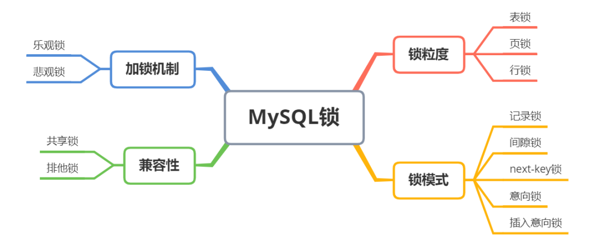

> 表锁：锁定整个表，资源开销小，加锁快，但并发度低，不会出现死锁；适合查询为主、少量更新的场景（如 MyISAM 引擎）
>
> 再细分的话，有表共享读锁（S锁）：允许多个事务同时读，但阻塞写操作；表独占写锁（X锁）：独占表，阻塞其他事务的读写。
>
> 行锁：锁定单行或多行，开销大、加锁慢，可能出现死锁，但并发度高（InnoDB 默认支持）。
>
> 再细分的话，有记录锁（Record Lock）：锁定索引中的具体记录；间隙锁（Gap Lock）：锁定索引记录之间的间隙，防止幻读；临键锁（Next-Key Lock）：结合记录锁和间隙锁，锁定一个左开右闭的区间（如 `(5, 10]`）。
>
> 共享锁（S锁/读锁），允许多个事务同时读取数据，但阻塞写操作。语法：`SELECT ... LOCK IN SHARE MODE`
>
> 排他锁（X锁/写锁），独占数据，阻塞其他事务的读写。语法：`SELECT ... FOR UPDATE`。
>
> 乐观锁假设冲突少，通过版本号或 CAS 机制检测冲突（如 `UPDATE SET version=version+1 WHERE version=old_version`）。
>
> 悲观锁假设并发冲突频繁，先加锁再操作`SELECT FOR UPDATE`

### 55.⭐️MYSQL中的行锁

行锁是InnoDB存储引擎中最细粒度的锁，锁定表中一行记录，允许其他事务访问表中的其他行。

底层是通过给索引加锁实现的，也就意味着只有通过索引条件检索数据时，才能使用行级锁，否则会退化为表锁。

> 行锁又可以细分为**记录锁、间隙锁和临键锁**三种形式。通过 `SELECT ... FOR UPDATE` 可以加排他锁（临键锁）。通过 `SELECT ...LOCK IN SHARE MODE` 可以加共享锁。
>
> 上面这两条语句必须在一个事务中，因为当事务提交了，锁就会被释放，所以在使用这两条语句的时候，要加上 begin 或者 start transaction 开启事务的语句。 除了上面这两条锁定读语句会加行级锁之外，update 和 delete 操作都会加行级锁，且锁的类型都是排他锁(X型锁)。

#### select for update 有什么需要注意的？

> 当执行 SELECT * FROM users WHERE id > 1 FOR UPDATE 时，InnoDB存储引擎会为查询结果中的每一行获取排他锁。这意味着其他事务不能对这些行进行更新或删除操作，直到当前事务提交或回滚。这种锁的机制用于确保在事务中对这些行的修改是安全的，避免并发冲突。不过，这也可能导致死锁或性能问题，因此需要合理设计事务逻辑，尽量减少锁的持有时间和事务的复杂性。 作者：程序员小叶 链接：https://zhuanlan.zhihu.com/p/19475852216 来源：知乎 著作权归作者所有。商业转载请联系作者获得授权，非商业转载请注明出处。

第一，必须在事务中使用，否则锁会立即释放。

```sql
START TRANSACTION;
SELECT * FROM your_table WHERE id = 1 FOR UPDATE;
-- 对该行进行操作
COMMIT;
```

第二，使用时必须注意是否命中索引，否则可能锁全表。

```sql
-- name 没有索引，会退化为表锁
SELECT * FROM user WHERE name = '王二' FOR UPDATE;
```

#### 记录锁

记录锁是行锁最基本的表现形式，当我们使用唯一索引或者主键索引进行等值查询时，MySql会为该锁自动添加排它锁，禁止其他事务读取或者修改锁定记录。

#### 间隙锁（补充）

间隙锁用于在范围查询时锁定记录之间的“间隙”，防止其他事务在该范围内插入新记录。仅在可重复读及以上的隔离级别下生效，主要用于防止幻读。

### 58.⭐️乐观锁和悲观锁

悲观锁是一种先上锁再操作的保守策略，它假设数据被外界访问时一定会发生冲突，因此在数据处理过程中全程加锁，保证同一时间只有一个线程可以访问数据。

MySQL中的表锁和行锁都是悲观锁。

乐观锁假定并发操作发生冲突的概率小，因此不会在读取数据时加锁，而是在**提交更新时才检查数据是否被其他事务修改过**。

乐观锁不是MySQL内置的锁机制，而是通过程序逻辑实现的，常见的时间方式有版本号机制和时间戳机制，通过在表中增加 version 字段或者 timestamp 字段来实现。

## 事务

### 60.⭐️MySQL事务的四大特性

事务是一条或多条sql语句组成的执行单元。四个特性分别是：原子性、一致性、隔离性和持久性（ACID）。

原子性保证事务的操作要么全部成功，要么全部失败；一致性保证数据从事务开始前的一个一致状态转移到结束后的另一个一致状态；隔离性保证并发事务之间互不干扰；持久性保证事务提交后数据不会丢失。

> 一致性确保数据的状态从一个一致状态转变为另一个一致状态。一致性与业务规则有关，比如银行转账，不论事务成功还是失败，转账双方的总金额应该是不变的。
>
> 隔离性主要是为了解决事务并发执行时可能出现的脏读、不可重复读、幻读等问题。


### 61.ACID靠什么保证的

ACID 中的原子性主要通过 Undo Log 来实现，持久性通过 Redo Log 来实现，隔离性由 MVCC 和锁机制来实现，一致性则由其他三大特性共同保证。

#### 如何保证隔离性

隔离性主要通过锁机制和 MVCC 来实现。

比如说一个事务正在修改某条数据时，MySQL 会通过临键锁来防止其他事务同时进行修改，避免数据冲突。

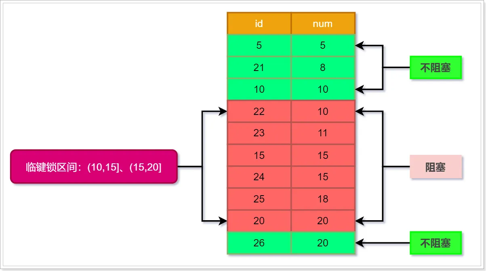阿里云社区：临键锁

同时，临键锁可以防止幻读现象的发生。比如事务 A 查询 `id > 10` 的记录，那么临键锁不仅会锁住 id=10 的行，还会锁住 10 后面的“间隙”，防止其他事务插入 id=15 的数据。

假如表中的主键有 `id: 5, 10, 15, 20, 25`，那么 InnoDB 会对以下区间和记录加锁：

| 加锁对象   | 类型   | 锁定含义                           |
| ---------- | ------ | ---------------------------------- |
| `(10, 15]` | 临键锁 | 锁住 id=15 和前间隙，防止插入11~14 |
| `(15, 20]` | 临键锁 | 锁住了 id=20 和前间隙              |
| `(20, 25]` | 临键锁 | 锁住了 id=25 和前间隙              |
| `(25, +∞)` | 间隙锁 | 锁住尾部防止插入30等               |

MVCC 主要用来优化读操作，通过保存数据的历史版本，让读操作不需要加锁就能直接读取快照，提高读的并发性能。

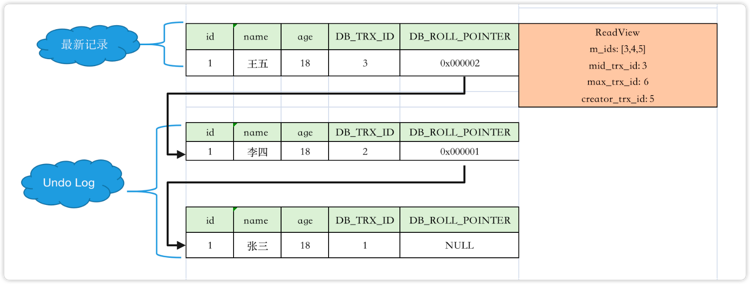小余哥：ReadView

不同的隔离级别对应不同的实现策略，比如说在可重复读隔离级别下，事务第一次查询时会生成一个 Read View，之后所有读操作都复用这个视图，保证多次读取的结果一致。、


### 62.⭐️事务的隔离级别有哪些

| 隔离级别                     | 是否会脏读 | 是否会不可重复读 | 是否会幻读                 |
| ---------------------------- | ---------- | ---------------- | -------------------------- |
| Read Uncommitted（读未提交） | ✅ 可能     | ✅ 可能           | ✅ 可能                     |
| Read Committed（读已提交）   | ❌ 不会     | ✅ 可能           | ✅ 可能                     |
| Repeatable Read（可重复读）  | ❌ 不会     | ❌ 不会           | ✅ 可能（但 InnoDB 已解决） |
| Serializable（可串行化）     | ❌ 不会     | ❌ 不会           | ❌ 不会                     |

隔离级别定义了一个事务可能受其他事务影响的程度，MySQL支持四种隔离级别，分别是：读未提交、读已提交、可重复读和串行化。

#### 读未提交

事务可以读取其他**未提交事务修改的数据**。也就是说，如果未提交的事务一旦回滚，读取到的数据就会变成了“脏数据”，通常不会使用。

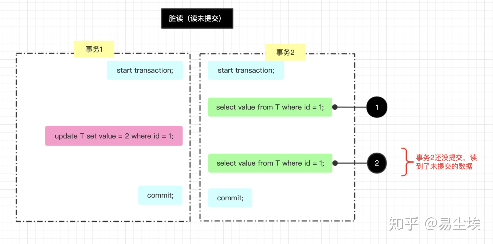

#### 读已提交

读已提交避免了脏读，但可能会出现不可重复读，即同一事务内多次读取同一数据结果会不同，因为其他事务**提交的修改**，对当前事务是可见的。

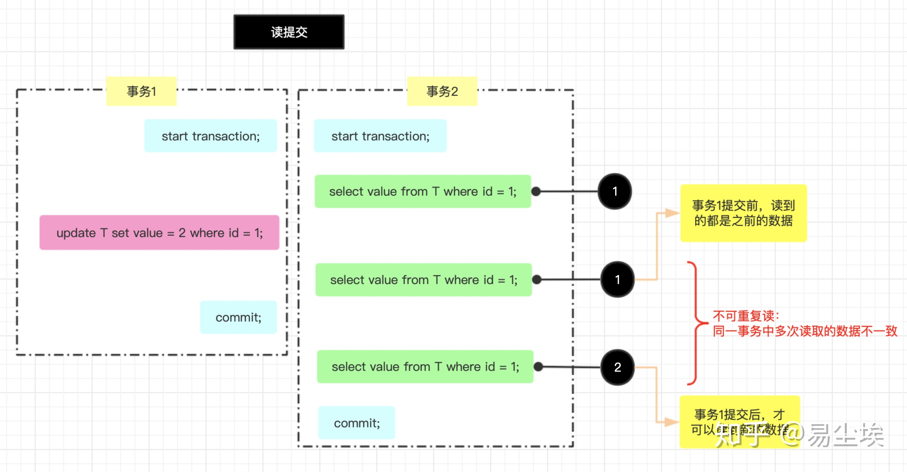

是 Oracle、SQL Server 等数据库的默认隔离级别。

#### 可重复读

可重复读能确保同一事务内多次读取相同数据的结果一致，即使其他事务已提交修改。

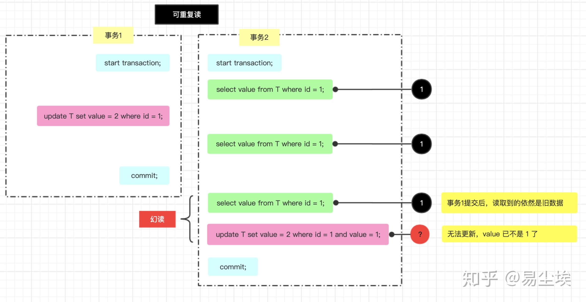

是 MySQL 默认的隔离级别，避免了“脏读”和“不可重复读”，但是有幻读问题。

> 幻读是数据库事务中的一种并发一致性问题，指同一事务在相同查询条件下，两次读取得到的结果集不同（返回的行数不一致，第二次读到了第一次没有的“新行”）。其核心特征是结果集数量的变化，区别于侧重于数据内容修改的不可重复读.
>
> 幻读发生的根本原因是在“可重复读”及以下隔离级别中，普通的一致性读（**快照读**）无法阻止其他事务插入新的、满足当前查询条件的数据 。它主要发生在数据库系统中并发操作较多的场景下

通过 MVCC 和临键锁也能在一定程度上避免幻读。

#### 串行化

串行化是最高的隔离级别，通过强制事务串行执行来解决“幻读”问题。但会导致大量的锁竞争问题，实际应用中很少用。

#### 如何更改事务的隔离级别

MySQL 支持通过 SET 语句修改事务隔离级别，包括全局级别、当前会话，但一般不建议在生产环境中随意修改隔离级别。

测试环境下可以使用 `SET SESSION TRANSACTION ISOLATION LEVEL REPEATABLE READ;` 可以修改当前会话的隔离级别。

使用 `SET GLOBAL TRANSACTION ISOLATION LEVEL READ COMMITTED;` 可以修改全局隔离级别，影响新的连接，但不会改变现有会话。

### 64.⭐️什么是幻读

幻读就是在同一个事务中，多次执行相同的范围查询，但是得到的结果集不同。种现象通常发生在其他事务在两次查询之间插入或删除了符合当前查询条件的数据。

#### 如何避免幻读

MySQL在可重复读的级别下，通过MVCC和临键锁可以一定程度上避免幻读。

比如说在查询时显示加锁，利用临键锁锁定查询范围，防止其他事务插入新的数据

```sql
START TRANSACTION;
SELECT * FROM user_info WHERE id > 1 FOR UPDATE; -- 加临键锁
COMMIT;
```

其他事务在插入数据时，会被阻塞，直到当前事务提交或回滚。

比如说在执行查询的事务中，不要尝试去更新其他事务插入/删除的数据，利用快照读来避免幻读

> 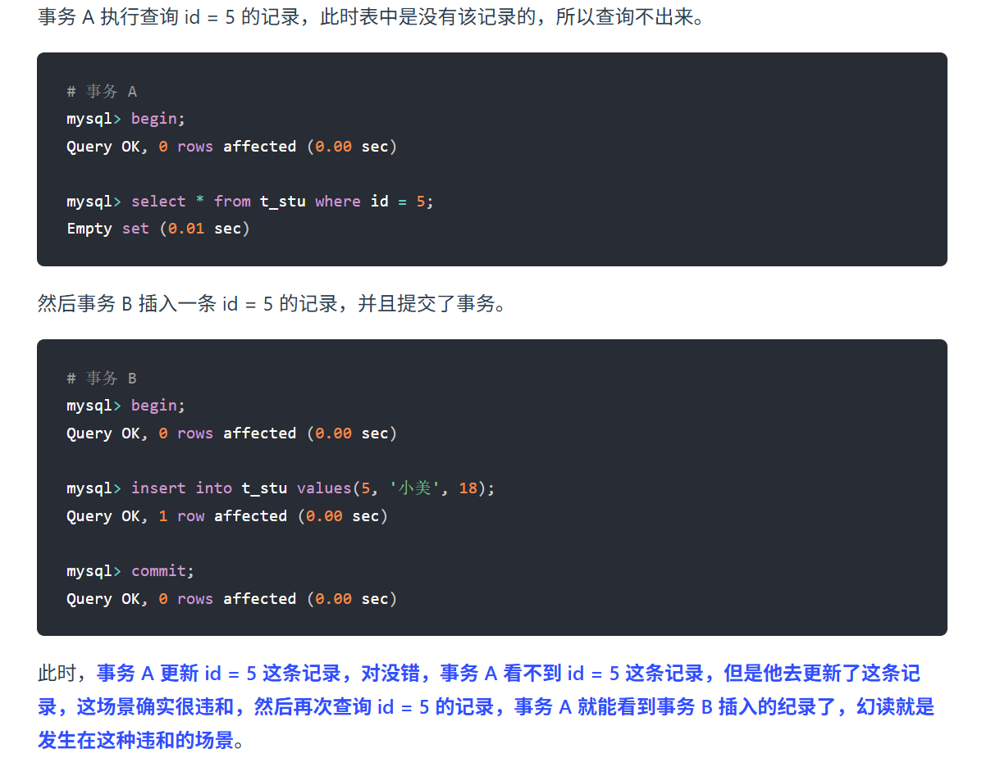

#### 什么是当前读

当前读是指读取记录的**最新已提交版本**，并且在读取时对**记录加锁**，确保其他并发事务不能修改当前记录。

比如 `SELECT ... LOCK IN SHARE MODE`、`SELECT ... FOR UPDATE`，以及 UPDATE、DELETE，都属于当前读。

**当前读的实现方式是行记录锁+间隙锁**

#### 为什么update和delete也是当前读

因为udpate和delete这些操作，本质上不仅是写操作，还要在写之前读数据，然后才能修改或删除。为了保证修改的是最新数据，并且防止并发冲突，InnoDB必须读取最新的数据并加锁，因此update和delete也是当前读。

> | SQL语句                                            | 是否当前读 | 是否加锁   |
> | -------------------------------------------------- | ---------- | ---------- |
> | `SELECT * FROM user WHERE id=1`                    | ❌ 否       | ❌ 否       |
> | `SELECT * FROM user WHERE id=1` FOR UPDATE         | ✅ 是       | ✅ 加排他锁 |
> | `SELECT * FROM user WHERE id=1 LOCK IN SHARE MODE` | ✅ 是       | ✅ 加共享锁 |
> | `UPDATE user SET ... WHERE id=1`                   | ✅ 是       | ✅ 加排他锁 |
> | `DELETE FROM user WHERE id=1`                      | ✅ 是       | ✅ 加排他锁 |

#### 什么是快照读

快照读是InnoDB通过MVCC实现的一种非阻塞读方法。当事务执行select查询时，InnoDB不会直接读取当前最新数据，而是根据事务开始时生成的Read View去判断每条记录的可见性，从而读取符合条件的历史版本。

> [Read View 在 MVCC 里如何工作的（ReadView是什么，什么时候创建） - lipu123 - 博客园](https://www.cnblogs.com/lipu123/p/18736151)
>
> ReadView（读视图）是 MVCC（多版本并发控制） 的核心机制，用于 **确定事务在快照读时能够看到数据库中的哪些数据版本**。它本质上是**一个事务在某一时间点对数据库状态的快照，记录了事务启动时系统的活跃事务信息**，并通过规则判断数据版本的可见性，从而解决读写冲突并实现事务隔离性。
>
>  ReadView 会记录 4 个重要的信息：
>
> - creator_trx_id：创建该 ReadView 的事务 ID。
> - m_ids：所有活跃事务的 ID 列表，活跃事务是指那些已经开始但尚未提交的事务。
> - min_trx_id：所有活跃事务中最小的事务 ID。它是 m_ids 数组中最小的事务 ID。
> - max_trx_id ：事务 ID 的最大值加一。换句话说，它是下一个将要生成的事务 ID。

### 65.⭐️MVCC了解吗

MVCC（Multi-Version Concurrency Control）指的是多版本并发控制，**每次修改数据时，都会生成一个新的版本，而不是直接在原有数据上进行修改**。并且每个事务只能看到在它开始之前已经提交的数据版本。这样的话，读操作就不会阻塞写操作，写操作也不会阻塞读操作，从而避免加锁带来的性能损耗。

其底层实现主要依赖于 Undo Log 和 Read View。

每次修改数据前，先**将记录拷贝到Undo Log**，并且每条记录会包含三个隐藏列，DB_TRX_ID 用来记录修改该行的事务 ID，DB_ROLL_PTR 用来指向 Undo Log 中的前一个版本，DB_ROW_ID 用来唯一标识该行数据（仅无主键时生成）。

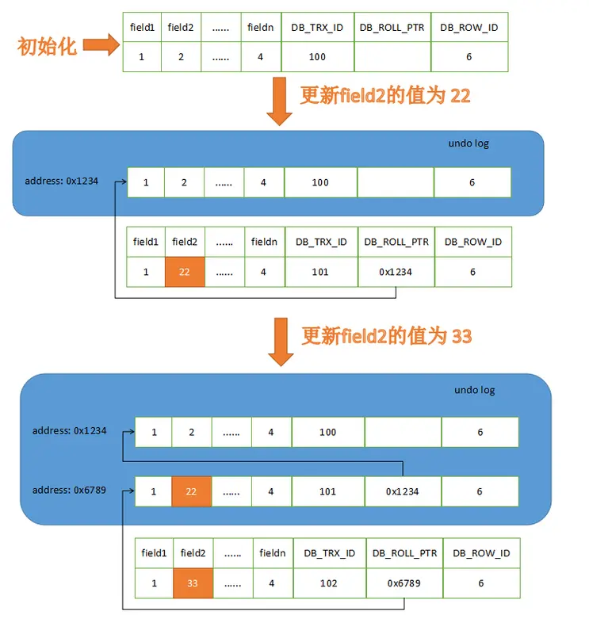

（读已提交）每次读取数据时，都会生成一个 ReadView，其中记录了当前活跃事务的 ID 集合、最小事务 ID（当前活跃事务的最小ID）、最大事务 ID （下一个应该生成的事务ID）等信息，通过与 DB_TRX_ID 进行对比，判断当前事务是否可以看到该数据版本。

#### 什么是版本链

版本链是指 InnoDB 中同一条记录的多个历史版本，通过 DB_ROLL_PTR 字段将它们像链表一样串起来，用来支持 MVCC 的快照读。

#### 什么是ReadView

ReadView是InnoDB为每一个事务创建的一份可见性视图，本质上是一个事务在某一时间点对数据库状态的快照，记录了该时间点系统的活跃事务信息，并通过规则判断数据版本的可见性，从而解决读写冲突并实现事务隔离性。

 ReadView 会记录 4 个重要的信息：

- creator_trx_id：创建该 ReadView 的事务 ID。
- m_ids：所有活跃事务的 ID 列表，活跃事务是指那些已经开始但尚未提交的事务。
- min_trx_id：所有活跃事务中最小的事务 ID。它是 m_ids 数组中最小的事务 ID。
- max_trx_id ：事务 ID 的最大值加一。换句话说，它是下一个将要生成的事务 ID。

> 通过上述参数，ReadView 对数据版本的可见性进行判断：
> 规则 1：若数据版本的事务 ID < min_trx_id，说明该版本在 ReadView 创建前已提交，**可见**。
> 规则 2：若事务 ID ≥ max_trx_id，说明该版本在 ReadView 创建后生成，**不可见**。
> 规则 3：若事务 ID 在 m_ids 中，说明该版本由未提交事务生成，**不可见**。
> 规则 4：若事务 ID 在 min_trx_id 和 max_trx_id 之间且不在 m_ids 中，**说明该版本已提交 ，可见**

#### 可重复读和读已提交在ReadView上有什么区别

可重复读：在事务第一次读取数据时生成一个 ReadView，这个 ReadView 会一直保持到事务结束，这样可以保证在事务中多次读取同一行数据时，读取到的数据是一致的。

读已提交：每次读取数据前都生成一个 ReadView，这样就能保证每次读取的数据都是最新的。

#### 如果两个 AB 事务并发修改一个变量，那么 A 读到的值是什么，怎么分析。

事务 A 在读取时是否能读到事务 B 的修改，取决于 A 是快照读还是当前读。如果是快照读，InnoDB 会使用 MVCC 的 ReadView 判断记录版本是否可见，若事务 B 尚未提交或在 A 的视图不可见，则 A 会读到旧值；如果是当前读，则需要加锁，若 B 已提交可直接读取，否则 A 会阻塞直到 B 结束。

## 高可用

### 70.⭐️一般是怎么分库的

分库的策略有两种，第一种是垂直分库：按照业务模块将不同的表拆分到不同的库中，比如说用户、登录、权限等表放在用户库中，商品、分类、库存放在商品库中，优惠券、满减、秒杀放在活动库中。

第二种是水平分库：按照一定的策略将一个表中的数据拆分到多个库中，比如哈希分片和范围分片，对用户 id 进行取模运算或者范围划分，将数据分散到不同的库中。

### 71.⭐️怎么分表的

当单表超过 500 万条数据，就可以考虑水平分表了。比如说我们可以将文章表拆分成多个表，如 article_0、article_9999、article_19999 等。

在[技术派实战项目](https://javabetter.cn/zhishixingqiu/paicoding.html)中，我们将文章的基本信息和内容详情做了垂直分表处理，因为文章的内容会占用比较大的空间，在只需要查看文章基本信息时把文章详情也带出来的话，就会占用更多的网络 IO 和内存导致查询变慢；而文章的基本信息，如标题、作者、状态等信息占用的空间较小，很适合不需要查询文章详情的场景。

# Redis

## 基础

### 1.⭐️说说什么是Redis

Redis是一种基于键值对的非关系型数据库（NoSQL）。

它的特点是把数据放在内存中，相比直接访问磁盘的关系型数据集，读写速度快很多，基本上能达到微妙级的响应。

所以在一些对性能要求很高的场景，如缓存热点数据，防止接口爆刷，都会用到Redis。

此外，Redis还支持持久化，还可以将内存中的数据异步落盘，以便服务宕机重启后能恢复数据。

#### Redis和MySQL的区别

Redis 属于非关系型数据库，数据是通过键值对的形式放在内存当中的；MySQL 属于关系型数据库，数据以行和列的形式存储在磁盘当中。

实际开发中，会将 MySQL 作为主存储，Redis 作为缓存，通过先查 Redis，未命中再查 MySQL 并写回Redis 的方式来提高系统的整体性能。

#### 部署过Redis吗

我只在本地部署过单机版，下载 Redis 的安装包，解压后运行 `redis-server` 命令即可。

#### Redis高可用方案部署过吗

有部署过哨兵机制，这是一个相对成熟的高可用解决方案，我们生产环境部署的是一主两从的 Redis 实例，再加上三个 Sentinel 节点监控它们。Sentinel 的配置相对简单，主要设置了故障转移的判定条件和超时阈值。

主节点配置：


```shell
port 6379
appendonly yes
```

从节点配置：


```shell
replicaof 192.168.1.10 6379
```

哨兵节点配置：


```shell
sentinel monitor mymaster 192.168.1.10 6379 2
sentinel down-after-milliseconds mymaster 5000
sentinel failover-timeout mymaster 60000
sentinel parallel-syncs mymaster 1
```

当主节点发生故障时，Sentinel 能够自动检测并协商选出新的主节点，这个过程大概需要 10-15 秒。

另一个大型项目中，我们使用了 Redis Cluster 集群方案。该项目数据量大且增长快，需要水平扩展能力。我们部署了 6 个主节点，每个主节点配备一个从节点，形成了一个 3主3从 的初始集群。Redis Cluster 的设置比 Sentinel 复杂一些，需要正确配置集群节点间通信、分片映射等。


```shell
redis-server redis-7000.conf
redis-server redis-7001.conf
...

# 使用 redis-cli 创建集群
# Redis 会自动将 key 哈希到 16384 个槽位
# 主节点均分槽位，从节点自动跟随
redis-cli --cluster create \
  127.0.0.1:7000 127.0.0.1:7001 127.0.0.1:7002 \
  127.0.0.1:7003 127.0.0.1:7004 127.0.0.1:7005 \
  --cluster-replicas 1
```

Redis Cluster 最大的优势是数据自动分片，我们可以通过简单地增加节点来扩展集群容量。此外，它的故障转移也很快，通常在几秒内就能完成。

对于一些轻量级应用，我也使用过主从复制加手动故障转移的方案。主节点负责读写操作，从节点负责读操作。手动故障转移时，我们会先将从节点提升为主节点，然后重新配置其他从节点。


```shell
# 1. 取消从节点身份
redis-cli -h <slave-ip> slaveof no one

# 2. 将其他从节点指向新的主节点
redis-cli -h <other-slave-ip> slaveof <new-master-ip> <port>
```

### 3.⭐️Redis有哪些数据类型

Redis 支持五种基本数据类型，分别是字符串、列表、哈希、集合和有序集合。

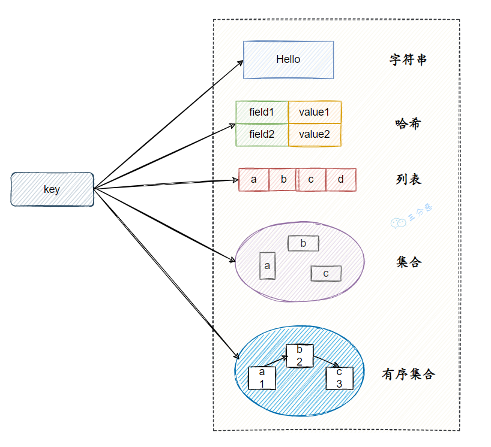

还有三种扩展数据类型，分别是用于位级操作的 Bitmap、用于基数估算的 HyperLogLog、支持存储和查询地理坐标的 GEO。

#### 详细介绍下字符串？

字符串是最基本的数据类型，可以存储文本、数字或者二进制数据，最大容量是 512 MB

适合缓存单个对象，比如验证码、token、计数器等。

#### 详细介绍下列表？

列表是一个有序的元素集合，支持从头部或尾部插入/删除元素，常用于消息队列或任务列表。

#### 详细介绍下哈希？

哈希是一个键值对集合，适合存储对象，如商品信息、用户信息等。比如说 `value = {name: '沉默王二', age: 18}`。

#### 详细介绍下集合？

集合是无序且不重复的，支持交集、并集操作，查询效率能达到 `O(1)` 级别，主要用于去重、标签、共同好友等场景。

#### 详细介绍下有序集合？

有序集合的元素按分数进行排序，支持范围查询，适用于排行榜或优先级队列。

#### 详细介绍下Bitmap？

Bitmap 可以把一组二进制位紧凑地存储在一块连续内存中，每一位代表一个对象的状态，比如是否签到、是否活跃等。

比如用户 0 的已签到 1、用户 1 未签到 0、用户 2 已签到，Redis 就会把这些状态放进一个连续的二进制串 `101`，1 亿用户签到仅需 `100,000,000 / 8 / 1024 ≈ 12MB` 的空间，真的省到离谱。

#### 详细介绍下HyperLogLog？

HyperLogLog 是一种用于基数统计的概率性数据结构，可以在仅有 12KB 的内存空间下，统计海量数据集中不重复元素的个数，误差率仅 0.81%。

底层基于 LogLog 算法改进，先把每个元素哈希成一个二进制串，然后取前 14 位进行分组，放到 16384 个桶中，记录每组最大的前导零数量，最后用一个近似公式推算出总体的基数。

#### 详细介绍下GEO？

GEO 用于存储和查询地理位置信息，可以用来计算两点之间的距离，查找某位置半径内的其他元素。

常见的应用场景包括：附近的人或者商家、计算外卖员和商家的距离、判断用户是否进入某个区域等。

底层基于 ZSet 实现，通过 Geohash 算法把经纬度编码成 score。

#### 为什么使用 hash 类型而不使用 string 类型序列化存储？

Hash 可以只读取或者修改某一个字段，而 String 需要一次性把整个对象取出来。

### 4.⭐️Redis为什么这么快

1. Redis 的所有数据都放在内存中，而内存的读写速度本身就比磁盘快几个数量级。

2. Redis 采用了基于 IO 多路复用技术的事件驱动模型来处理客户端请求和执行 Redis 命令。其中的 IO 多路复用技术可以在只有一个线程的情况下，同时监听成千上万个客户端连接，解决传统 IO 模型中每个连接都需要一个独立线程带来的性能开销。

   IO 多路复用会持续监听请求，然后把准备好的请求压入到一个队列当中，并将其有序地传递给文件事件分派器，最后由事件处理器来执行对应的 accept、read 和 write 请求。

   Redis 会根据操作系统选择最优的 IO 多路复用技术，比如 Linux 下使用 epoll，macOS 下使用 kqueue 等。

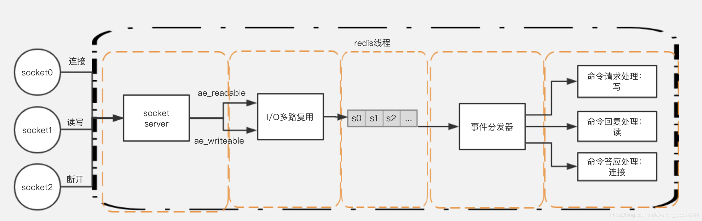

3. Redis 对底层数据结构做了极致的优化，比如说 String 的底层数据结构动态字符串支持动态扩容、预分配冗余空间，能够减少内存碎片和内存分配的开销。

## 持久化

### 10.⭐️Redis的持久化方式有哪些

主要有两种，RDB 和 AOF。RDB 通过创建时间点**快照**来实现持久化，AOF 通过**记录每个写操作命令**来实现持久化。

这两种方式可以单独使用，也可以同时使用。这样就可以保证 Redis 服务器在重启后不丢失数据，通过 RDB 和 AOF 文件来恢复内存中原有的数据。

#### 详细说一说RDB？

RDB 持久化机制可以在指定的时间间隔内将 Redis 某一时刻的数据保存到磁盘上的 RDB 文件中，当 Redis 重启时，可以通过加载这个 RDB 文件来恢复数据。

RDB 持久化可以通过 save 和 bgsave 命令手动触发，也可以通过配置文件中的 save 指令自动触发。

- save 命令会阻塞 Redis 进程，直到 RDB 文件创建完成。
- bgsave 命令会在后台 fork 一个子进程来执行 RDB 持久化操作，主进程不会被阻塞。

#### 什么情况下会自动触发RDB持久化

第一种，在 Redis 配置文件中设置 RDB 持久化参数 `save <seconds> <changes>`，表示在指定时间间隔内，如果有指定数量的键发生变化，就会自动触发 RDB 持久化。

```bash
save 900 1      # 900 秒（15 分钟）内有 1 个 key 发生变化，触发快照
save 300 10     # 300 秒（5 分钟）内有 10 个 key 发生变化，触发快照
save 60 10000   # 60 秒内有 10000 个 key 发生变化，触发快照
```

第二种，主从复制时，当从节点第一次连接到主节点时，主节点会自动执行 bgsave 生成 RDB 文件，并将其发送给从节点。

第三种，如果没有开启 AOF，执行 shutdown 命令时，Redis 会自动保存一次 RDB 文件，以确保数据不会丢失。

#### 详细说一说AOF？

AOF 通过记录每个写操作命令，并将其追加到 AOF 文件来实现持久化，Redis 服务器宕机后可以通过重新执行这些命令来恢复数据。

当 Redis 执行写操作时，会将写命令追加到 AOF 缓冲区；Redis 会根据同步策略将缓冲区的数据写入到 AOF 文件。

当 AOF 文件过大时，Redis 会自动进行 AOF 重写，剔除多余的命令，比如说多次对同一个 key 的 set 和 del，生成一个新的 AOF 文件；当 Redis 重启时，读取 AOF 文件中的命令并重新执行，以恢复数据。

#### AOF的刷盘策略了解吗

Redis 将 AOF 缓冲区的数据写入到 AOF 文件时，涉及两个系统调用：write 将数据写入到操作系统的缓冲区，fsync 将 OS 缓冲区的数据刷新到磁盘。

这里的刷盘涉及到三种策略：always、everysec 和 no。

- always：每次写命令执行完，立即调用 fsync 同步到磁盘，这样可以保证数据不丢失，但性能较差。
- everysec：每秒调用一次 fsync，将多条命令一次性同步到磁盘，性能较好，数据丢失的时间窗口为 1 秒。
- no：不主动调用 fsync，由操作系统决定，性能最好，但数据丢失的时间窗口不确定，依赖于操作系统的缓存策略，可能会丢失大量数据

可以通过配置文件中的 appendfsync 参数进行设置。


```bash
appendfsync everysec  # 每秒 fsync 一次
```

#### AOF的重写机制

由于 AOF 文件会随着写操作的增加而不断增长，为了解决这个问题， Redis 提供了重写机制来对 AOF 文件进行压缩和优化。

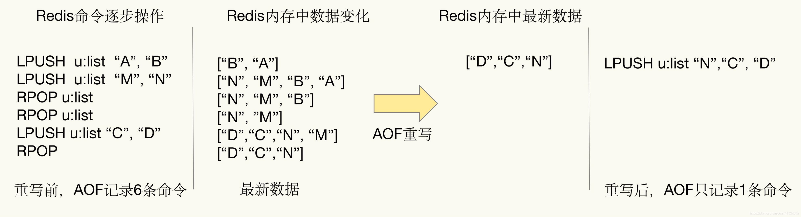

AOF 重写可以通过两种方式触发，第一种是手动执行 `BGREWRITEAOF` 命令，适用于需要立即减小AOF文件大小的场景。

第二种是在 Redis 配置文件中设置自动重写参数，比如说 `auto-aof-rewrite-percentage` 和 `auto-aof-rewrite-min-size`，表示当 AOF 文件大小超过指定值时，自动触发重写。

```shell
auto-aof-rewrite-percentage 100  # 默认值100，表示当前AOF文件大小相比上次重写后大小增长了多少百分比时触发重写
auto-aof-rewrite-min-size 64mb  # 默认值64MB，表示AOF文件至少要达到这个大小才会考虑重写
```

#### AOF重写具体过程是什么样的

Redis 在收到重写指令后，会创建一个子进程，并 fork 一份与父进程完全相同的数据副本，然后遍历内存中的所有键值对，生成重建它们所需的最少命令。

比如说多个 RPUSH 命令可以合并为一个带有多个参数的 RPUSH；

比如说一个键被设置后又被删除，这个键的所有操作都不会被写入新 AOF。

比如说使用 `SADD key member1 member2 member3` 代替多个单独的 `SADD key memberX`。

子进程在执行 AOF 重写的同时，主进程可以继续处理来自客户端的命令。

为了保证**数据一致性**，Redis 使用了 **AOF 重写缓冲区机制**，主进程在执行写操作时，会**将命令同时写入旧的 AOF 文件和重写缓冲区。**

等子进程完成重写后，会向主进程发送一个信号，主进程收到后将重写缓冲区中的命令追加到新的 AOF 文件中，然后调用操作系统的 rename，将旧的 AOF 文件替换为新的 AOF 文件。

```bash
主进程（fork）  
   │  
   ├─→ 子进程（生成新的 AOF 文件）  
   │       │  
   │       ├─→ 内存快照  
   │       ├─→ 写入临时 AOF 文件  
   │       ├─→ 通知主进程完成  
   │  
   ├─→ 主进程（追加缓冲区到新 AOF 文件）  
   ├─→ 替换旧 AOF 文件  
   ├─→ 重写完成
```

AOF 重写期间，Redis 服务器会处于特殊状态：

- aof_child_pid 不为 0，表示有子进程在执行 AOF 重写
- aof_rewrite_buf_blocks 链表不为空，存储 AOF 重写缓冲区内容

如果在配置文件中设置 no-appendfsync-on-rewrite 为 yes，那么重写期间可能会暂停 AOF 文件的 fsync 操作。

```shell
appendonly yes                # 开启AOF
appendfilename "appendonly.aof"  # AOF文件名
appendfsync everysec          # 写入磁盘策略
no-appendfsync-on-rewrite no  # 重写期间是否临时关闭fsync
auto-aof-rewrite-percentage 100   # AOF文件增长到原来多少百分比时触发重写
auto-aof-rewrite-min-size 64mb    # AOF文件最小多大时才允许重写
```

#### AOF文件存储的是什么类型的数据

AOF 文件存储的是 Redis 服务器接收到的写命令数据，以 Redis 协议格式保存。

这种格式的特点是，每个命令以*开头，后跟参数的数量，每个参数前用`$`符号，后跟参数字节长度，然后是参数的实际内容。

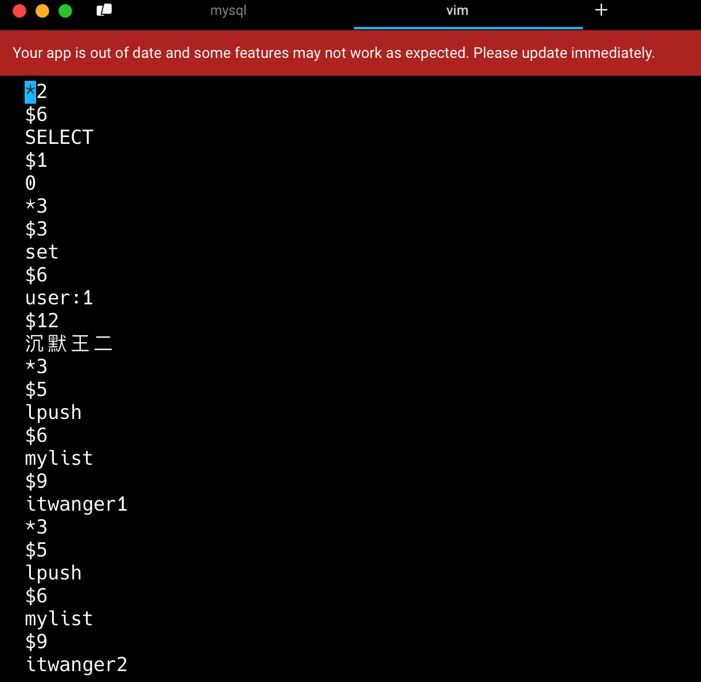

#### AOF重写期间命令可能会写入两次，会造成什么影响

AOF 重写期间命令会同时写入现有AOF文件和重写缓冲区，这种机制是有意设计的，并不会导致数据重复或不一致问题。

因为新旧文件是分离的，现有命令写入当前 AOF 文件，重写缓冲区的命令最终写入新的 AOF 文件，完成后，新文件通过原子性的 rename 操作替换旧文件。两个文件是完全分离的，不会导致同一个 AOF 文件中出现重复命令。

### 14.⭐️Redis4.0混合持久化了解吗

混合持久化结合了 RDB 和 AOF 两种方式的优点，解决了它们各自的不足。在 Redis 4.0 之前，我们要么面临 RDB 可能丢失数据的风险，要么承受 AOF 恢复慢的问题，很难两全其美。

混合持久化的工作原理非常巧妙：在 AOF 重写期间，先以 RDB 格式将内存中的数据快照保存到 AOF 文件的开头，再将重写期间的命令以 AOF 格式追加到文件末尾。

这样，当需要恢复数据时，Redis 先加载 RDB 格式的数据来快速恢复大部分的数据，然后通过重放命令恢复最近的数据，这样就能在保证数据完整性的同时，提升恢复速度

#### 如何设置持久化模型

启用混合持久化的方式非常简单，只需要在配置文件中设置 `aof-use-rdb-preamble yes` 就可以了

#### 你在开发中怎么配置RDB和AOF的

对于大多数生产环境，我倾向于使用混合持久化方式，结合 RDB 和 AOF 的优点。

```shell
# 启用AOF
appendonly yes

# 使用混合持久化
aof-use-rdb-preamble yes

# 每秒同步一次AOF，平衡性能和安全性
appendfsync everysec

# AOF重写触发条件：文件增长100%且至少达到64MB
auto-aof-rewrite-percentage 100
auto-aof-rewrite-min-size 64mb

# RDB备份策略
save 900 1    # 15分钟内有1个修改
save 300 10   # 5分钟内有10个修改
save 60 10000 # 1分钟内有10000个修改
```

对于于单纯的缓存场景，或者本地开发，我会只启用 RDB，关闭 AOF

```shell
# 禁用AOF
appendonly no

# 较宽松的RDB策略
save 3600 1    # 1小时内有1个修改
save 300 100   # 5分钟内有100个修改
```

而对于金融类等高一致性的系统，我通常会在关键时间窗口动态将 `appendfsync` 设置为 `always`

```shell
# 启用AOF
appendonly yes

# 使用混合持久化
aof-use-rdb-preamble yes

# 每个命令都同步（谨慎使用，性能影响大）
# 通常我会在关键时间窗口动态修改为always
appendfsync always

# 更频繁的RDB快照
save 300 1     # 5分钟内有1个修改
save 60 100    # 1分钟内有100个修改
```

另外，对于高并发场景，应该设置`no-appendfsync-on-rewrite yes`，避免 AOF 重写影响主进程性能；对于大型实例，也应该设置 `rdb-save-incremental-fsync yes` 来减少大型 RDB 保存对性能的影响


```shell
# AOF重写期间不fsync，AOF 重写期间，主进程不会对新写入的 AOF 缓冲区执行 fsync 操作（即不强制刷盘），而是等重写结束后再统一刷盘。
no-appendfsync-on-rewrite yes
# RDB 快照保存时采用增量 fsync，即每写入一定量的数据就执行一次 fsync，将数据分批同步到磁盘。
rdb-save-incremental-fsync yes
```

## 缓存设计

### 29.⭐️什么是缓存击穿、缓存穿透、缓存雪崩？

#### 缓存击穿

缓存击穿是指某个热点数据缓存过期时，大量请求就会穿透缓存直接访问数据库，导致数据库瞬间承受的压力巨大。

解决缓存击穿有两种常用的策略：

第一种是加互斥锁。当缓存失效时，第一个访问的线程先获取锁并负责重建缓存，其他线程等待或重试。

这种策略虽然会导致部分请求延迟，但实现起来相对简单。在[技术派实战项目](https://javabetter.cn/zhishixingqiu/paicoding.html)中，我们就使用了 Redisson 的分布式锁来确保只有一个服务实例能更新缓存。

第二种是永不过期策略。缓存项本身不设置过期时间，也就是永不过期，但在缓存值中维护一个逻辑过期时间。当缓存逻辑上过期时，返回旧值的同时，异步启动一个线程去更新缓存。

#### 缓存穿透

缓存穿透是指查询的数据在缓存中没有命中，因为数据压根不存在，所以请求会直接落到数据库上。如果这种查询非常频繁，就会给数据库造成很大的压力。

缓存击穿是因为单个热点数据缓存失效导致的，而缓存穿透是因为**查询的数据不存在**，原因可能是自身的业务代码有问题，或者是恶意攻击造成的，比如爬虫。

常用的解决方案有两种：

第一种是**布隆过滤器**，它是一种空间效率很高的数据结构，可以用来**判断一个元素是否在集合中。**

我们可以将所有可能存在的数据哈希到布隆过滤器中，查询时先检查布隆过滤器，如果布隆过滤器认为该数据不存在，就直接返回空；否则再去查询缓存，这样就可以避免无效的缓存查询。

第二种是缓存空值。对于不存在的数据，我们将空值写入缓存，并设置一个合理的过期时间。这样下次相同的查询就能直接从缓存返回，而不再访问数据库。

缓存空值的方法实现起来比较简单，但需要给空值设置一个合理的过期时间，以免数据库中新增了这些数据后，缓存仍然返回空值。

在实际的项目当中，还需要在接口层面做一些处理，比如说对参数进行校验，拦截明显不合理的请求；或者对疑似攻击的 IP 进行限流和封禁。

#### 缓存雪崩

缓存雪崩是指在某一时间段，大量缓存同时失效或者缓存服务突然宕机了，导致大量请求直接涌向数据库，导致数据库压力剧增，甚至引发系统崩溃的现象。

缓存击穿是单个热点数据失效导致的，缓存穿透是因为请求不存在的数据，而缓存雪崩是因为大范围的缓存失效。

缓存雪崩主要有三种成因和应对策略。

第一种，大量缓存同时过期，解决方法是添加**随机过期时间**。

第二种，缓存服务崩溃，解决方法是使用**高可用的缓存集群**。

比如说使用 Redis Cluster 构建多节点集群，确保数据在多个节点上有备份，并且支持自动故障转移

对于一些高频关键数据，可以配置本地缓存作为二级缓存，缓解 Redis 的压力。在[技术派实战项目](https://javabetter.cn/zhishixingqiu/paicoding.html)中，我们就采用了多级缓存的策略，其中就包括使用本地缓存 Caffeine 来作为二级缓存，当 Redis 出现问题时自动切换到本地缓存。

这个过程称为“缓存降级”，保证 Redis 发生故障时，系统能够继续提供服务。

第三种，缓存服务正常但并发请求量超过了缓存服务的承载能力，这种情况下可以采用**限流和降级措施。**

### 30.⭐️说一说布隆过滤器

布隆过滤器时一种空间效率极高的概率性数据结构，用于快速判断一个元素是否在一个集合中。它的特点是能用极小的内存消耗，判断一个元素“一定不在集合中”或“可能在集合中”，长用来解决redis缓存穿透问题。

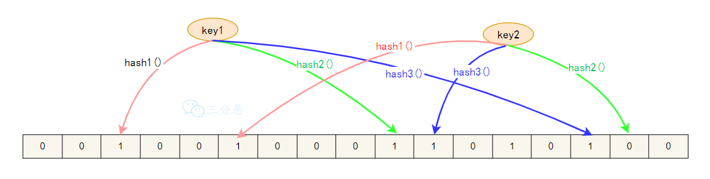

布隆过滤器的核心由一个很长的二进制向量和一系列哈希函数组成。

> - 初始化的时候，创建一个长度为 m 的位数组，初始值全为 0，同时选择 k 个不同的哈希函数
> - 当添加一个元素时，用 k 个哈希函数计算出 k 个哈希值，然后对 m 取模，得到 k 个位置，将这些位置的二进制位都设为 1
> - 当需要判断一个元素是否在集合中时，同样用 k 个哈希函数计算出 k 个位置，如果这些位置的二进制位有任何一个为 0，该元素一定不在集合中；如果全部为 1，则该元素可能在集合中
>
> ```java
> public class BloomFilter<T> {
>     private BitSet bitSet;
>     private int bitSetSize;
>     private int numberOfHashFunctions;
>     
>     public BloomFilter(double falsePositiveProbability, int expectedNumberOfElements) {
>         // 根据预期元素数量和期望的误判率，计算最优的位数组大小和哈希函数个数
>         this.bitSetSize = calculateOptimalBitSetSize(expectedNumberOfElements, falsePositiveProbability);
>         this.numberOfHashFunctions = calculateOptimalNumberOfHashFunctions(expectedNumberOfElements, bitSetSize);
>         this.bitSet = new BitSet(bitSetSize);
>     }
>     
>     public void add(T element) {
>         int[] hashes = createHashes(element);
>         for (int hash : hashes) {
>             bitSet.set(Math.abs(hash % bitSetSize), true);
>         }
>     }
>     
>     public boolean mightContain(T element) {
>         int[] hashes = createHashes(element);
>         for (int hash : hashes) {
>             if (!bitSet.get(Math.abs(hash % bitSetSize))) {
>                 return false; // 如果任何一位为0，元素一定不存在
>             }
>         }
>         return true; // 所有位都为1，元素可能存在
>     }
>     
>     // 其他辅助方法，如计算哈希值，计算最优参数等
> }
> ```

#### 布隆过滤器存在误判吗

布隆过滤器存在误判。它可能会错误地认为某个元素在集合中，而元素实际上并不在集合中。

但如果布隆过滤器认为某个元素不存在于集合中，那么它一定不存在。

误判产生的原因是因为哈希冲突。在布隆过滤器中，多个不同的元素可能映射到相同的位置。随着向布隆过滤器中添加的元素越来越多，位数组中的 1 也越来越多，发生哈希冲突的概率随之增加，误判率也就随之上。

> 误判率取决于以下 3 个因素：
>
> 1. 位数组的大小（m）：m 决定了可以存储的标志位数量。如果位数组过小，那么哈希碰撞的几率就会增加，从而导致更高的误判率。
> 2. 哈希函数的数量（k）：k 决定了每个元素在位数组中标记的位数。哈希函数越多，碰撞的概率也会相应变化。如果哈希函数太少，过滤器很快会变得不精确；如果太多，误判率也会升高，效率下降。
> 3. 存入的元素数量（n）：n 越多，哈希碰撞的几率越大，从而导致更高的误判率。
>
> 
>
> 要降低误判率，可以增加位数组的大小或者减少插入的元素数量。
>
> 要彻底解决布隆过滤器的误判问题，可以在布隆过滤器返回"可能存在"时，再通过数据库进行二次确认。

#### 布隆过滤器支持删除吗

布隆过滤器并不支持删除操作，这是它的一个重要限制。

当我们添加一个元素时，会将位数组中的 k 个位置设置为 1。由于多个不同元素可能共享相同的位，如果我们尝试删除一个元素，将其对应的 k 个位重置为 0，可能会错误地影响到其他元素的判断结果。

例如，元素 A 和元素 B 都将位置 5 设为 1，如果删除元素 A 时将位置 5 重置为 0，那么对元素 B 的查询就会产生错误的"不存在"结果，这违背了布隆过滤器的基本特性。

如果想要实现删除操作，可以使用计数布隆过滤器，它在每个位置上存储一个计数器而不是单一的位。这样可以通过减少计数器的值来实现删除操作，但会增加内存开销。

#### 为什么不能使用哈希表而是用布隆过滤器

布隆过滤器最突出的优势是内存效率。

假如我们要判断 10 亿个用户 ID 是否曾经访问过特定页面，使用哈希表至少需要 10G 内存（每个 ID 至少需要8字节），而使用布隆过滤器只需要 1.2G 内存。

```shell
m ≈ -n*ln(p)/ln(2)² ≈ -10⁹*ln(0.01)/ln(2)² ≈ 9.6 billion bits ≈ 1.2GB
```

### 31.⭐️如何保证缓存和数据库的数据一致性

在技术派中，对于文章标签这种允许短暂不一致的数据，采用Cache Aside+TTL过期机制保证缓存和数据库的一致性

具体做法是读取时先查 Redis，未命中再查 MySQL，同时为缓存设置一个合理的过期时间；更新时先更新 MySQL，再删除 Redis。

这种方式简单有效，适用于读多写少的场景。TTL 过期时间也能够保证即使更新操作失败，未能及时删除缓存，过期时间也能确保数据最终一致。

#### 为什么要删除缓存而不是更新缓存

首先，删除缓存速度比更新缓存的速度快得多，因为删除操作只是简单的 DEL 命令，而更新可能需要重新序列化整个对象再写入缓存。

其次，在并发环境下，如果更新缓存，可能出现缓存和数据库不一致的情况：操作 A 和操作 B 同时发生，A 先更新 MySQL 将值改为 10，B 后更新 MySQL 将值改为 11。但在缓存更新时，可能 B 先执行将缓存设为 11，然后 A 才执行将缓存设为10。这样就会造成 MySQL 是 11 但 Redis 是 10 的不一致状态。

而采用删除策略，无论 A 和 B 谁先删除缓存，后续的读取操作都会从 MySQL 获取最新值。

#### 为什么先更新数据库，再删除缓存

如果我们采用先删缓存再更新数据库的策略，在高并发场景下就可能出现数据不一致的问题：

- 线程 A 要更新用户信息，先删除了缓存
- 线程 B 恰好此时要读取该用户信息，发现缓存为空，于是查询数据库，此时还是旧值
- 线程 B 将查到的旧值重新放入缓存
- 线程 A 完成数据库更新

结果就是数据库是新的值，但缓存中还是旧值。

而采用先更新数据库再删缓存的策略，即使出现类似的并发情况，最坏的情况也只是短暂地从缓存中读取到了旧值，但缓存删除后的请求会直接从数据库中获取最新值。

另外，如果先删缓存再更新数据库，当数据库更新失败时，缓存已经被删除了。这会导致短期内所有读请求都会穿透到数据库，对数据库造成额外的压力。

而先更新数据库再删缓存，如果数据库更新失败，缓存保持原状，系统仍然能继续正常提供服务。

#### 如果对缓存数据库一致性要求高，怎么办

当业务对缓存与数据库的一致性要求很高时，比如支付系统、库存管理等场景，我会采用多种策略来保证强一致性。

第一种，引入消息队列来保证缓存最终被删除，比如说在数据库更新的事务中插入一条本地消息记录，事务提交后异步发送给 MQ 进行缓存删除。即使缓存删除失败，消息队列的**重试机制**也能保证最终一致性。

第二种，使用 [Canal](https://github.com/alibaba/canal) 监听 MySQL 的 binlog，在数据更新时，将数据变更记录到消息队列中，消费者消息监听到变更后去删除缓存。

这种方案的优势是完全解耦了业务代码和缓存维护逻辑。

当然了，如果说业务比较简单，不需要上消息队列，可以通过延迟双删策略降低缓存和数据库不一致的时间窗口，在第一次删除缓存之后，过一段时间之后，再次尝试删除缓存。

这种方式主要针对缓存不存在，但写入了脏数据的情况

最后，无论采用哪种策略，最好为缓存设置一个合理的过期时间作为最后的保障。即使所有的主动删除机制都失败了，TTL 也能确保数据最终达到一致。

## Redis运维

### 40.⭐️Redis有哪些内存淘汰策略

当内存使用接近 maxmemory 限制时，Redis 会依据内存淘汰策略来决定删除哪些 key 以缓解内存压力。

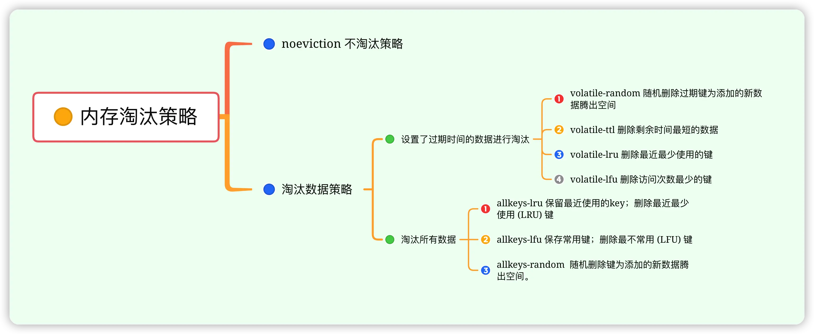

常用的内存淘汰策略有八种，分别是默认的 noeviction（不淘汰策略），内存不足时不会删除任何 key，直接返回错误信息，生产环境下基本上不会使用。

然后是针对所有 key 的 allkeys-lru、allkeys-lfu 和 allkeys-random。lru 会删除最近最少使用的 key（关注最后一次访问时间），在纯缓存场景中最常用，能自动保留热点数据；lfu 会删除最不经常使用 key（关注访问次数），更适合长期运行的系统；random 会随机删除一些 key，一般不推荐使用。

其次是**针对设置了过期时间的 key**，有 volatile-lru、volatile-lfu、volatile-ttl 和 volatile-random.

lru 在混合存储场景中经常使用。

```java
@Service
public class HybridStorageService {
    
    // 重要数据不设置过期时间，临时数据设置过期时间
    public void storeData(String key, Object data, DataImportance importance) {
        if (importance == DataImportance.HIGH) {
            // 重要数据不设置过期时间，在volatile-*策略下不会被淘汰
            redisTemplate.opsForValue().set(key, data);
        } else {
            // 临时数据设置过期时间，可以被volatile-*策略淘汰
            redisTemplate.opsForValue().set(key, data, Duration.ofHours(1));
        }
    }
}
```

lfu 适合需要保护某些重要数据不被淘汰的场景；ttl 优先删除即将过期的 key，在用户会话管理系统中推荐使用；random 仍然很少用。

## Redis应用

### 45.⭐️Redis支持事务吗

Redis 支持简单的事务，可以将 multi、exec、discard 和 watch 命令打包，然后一次性的按顺序执行。

基本流程是用 multi 开启事务，然后执行一系列命令，最后用 exec 提交。这些命令会被放入队列，在 exec 时批量执行。

当客户端处于非事务状态时，所有发送给 Redis 服务的命令都会立即执行；但当客户端进入事务状态之后，这些命令会被放入一个事务队列中，然后立即返回 QUEUED，表示命令已入队。

当 exec 命令执行时，Redis 会将事务队列中的所有命令按先进先出的顺序执行。当事务队列里的命令全部执行完毕后，Redis 会返回一个数组，包含每个命令的执行结果。

discard 命令用于取消一个事务，它会清空事务队列并退出事务状态。

watch 命令用于监视一个或者多个 key，如果这个 key 在事务执行之前 被其他命令改动，那么事务将会被打断。

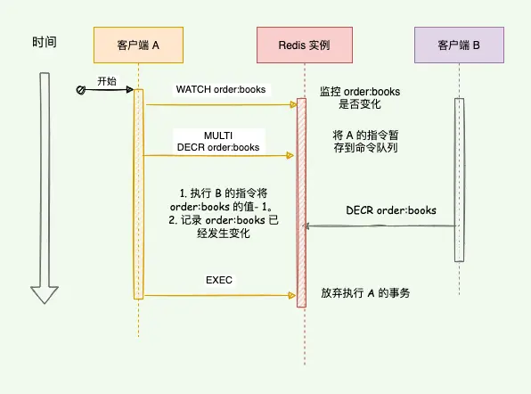

但 Redis 的事务与 MySQL 的有很大不同，它并不支持回滚，也不支持隔离级别。

#### Redis事务的原理

Redis 事务的原理并不复杂，核心就是一个"先排队，后执行"的机制。

当执行 MULTI 命令时，Redis 会给这个客户端打一个事务的标记，表示这个客户端后面发送的命令不会被立即执行，而是被放到一个队列里排队等着。

当 Redis 收到 EXEC 命令时，它会把队列里的命令一个个拿出来执行。因为 Redis 是单线程的，所以这个过程不会被其他命令打断，这就保证了Redis 事务的原子性。

当执行 WATCH 命令时，Redis 会将 key 添加到全局监视字典中；只要这些 key 在 EXEC 前被其他客户端修改，Redis 就会给相关客户端打上脏标记，EXEC 时发现事务已被干扰就会直接取消整个事务。

DISCARD 做的事情很简单直接，首先检查客户端是否真的在事务状态，如果不在就报错；如果在事务状态，就清空事务队列并退出事务状态。

#### Redis事务有哪些注意点

最重要的的一点是，Redis 事务不支持回滚，一旦 EXEC 命令被调用，所有命令都会被执行，即使有些命令可能执行失败。

#### 为什么不支持回滚

Redis 的核心设计理念是简单、高效，而不是完整的 ACID 特性。而实现回滚需要在执行过程中保存大量的状态信息，并在发生错误时逆向执行命令以恢复原始状态。这会增加 Redis 的复杂性和性能开销。

#### Redis事务满足原子性吗，怎么改进

Redis 的事务不能满足标准的原子性，因为它不支持事务回滚，也就是说，假如某个命令执行失败，整个事务并不会自动回滚到初始状态。

可以使用 Lua 脚本来替代事务，**脚本运行期间，Redis 不会处理其他命令**，并且我们可以**在脚本中处理整个业务逻辑**，包括条件检查和错误处理，保证要么执行成功，要么保持最初的状态，不会出现一个命令执行失败、其他命令执行成功的情况。

#### Redis事务的ACID特性如何体现

单个 Redis 命令的执行是原子性的，但 Redis 没有在事务上增加任何维持原子性的机制，所以 Redis 事务在执行过程中如果某个命令失败了，其他命令还是会继续执行，不会回滚。

一致性指的是，如果数据在执行事务之前是一致的，那么在事务执行之后，无论事务是否执行成功，数据也应该是一致的。但 Redis 事务并不保证一致性，因为如果事务中的某个命令失败了，其他命令仍然会执行，就会出现数据不一致的情况。

Redis 是单线程执行事务的，并且不会中断，直到执行完所有事务队列中的命令为止。因此，我认为 Redis 的事务具有隔离性的特征。

Redis 事务的持久性完全依赖于 Redis 本身的持久化机制，如果开启了 AOF，那么事务中的命令会作为一个整体记录到 AOF 文件中，当然也要看 AOF 的 fsync 策略。

如果只开启了 RDB，事务中的命令可能会在下次快照前丢失。如果两个都没有开启，肯定是不满足持久性的。

### 48.⭐️Redis能实现分布式锁吗

分布式锁是控制多个不同进程在分布式系统中访问共享资源的一种锁机制，它能确保在同一时刻，只有一个节点可以对资源进行访问，避免分布式场景下的并发问题。

可以使用 Redis 的 SETNX 命令实现简单的分布式锁。比如 `SET key value NX PX 3000` 就创建了一个锁名为 `key` 的分布式锁，锁的持有者为 `value`。NX 保证只有在 key 不存在时才能创建成功，EX 设置过期时间用以防止死锁（PX为毫秒过期时间）/ `setnx key value`。

#### Redis如何保证setnx不会发生冲突

当我们使用 `SET key value NX EX 30` 这个命令进行加锁时，Redis 会把整个操作当作一个原子指令来执行。因为 Redis 的命令处理是单线程的，所以在同一时刻只能有一个命令在执行。

比如说两个客户端 A 和 B 同时请求同一个锁：


```redis
客户端A: SET lock_key uuid_a NX EX 30
客户端B: SET lock_key uuid_b NX EX 30
```

虽然这两个请求可能几乎同时到达 Redis 服务器，但 Redis 会严格按照到达的先后顺序来处理。假设 A 的请求先到，Redis 会先执行 A 的 SET 命令，这时 lock_key 被设置为 uuid_a。

当处理 B 的请求时，因为 lock_key 已经存在了，NX 条件不满足，所以 B 的 SET 命令会失败，返回 NULL。这样就保证了只有 A 能获取到锁。

关键点在于 NX 的语义：`NOT EXISTS`，只有在 key 不存在的时候才会设置成功。Redis 在执行这个命令时，会先检查 key 是否存在，如果不存在才会设置值，这整个过程是原子的，不会被其他命令打断。

#### SETNX有什么问题，如何解决？

使用 SETNX 创建分布式锁时，虽然可以通过设置过期时间来避免死锁，但会误删锁。比如线程 A 获取锁后，业务执行时间比较长，锁过期了。这时线程 B 获取到锁，但线程 A 执行完业务逻辑后，会尝试删除锁，这时候删掉的其实是线程 B 的锁。

在获取锁时存入线程标示（可以用UUID表示），在释放锁时先获取锁中的线程标示，判断是否与当前线程标示一致。

可以通过锁的自动续期机制来解决**锁过期**的问题，比如 Redisson 的看门狗机制，在后台启动一个定时任务，每隔一段时间就检查锁是否还被当前线程持有，如果是就自动延长过期时间。这样既避免了死锁，又防止了锁被提前释放。

#### Redisson了解多少

Redisson 是一个基于 Redis 的 Java 客户端框架，它不只是对 Redis 的操作进行简单地封装，还提供了很多分布式的数据结构和服务，比如最常用的分布式锁。

Redisson 的分布式锁比 SETNX 完善的得多，它的看门狗机制可以让我们在获取锁的时候省去手动设置过期时间的步骤，它在内部封装了一个定时任务，每隔 10 秒会检查一次，如果当前线程还持有锁就自动续期 30 秒。

另外，Redisson 还提供了分布式限流器 RRateLimiter，基于令牌桶算法实现，用于控制分布式环境下的访问频率

#### 详细说说Redisson的看门狗机制

Redisson 的看门狗机制是一种自动续期机制，用于解决分布式锁的过期问题。

基本原理是这样的：当调用 `lock()` 方法加锁时，如果没有显式设置过期时间，Redisson 会默认给锁加一个 30 秒的过期时间，同时启用一个名为“看门狗”的定时任务，每隔 10 秒（默认是过期时间的 1/3），去检查一次锁是否还被当前线程持有，如果是，就自动续期，将过期时间延长到 30 秒。

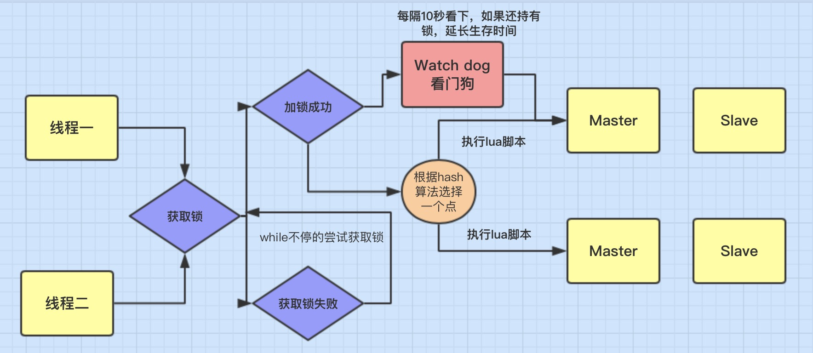

```java
// 伪代码展示核心逻辑
private void renewExpiration() {
    Timeout task = commandExecutor.getConnectionManager()
        .newTimeout(new TimerTask() {
            @Override
            public void run(Timeout timeout) {
                // 用 Lua 脚本检查并续期
                if (redis.call("get", lockKey) == currentThreadId) {
                    redis.call("expire", lockKey, 30);
                    // 递归调用，继续下一次续期
                    renewExpiration();
                }
            }
        }, 10, TimeUnit.SECONDS);
}
```

续期的 Lua 脚本会检查锁的 value 是否匹配当前线程，如果匹配就延长过期时间。这样就能保证只有锁的真正持有者才能续期。

当调用 `unlock()` 方法时，看门狗任务会被取消。或者如果业务逻辑执行完但忘记 unlock 了，看门狗也会帮我们自动检查锁，如果锁已经不属于当前线程了，也会自动停止续期。

这样我们就不用担心业务执行时间过长导致锁被提前释放，也避免了手动估算过期时间的麻烦，同时也解决了分布式环境下的死锁问题。

#### 看门狗机制中的检查锁过程是原子操作吗

是的，Redisson 使用了 Lua 脚本来保证锁检查的原子性。

Redis 在执行 Lua 脚本时，会把整个脚本当作一个命令来处理，期间不会执行其他命令。所以 hexists 检查和 expire 续期是原子执行的。

## 底层结构

### 49.⭐️？Redis都有哪些底层数据结构

Redis 之所以快，除了基于内存读写之外，还有很重要的一点就是它精心设计的底层数据结构。Redis 总共有 **8 种核心的底层数据结构**，我按照重要程度来说一下。

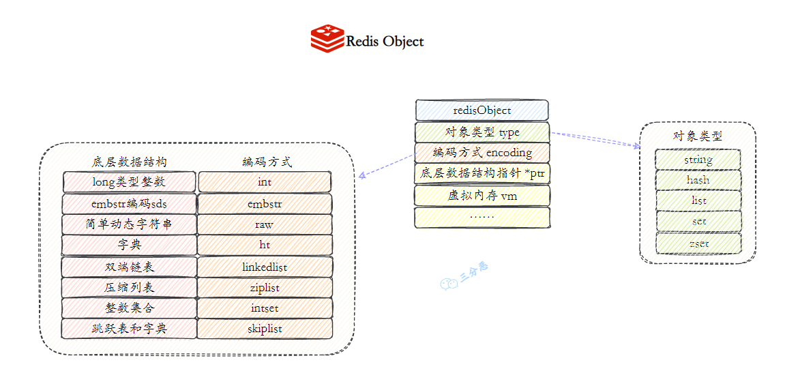

首先是SDS，这是Redis自己实现的动态字符串，保留了C语言原生的字符串长度，所以获取长度时间复杂度是O(1)，在此基础上还支持动态扩展以及存储二进制数据。

然后是字典，更底层是用数组+链表实现的哈希表。它的设计很巧妙，用了两个哈希表，平时用第一个，rehash 的时候用第二个，这样可以渐进式地进行扩容，不会阻塞太久。

接下来压缩列表 ziplist，这个设计很有意思。Redis 为了节省内存，设计了这种紧凑型的数据结构，把所有元素连续存储在一块内存里。但是它有个致命问题叫"连锁更新"，就是当我们修改一个元素的时候，可能会导致后面所有的元素都要重新编码，性能会急剧下降。

为了解决压缩列表的问题，Redis 后来设计了 quicklist。这个设计思路很聪明，它把 ziplist 拆分成小块，然后用双向链表把这些小块串起来。这样既保持了 ziplist 节省内存的优势，又避免了连锁更新的问题，因为每个小块的 ziplist 都不会太大。

再后来，Redis 又设计了 listpack，这个可以说是 ziplist 的完美替代品。它最大的特点是每个元素只记录自己的长度，不记录前一个元素的长度，这样就彻底解决了连锁更新的问题。Redis 5.0 已经用 listpack 替换了 ziplist。

跳表skiplist 主要用在 ZSet 中。它的设计很巧妙，通过多层指针来实现快速查找，平均时间复杂度是 `O(log N)`。相比红黑树，跳表的实现更简单，而且支持范围查询，这对 Redis 的有序集合来说很重要。

还有整数集合intset，当 Set 中都是整数且元素数量较少时使用，内部是一个有序数组，查找用的二分法。

最后是双向链表LinkedList，早期版本的 Redis 会在 List 中用到，但 Redis 3.2 后就被 quicklist 替代了，因为纯链表的问题是内存不连续，影响 CPU 缓存性能。

#### 简单介绍一下链表

Redis 的 linkedlist 是⼀个双向⽆环链表结构，和 Java 中的 [LinkedList](https://javabetter.cn/collection/linkedlist.html) 类似。

节点由 listNode 表示，每个节点都有指向其前置节点和后置节点的指针，头节点的前置和尾节点的后置均指向 null。

#### 说一说整数集合

整数集合是 Redis 中一个非常精巧的数据结构，当一个 Set 只包含整数元素，并且数量不多时，默认不超过 512 个，Redis 就会用 intset 来存储这些数据。

intset 最有意思的地方是类型升级机制。它有三种编码方式：16位、32位和 64位，会根据存储的整数大小动态调整。比如原来存的都是小整数，用 16 位编码就够了，但突然插入了一个很大的数，超出了 16 位的范围，这时整个数组会升级到 32 位编码。

当然了，这种升级是有代价的，因为需要重新分配内存并复制数据，并且是不可逆的，但它的好处是可以节省内存空间，特别是在存储大量小整数时。

另外，所有元素在数组中按照从小到大的顺序排列，这样就可以使用二分查找来定位元素，时间复杂度为 `O(log N)`。

#### 说一下zset的底层原理

zset是redis最复杂的数据类型，它有两种底层实现方式：压缩列表和跳表

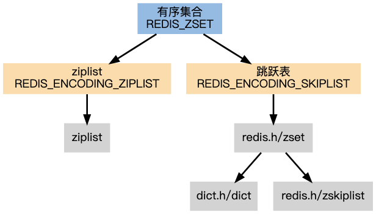

当保存的元素数量少于 128 个，且保存的所有元素大小都小于 64 字节时，Redis 会采用压缩列表的编码方式；否则就用跳表。当然，这两个条件都可以通过参数进行调整。

选择压缩列表作为底层实现时，每个元素会使用两个紧挨在一起的节点来保存：第一个节点保存元素的成员，第二个节点保存元素的分值。

所有元素按分值从小到大有序排列，小的放在靠近表头的位置，大的放在靠近表尾的位置。

但压缩列表的缺点是查找只能按顺序进行，时间复杂度为 `O(N)`，而且在最坏的情况下，插入和删除操作还可能会引起连锁更新。

当元素数量较多或元素较大时，Redis 会使用 skiplist 的编码方式；这个设计非常的巧妙，同时使用了两种数据结构：

```java
typedef struct zset {
    zskiplist *zsl;  // 跳跃表
    dict *dict;      // 字典
} zset;
```

跳表按分数有序保存所有元素，且支持范围查询（如 `ZRANGE`、`ZRANGEBYSCORE`），平均时间复杂度为 `O(log N)`。而哈希表则用来存储成员和分值的映射关系，查找时间复杂度为 `O(1)`。

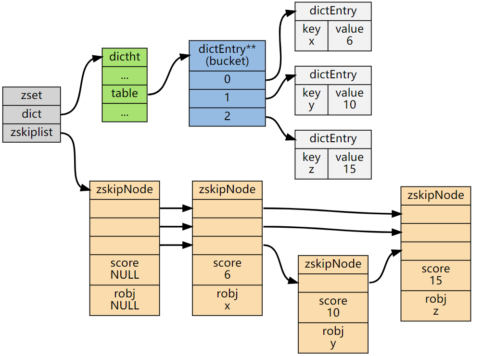

虽然同时使用两种结构，但它们会通过指针来共享相同元素的成员和分值，因此不会浪费额外的内存。

主要是为了解决压缩列表的一个核心问题——**连锁更新**。在压缩列表中，每个节点都需要记录前一个节点的长度信息。

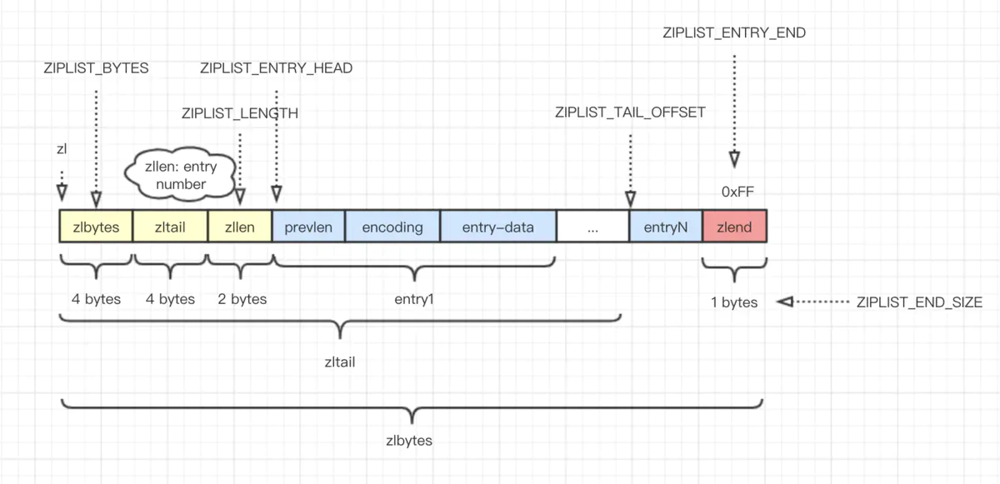

当插入或删除一个节点时，如果这个操作导致某个节点的长度发生了变化，那么后续的节点可能都需要更新它们存储的"前一个节点长度"字段。最坏的情况下，一次操作可能触发整个链表的更新，时间复杂度会从 `O(1)`退化到 `O(n²)`。

而 listpack 的设计理念完全不同。它让每个节点只记录自己的长度信息，不再依赖前一个节点的长度。**这样就从根本上避免了连锁更新的问题**

listpack 中的节点不再保存其前一个节点的长度，而是保存当前节点的编码类型、数据和长度。

#### 连锁更新是怎么发生的

比如说我们有一个压缩列表，其中有几个节点的长度都是 253 个字节。在 ziplist 的编码中，如果前一个节点的长度小于 254 字节，我们只需要 1 个字节来存储这个长度信息。

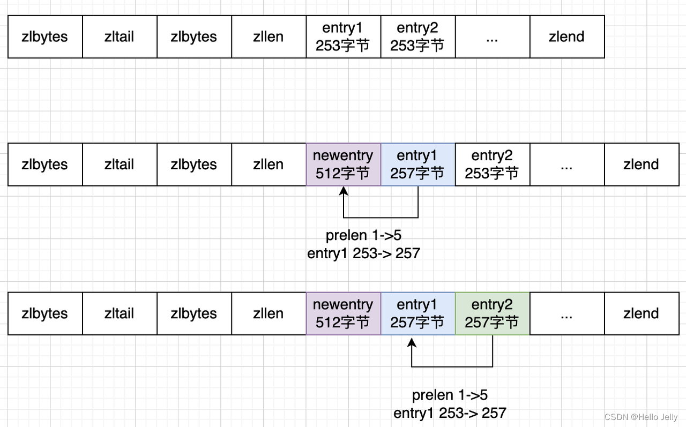

但如果在这些节点前面插入一个长度为 254 字节的节点，那么原来只需要 1 个字节存储长度的节点现在需要 5 个字节来存储长度信息。这就会导致后续所有节点的长度信息都需要更新。

### 52.⭐️？你了解跳表吗

跳表是一种非常巧妙的数据结构，它在有序链表的基础上建立了多层索引，最底层包含所有数据，每往上一层，节点数量就减少一半。（跳表本质上是一个多层链表，底层是一个包含所有元素的有序链表，上一层作为索引层，包含了下一层的部分节点；层数通过随机算法确定，理论上可以无限高。）

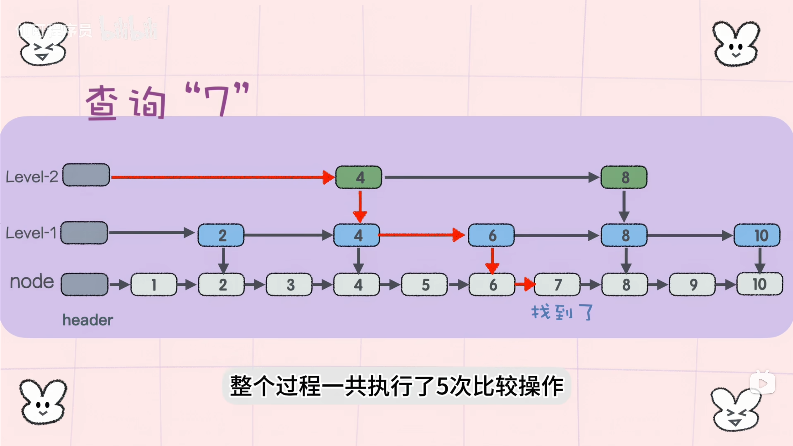

它的核心思想是"用空间换时间"，通过多层索引来跳过大量节点，从而提高查找效率。

每个节点有 50% 的概率只在第 1 层出现，25% 的概率在第 2 层出现，依此类推。查找的时候从最高层开始水平移动，当下一个节点值大于目标时，就向下跳一层，直到找到目标节点。

#### 怎么往跳表中插入节点

首先是找到插入位置，从最高层的头节点开始，在每一层都找到应该插入位置的前驱节点，用一个 update 数组把这些前驱节点记录下来。这个查找过程和普通查找一样，在每层向右移动直到下个节点的值大于要插入的值，然后下降到下一层。

接下来随机生成新节点的层数。通常用一个循环，每次有 50% 的概率继续往上，直到随机失败或达到最大层数限制。

创建新节点后，从底层开始到新节点的最高层，在每一层都进行标准的链表插入操作。这一步要利用之前记录的 update 数组，将新节点插入到正确位置，然后更新前后指针的连接关系。

#### zset为什么使用跳表

1. 跳表天然就是有序的数据结构，查找、插入和删除都能保持 `O(log n)` 的时间复杂度。
2. 跳表支持范围查询，找到起始位置后可以直接沿着底层链表顺序遍历，满足 ZRANGE 按排名获取元素，或者 ZRANGEBYSCORE 按分值范围获取元素。


# Java并发编程

## 基础

### 2.⭐️说说进程和线程的区别

进程就是应用程序在内存中分配的空间，也就是正在运行的程序，他是操作系统分配资源的最小单位。

线程就是进程的独立执行单元，多个线程可以共享同一个进程的资源，如内存；每个线程都有自己独立的栈和寄存器。

#### 如何理解协程

协程被视为比线程更轻量级的并发单元，可以在线程中实现并发执行，由开发者显式调度。

协程是在用户态进行调度的，避免线程切换时的内核态开销。

#### 线程之间如何通信的

原则上可以通过消息传递和共享内存两种方法实现，java采用的是共享内存的并发模型。

这个模型被称为java内存模型，简写为JMM，它决定了一个线程对共享变量的写入，何时对另外一个线程可见。当然了，本地内存是 JMM 的一个抽象概念，并不真实存在。

用一句话来概括就是：共享变量存储在主内存中，每个线程的私有本地内存，存储的是这个共享变量的副本。

> 回答的是底层原理，线程通信靠什么，不是具体实现方式（代码）

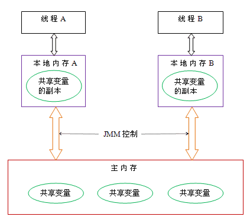

线程A和线程B之间要通信，需要经历两个步骤：

- 线程A把本地内存A中的共享变量副本刷新到主内存中。
- 线程 B 到主内存中读取线程 A 刷新过的共享变量，再同步到自己的共享变量副本中.

### 3.⭐️线程有几种创建方式

有三种，分别是继承Thread类，实现Runnable接口，实现Callable接口


第一种需要重写Thread的run方法，并调用start()方法启动线程。

```java
class ThreadTask extends Thread {
    public void run() {
        System.out.println("看完二哥的 Java 进阶之路，上岸了!");
    }

    public static void main(String[] args) {
        ThreadTask task = new ThreadTask();
        task.start();
    }
}
```


这种方法的缺点是，如果 这个类已经继承了另外一个类，就不能再继承 Thread 类了，因为 Java 不支持多重继承。

第二种需要重写 Runnable 接口的 `run()` 方法，并将实现类的对象作为参数传递给 Thread 对象的构造方法，最后调用 `start()` 方法启动线程。

```java
class RunnableTask implements Runnable {
    public void run() {
        System.out.println("看完二哥的 Java 进阶之路，上岸了!");
    }

    public static void main(String[] args) {
        RunnableTask task = new RunnableTask();
        Thread thread = new Thread(task);
        thread.start();
    }
}
```

这种方法的优点是可以避免 Java 的单继承限制，并且更符合面向对象的编程思想，因为 Runnable 接口**将任务代码和线程控制的代码解耦了**

第三种需要重写Callable接口的call()方法，然后创建FutureTask对象，参数为实现类对象，然后创建Thread对象，参数为FutureTask对象，最后调用start方法启动线程。

```java
class CallableTask implements Callable<String> {
    public String call() {
        return "看完二哥的 Java 进阶之路，上岸了!";
    }

    public static void main(String[] args) throws ExecutionException, InterruptedException {
        CallableTask task = new CallableTask();
        FutureTask<String> futureTask = new FutureTask<>(task);
        Thread thread = new Thread(futureTask);
        thread.start();
        System.out.println(futureTask.get());
    }
}
```

这种方法的优点是可以获取线程的执行结果。

#### 一个 8G 内存的系统最多能创建多少个线程?

推荐阅读：[深入理解 JVM 的运行时数据区](https://javabetter.cn/jvm/neicun-jiegou.html)

理论上大约 8000 个。

创建线程的时候，至少需要分配一个虚拟机栈，在 64 位操作系统中，默认大小为 1M，因此一个线程大约需要 1M 的内存。

但 JVM、操作系统本身的运行就要占一定的内存空间，所以实际上可以创建的线程数远比 8000 少。

详细解释一下。

可以通过 `java -XX:+PrintFlagsFinal -version | grep ThreadStackSize` 命令查看 JVM 栈的默认大小

#### 启动一个Java程序，你能说说里面有哪些线程吗

首先是main线程，他是程序执行的入口。

然后是垃圾回收线程，是一个后台线程，负责回收不再使用的对象。

然后是编译器线程，比如JIT，负责将一部分热点代码编译后放到codeCache中。

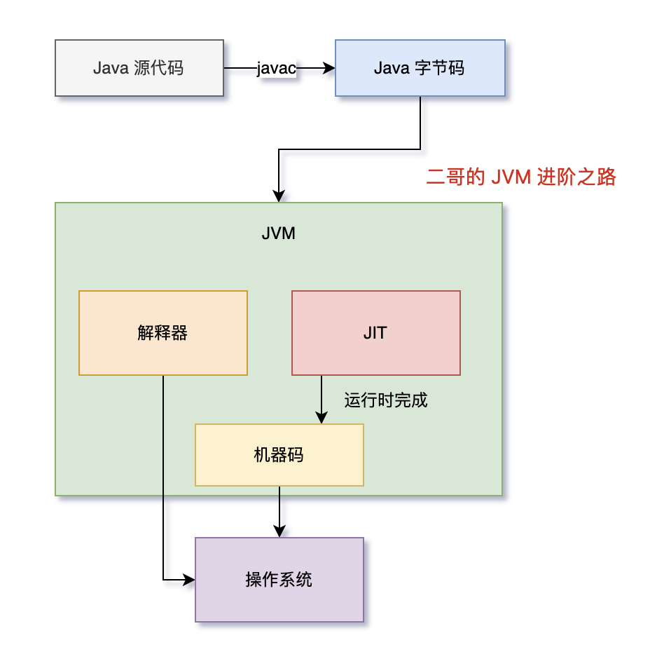

可以通过下面的代码进行检测：


```java
class ThreadLister {
    public static void main(String[] args) {
        // 获取所有线程的堆栈跟踪
        Map<Thread, StackTraceElement[]> threads = Thread.getAllStackTraces();
        for (Thread thread : threads.keySet()) {
            System.out.println("Thread: " + thread.getName() + " (ID=" + thread.getId() + ")");
        }
    }
}
```

结果如下所示：


```java
Thread: Monitor Ctrl-Break (ID=5)
Thread: Reference Handler (ID=2)
Thread: main (ID=1)
Thread: Signal Dispatcher (ID=4)
Thread: Finalizer (ID=3)
```

简单解释下：

- `Thread: main (ID=1)` - 主线程，Java 程序启动时由 JVM 创建。
- `Thread: Reference Handler (ID=2)` - 这个线程是用来处理引用对象的，如软引用、弱引用和虚引用。负责清理被 JVM 回收的对象。
- `Thread: Finalizer (ID=3)` - 终结器线程，负责调用对象的 finalize 方法。对象在垃圾回收器标记为可回收之前，由该线程执行其 finalize 方法，用于执行特定的资源释放操作。
- `Thread: Signal Dispatcher (ID=4)` - 信号调度线程，处理来自操作系统的信号，将它们转发给 JVM 进行进一步处理，例如响应中断、停止等信号。
- `Thread: Monitor Ctrl-Break (ID=5)` - 监视器线程，通常由一些特定的 IDE 创建，用于在开发过程中监控和管理程序执行或者处理中断

#### 你用过多线程吗，在代码中哪些场景使用

用得比较多，批量数据处理、异步任务处理、定时任务调度都需要用到多线程。

比如说在[技术派的首页内容加载](https://javabetter.cn/zhishixingqiu/paicoding.html)中，就用到了多线程来并行加载不同的模块，提高页面的响应速度.

在Ragent中，使用消息队列多线程异步处理文档入库和向量化、对话内容持久化等。

### 4.⭐️[调用 start 方法时会执行 run 方法，那怎么不直接调用 run方法？](https://javabetter.cn/sidebar/sanfene/javathread.html#_4-🌟调用-start-方法时会执行-run-方法-那怎么不直接调用-run方法)

调用 `start()` 会创建一个新的线程，并异步执行 `run()` 方法中的代码。

直接调用 `run()` 方法只是一个普通的同步方法调用，所有代码都在当前线程中执行，不会创建新线程。没有新的线程创建，也就达不到多线程并发的目的。

通过敲代码体验一下。


```java
class MyThread extends Thread {
    public void run() {
        System.out.println(Thread.currentThread().getName());
    }

    public static void main(String[] args) {
        MyThread t1 = new MyThread();
        t1.start(); // 正确的方式，创建一个新线程，并在新线程中执行 run()
        t1.run(); // 仅在主线程中执行 run()，没有创建新线程
    }
}
```

来看输出结果：


```java
main
Thread-0
```

也就是说，调用 `start()` 方法会通知 JVM，去调用底层的线程调度机制来启动新线程。

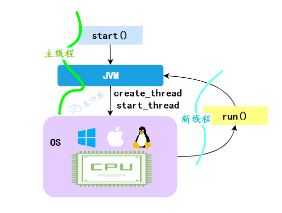

调用 `start()` 后，线程进入就绪状态，等待操作系统调度；一旦调度执行，线程会执行其 `run()` 方法中的代码。

### 6.⭐️线程有几种状态

六种

new 代表线程被创建但未启动；runnable 代表线程处于就绪或正在运行状态，由操作系统调度；blocked 代表线程被阻塞，等待获取锁；waiting 代表线程等待其他线程的通知或中断；timed_waiting 代表线程会等待一段时间，超时后自动恢复；terminated 代表线程执行完毕，生命周期结束。


也就是说，线程的生命周期可以分为五个主要阶段：新建、就绪、运行、阻塞和终止。线程在运行过程中会根据状态的变化在这些阶段之间切换。

```java
class ThreadStateExample {
    public static void main(String[] args) throws InterruptedException {
        Thread thread = new Thread(() -> {
            try {
                Thread.sleep(2000); // TIMED_WAITING
                synchronized (ThreadStateExample.class) {
                    ThreadStateExample.class.wait(); // WAITING
                }
            } catch (InterruptedException e) {
                Thread.currentThread().interrupt();
            }
        });

        System.out.println("State after creation: " + thread.getState()); // NEW

        thread.start();
        System.out.println("State after start: " + thread.getState()); // RUNNABLE

        Thread.sleep(500);
        System.out.println("State while sleeping: " + thread.getState()); // TIMED_WAITING

        synchronized (ThreadStateExample.class) {
            ThreadStateExample.class.notify(); // 唤醒线程
        }

        thread.join();
        System.out.println("State after termination: " + thread.getState()); // TERMINATED
    }
}
```

用一个表格来做个总结：

| 状态         | 说明                                                         |
| ------------ | ------------------------------------------------------------ |
| NEW          | 当线程被创建后，如通过`new Thread()`，它处于新建状态。此时，线程已经被分配了必要的资源，但还没有开始执行。 |
| RUNNABLE     | 当调用线程的`start()`方法后，线程进入可运行状态。在这个状态下，线程可能正在运行也可能正在等待获取 CPU 时间片，具体取决于线程调度器的调度策略。 |
| BLOCKED      | 线程在试图获取一个锁以进入同步块/方法时，如果锁被其他线程持有，线程将进入阻塞状态，直到它获取到锁。 |
| WAITING      | 线程进入等待状态是因为调用了如下方法之一：`Object.wait()`或`LockSupport.park()`。在等待状态下，线程需要其他线程显式地唤醒，否则不会自动执行。 |
| TIME_WAITING | 当线程调用带有超时参数的方法时，如`Thread.sleep(long millis)`、`Object.wait(long timeout)` 或`LockSupport.parkNanos()`，它将进入超时等待状态。线程在指定的等待时间过后会自动返回可运行状态。 |
| TERMINATED   | 当线程的`run()`方法执行完毕后，或者因为一个未捕获的异常终止了执行，线程进入终止状态。一旦线程终止，它的生命周期结束，不能再被重新启动。 |

#### 如何强制终止线程？

第一步，调用线程的 `interrupt()` 方法，请求终止线程。

第二步，在线程的 `run()` 方法中检查中断状态，如果线程被中断，就退出线程。

```java
class MyTask implements Runnable {
    @Override
    public void run() {
        while (!Thread.currentThread().isInterrupted()) {
            try {
                System.out.println("Running...");
                Thread.sleep(1000); // 模拟工作
            } catch (InterruptedException e) {
                // 捕获中断异常后，重置中断状态
                Thread.currentThread().interrupt();
                System.out.println("Thread interrupted, exiting...");
                break;
            }
        }
    }
}

public class Main {
    public static void main(String[] args) throws InterruptedException {
        Thread thread = new Thread(new MyTask());
        thread.start();
        Thread.sleep(3000); // 主线程等待3秒
        thread.interrupt(); // 请求终止线程
    }
}
```

### 10.⭐️sleep和wait的区别

sleep 会让当前线程休眠，不需要获取对象锁（持有锁也不会释放锁），属于 Thread 类的方法；wait 会让获得对象锁的线程等待，要提前获得对象锁，会释放锁，属于 Object 类的方法。

③、使用条件不同

- `sleep()` 方法可以在任何地方被调用。
- `wait()` 方法必须在同步代码块或同步方法中被调用，这是因为调用 `wait()` 方法的前提是当前线程必须持有对象的锁。否则会抛出 `IllegalMonitorStateException` 异常。

④、唤醒方式不同

- 调用 sleep 方法后，线程会进入 TIMED_WAITING 状态，即在指定的时间内暂停执行。当指定的时间结束后，线程会自动恢复到 RUNNABLE 状态，等待 CPU 调度再次执行。
- 调用 wait 方法后，线程会进入 WAITING 状态，直到有其他线程在同一对象上调用 notify 或 notifyAll 方法，线程才会从 WAITING 状态转变为 RUNNABLE 状态，准备再次获得 CPU 的执行权。

### 11.⭐️如何保证线程安全

线程安全，是在并发场景下，多个线程访问共享资源时，程序能正确执行，而不会出现数据不一致的问题。

为了保证线程安全，可以使用 [synchronized 关键字](https://javabetter.cn/thread/synchronized-1.html)对方法加锁，对代码块加锁。线程在执行同步方法、同步代码块时，会获取类锁或者对象锁，其他线程就会阻塞并等待锁。

如果需要更细粒度的锁，可以使用 [ReentrantLock 并发重入锁](https://javabetter.cn/thread/reentrantLock.html)等。

如果需要保证变量的内存可见性，可以使用 [volatile 关键字](https://javabetter.cn/thread/volatile.html)。

对于简单的原子变量操作，还可以使用 [Atomic 原子类](https://javabetter.cn/thread/atomic.html)。

对于线程独立的数据，可以使用 [ThreadLocal](https://javabetter.cn/thread/ThreadLocal.html) 来为每个线程提供专属的变量副本。

对于需要并发容器的地方，可以使用 [ConcurrentHashMap](https://javabetter.cn/thread/ConcurrentHashMap.html)、[CopyOnWriteArrayList](https://javabetter.cn/thread/CopyOnWriteArrayList.html) 等。

#### [场景:有一个 key 对应的 value 是一个json 结构，json 当中有好几个子任务，这些子任务如果对 key 进行修改的话，会不会存在线程安全的问题？](https://javabetter.cn/sidebar/sanfene/javathread.html#场景-有一个-key-对应的-value-是一个json-结构-json-当中有好几个子任务-这些子任务如果对-key-进行修改的话-会不会存在线程安全的问题)

在单节点环境中，可以使用 synchronized 关键字或 ReentrantLock 来保证对 key 的修改操作是原子的。

```java
class KeyManager {
    private final ReentrantLock lock = new ReentrantLock();

    private String key = "{\"tasks\": [\"task1\", \"task2\"]}";

    public String readKey() {
        lock.lock();
        try {
            return key;
        } finally {
            lock.unlock();
        }
    }

    public void updateKey(String newKey) {
        lock.lock();
        try {
            this.key = newKey;
        } finally {
            lock.unlock();
        }
    }
}
```

在多节点环境中，可以使用分布式锁 Redisson 来保证对 key 的修改操作是原子的。

```java
class DistributedKeyManager {
    private final RedissonClient redisson;

    public DistributedKeyManager() {
        Config config = new Config();
        config.useSingleServer().setAddress("redis://127.0.0.1:6379");
        this.redisson = Redisson.create(config);
    }

    public void updateKey(String key, String newValue) {
        RLock lock = redisson.getLock(key);
        lock.lock();
        try {
            // 模拟读取和更新操作
            String currentValue = readFromDatabase(key); // 假设读取 JSON 数据
            String updatedValue = modifyJson(currentValue, newValue); // 修改 JSON
            writeToDatabase(key, updatedValue); // 写回数据库
        } finally {
            lock.unlock();
        }
    }

    private String readFromDatabase(String key) {
        // 模拟从数据库读取
        return "{\"tasks\": [\"task1\", \"task2\"]}";
    }

    private String modifyJson(String json, String newValue) {
        // 使用 JSON 库解析并修改
        return json.replace("task1", newValue);
    }

    private void writeToDatabase(String key, String value) {
        // 模拟写回数据库
    }
}
```

#### 说一个线程安全的使用场景

单例模式。在多线程环境下，如果多个线程同时尝试创建实例，单例类必须确保只创建一个实例，并提供一个全部访问点。

饿汉式是一种比较直接的实现方式，它通过在类加载时就立即初始化单例对象来保证线程安全。

```java
class Singleton {
    private static final Singleton instance = new Singleton();

    private Singleton() {
    }

    public static Singleton getInstance() {
        return instance;
    }
}
```

懒汉式单例则在第一次使用时初始化单例对象，这种方式需要使用**双重检查锁定**来确保线程安全，volatile 关键字用来保证可见性，syncronized 关键字用来保证同步。

```java
class LazySingleton {
    private static volatile LazySingleton instance;

    private LazySingleton() {}

    public static LazySingleton getInstance() {
        if (instance == null) { // 第一次检查
            synchronized (LazySingleton.class) {
                if (instance == null) { // 第二次检查
                    instance = new LazySingleton();
                }
            }
        }
        return instance;
    }
}
```

#### Hashtable的底层结构

与 HashMap 类似，Hashtable 的底层数据结构也是一个数组加上链表的方式，然后通过 synchronized 加锁来保证线程安全。

## ThreadLocal

ThreadLocal是一种用于实现线程局部变量的工具类，它允许每个线程都有自己的独立副本，从而实现线程隔离。


使用 ThreadLocal 通常分为四步：

①、创建 ThreadLocal


```
//创建一个ThreadLocal变量
public static ThreadLocal<String> localVariable = new ThreadLocal<>();
```

②、设置 ThreadLocal 的值


```
//设置ThreadLocal变量的值
localVariable.set("沉默王二是沙雕");
```

③、获取 ThreadLocal 的值


```
//获取ThreadLocal变量的值
String value = localVariable.get();
```

④、删除 ThreadLocal 的值


```
//删除ThreadLocal变量的值
localVariable.remove();
```

在 Web 应用中，可以使用 ThreadLocal 存储用户会话信息，这样每个线程在处理用户请求时都能方便地访问当前用户的会话信息。

在数据库操作中，可以使用 ThreadLocal 存储数据库连接对象，每个线程有自己独立的数据库连接，从而避免了多线程竞争同一数据库连接的问题。

```java
public class DsContextHolder {
    private static final ThreadLocal<DsNode> CONTEXT_HOLDER = new InheritableThreadLocal<>();
    
    public static void reset() {
        DsNode ds = CONTEXT_HOLDER.get();
        if (ds == null) {
            return;
        }

        if (ds.pre != null) {
            CONTEXT_HOLDER.set(ds.pre);
        } else {
            CONTEXT_HOLDER.remove(); // 清除ThreadLocal中的数据
        }
    }
}
```

在格式化操作中，例如日期格式化，可以使用 ThreadLocal 存储 SimpleDateFormat 实例，避免多线程共享同一实例导致的线程安全问题。

ThreadLocal有哪些优点：每个线程访问的变量副本都是独立的，避免了共享变量引起的**线程安全问题**。由于 ThreadLocal 实现了变量的线程独占，使得变量不需要同步处理，因此能够避免资源竞争。

ThreadLocal 可用于跨方法、跨类时传递上下文数据，不需要在方法间传递参数。

### 14.⭐️ThreadLocal是怎么实现的

当我们创建一个 ThreadLocal 对象并调用 set 方法时，其实是在当前线程中初始化了一个 ThreadLocalMap。

ThreadLocalMap 是 ThreadLocal 的一个静态内部类，它内部维护了一个 Entry 数组，key 是 ThreadLocal 对象，value 是线程的局部变量，这样就相当于为每个线程维护了一个变量副本。


Entry 继承了 WeakReference，它限定了 key 是一个弱引用，弱引用的好处是当内存不足时，JVM 会回收 ThreadLocal 对象，并且将其对应的 Entry.value 设置为 null，这样可以在很大程度上避免内存泄漏。

```java
static class Entry extends WeakReference<ThreadLocal<?>> {
    /** The value associated with this ThreadLocal. */
    Object value;

    //节点类
    Entry(ThreadLocal<?> k, Object v) {
        //key赋值
        super(k);
        //value赋值
        value = v;
    }
}
```

简版回答：

ThreadLocal 的实现原理是，每个线程维护一个 Map，key 为 ThreadLocal 对象，value 为想要实现线程隔离的对象。

- 1、通过 ThreadLocal 的 set 方法将对象存入 Map 中。
- 2、通过 ThreadLocal 的 get 方法从 Map 中取出对象。
- 3、Map 的大小由 ThreadLocal 对象的多少决定。

#### 什么是弱引用，什么是强引用

强引用 就是常用的对象引用，只要强引用还在，对象就不会被垃圾回收，即使系统内存不足，除非引用断开。

如果一个对象只有弱引用，那么当JVM进行垃圾回收时，就会将其回收（不管内存空间是否足够，区别于软引用）。不过，由于垃圾回收器是一个优先级很低的线程，因此不一定会很快发现那些只具有弱引用的对象。

其关系链就是：

- ThreadLocal 强引用 -> ThreadLocal 对象。
- Thread 强引用 -> ThreadLocalMap。
- `ThreadLocalMap[i]` 强引用了 -> Entry。
- Entry.key 弱引用 -> ThreadLocal 对象。
- Entry.value 强引用 -> 线程的局部变量对象。


> ThreadLocalMap 是 ThreadLocal 的一个静态内部类，那为什么说：Thread 强引用 -> ThreadLocalMap
>
> 你这个问题**问到了 ThreadLocal 最核心、最容易被误解的地方**！
>
> 我用**最直白、最准确、不绕弯**的方式给你讲透👇
>
> 一句话终极结论
>
> **ThreadLocalMap 虽然是 ThreadLocal 的内部类，但它的实例对象，是存在 Thread 类里的！**
>
> 所以：
>
> **Thread 类 \**强引用\** → ThreadLocalMap 对象**
>
> ------
>
>   1. 看源码！一眼就懂
>
> 打开 `java.lang.Thread` 源码，你会看到：
>
> 
>
> 运行
>
> ```
> public class Thread implements Runnable {
>     // 每个线程 自带 一个 ThreadLocalMap！
>     ThreadLocal.ThreadLocalMap threadLocals = null;
> }
> ```
>
> **真相：**
>
> - **Thread 里面有一个成员变量：threadLocals**
> - 这个变量的类型，就是 **ThreadLocalMap**
> - 所以 **Thread 对象持有 threadLocals（ThreadLocalMap）的强引用**
>
> ------
>
>   2. 关系结构（必须背下来）
>
> 
>
> ```
> Thread（线程对象）
>    ↓ 强引用
> ThreadLocalMap（每个线程自己的 map）
>    ↓ 弱引用
> ThreadLocal（key）
> ```
>
>  层级关系：
>
> 1. **Thread 持有 ThreadLocalMap 的强引用**
> 2. ThreadLocalMap 持有 **ThreadLocal 作为 key**（弱引用）
> 3. value 是强引用
>
> ------
>
>   3. 你 confusion 的点在哪里？
>
> 你觉得：
>
> > ThreadLocalMap 是 ThreadLocal 的静态内部类
> >
> > 那应该是 ThreadLocal 持有它啊？
>
> **错！错！错！**
>
> **静态内部类 =/= 外部类持有它的对象！**
>
> - `static class` 只是**定义在里面**
> - **不代表外部类持有它的对象**
> - 对象实例**存在 Thread 里**
>
> ------
>
> 4. 最通俗的比喻
>
> - **ThreadLocalMap = 房子**
> - **ThreadLocal = 房子的设计图**
> - **Thread = 住户**
>
> 房子（ThreadLocalMap）是根据图纸造的，但**房子是住户（Thread）住的、住户持有房子**。
>
> 图纸（ThreadLocal）不持有房子！
>
> ------
>
> 5. 为什么要这么设计？（面试必问）
>
> **目的：让每个线程拥有自己独立的数据！**
>
> - 每个 Thread 自己有一个 Map
> - 自己用，别人拿不到
> - 天然线程安全
>
>   6. 最终结论（面试满分答案）
>
> ThreadLocalMap 是 ThreadLocal 的静态内部类，
>
> 但 **ThreadLocalMap 的实例对象是 Thread 类的成员变量**，
>
> 所以：
>
> *Thread 强引用 → ThreadLocalMap**
>
> 总结
>
> 1. **Thread 内部有变量 threadLocals，类型是 ThreadLocalMap**
> 2. 所以 **Thread 强引用 ThreadLocalMap**
> 3. ThreadLocalMap 是定义在 ThreadLocal 里的**静态内部类**，但**实例归 Thread 拥有**
> 4. 这是 ThreadLocal 实现**线程隔离**的核心原理

### 15. ⭐️ThreadLocal内存泄漏怎么办

ThreadLocalMap 的 Key 是 弱引用，但 Value 是强引用。

如果一个线程一直在运行，并且 value 一直指向某个强引用对象，那么这个对象就不会被回收，从而导致内存泄漏。

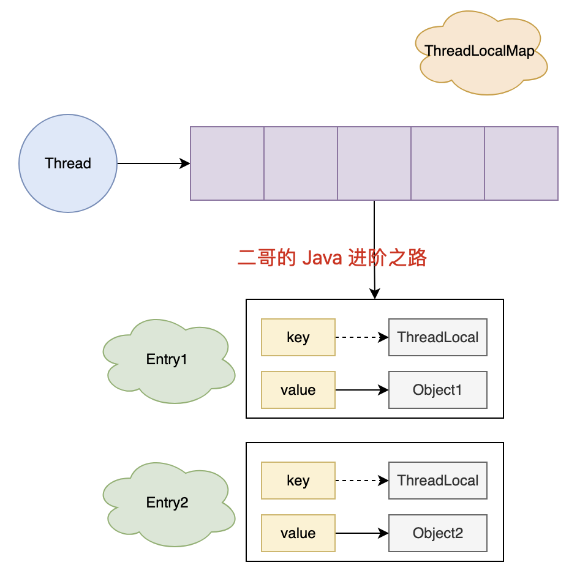


#### [那怎么解决内存泄漏问题呢？](https://javabetter.cn/sidebar/sanfene/javathread.html#那怎么解决内存泄漏问题呢)

很简单，使用完 ThreadLocal 后，及时调用 `remove()` 方法释放内存空间。


```
try {
    threadLocal.set(value);
    // 执行业务操作
} finally {
    threadLocal.remove(); // 确保能够执行清理
}
```

`remove()` 会调用 ThreadLocalMap 的 remove 方法遍历哈希表，找到 key 等于当前 ThreadLocal 的 Entry，找到后会调用 Entry 的 clear 方法，将 Entry 的 value 设置为 null。


```java
private void remove(ThreadLocal<?> key) {
    Entry[] tab = table;
    int len = tab.length;
    // 计算 key 的 hash 值
    int i = key.threadLocalHashCode & (len-1);
    // 遍历数组，找到 key 为 null 的 Entry
    for (Entry e = tab[i];
            e != null;
            e = tab[i = nextIndex(i, len)]) {
        if (e.get() == key) {
            // 将该 Entry 的 key 置为 null（即 Entry 失效）
            e.clear();
            // 清理过期的 entry
            expungeStaleEntry(i);
            return;
        }
    }
}

public void clear() {
    this.referent = null;
}
```

然后执行 `expungeStaleEntry()` 方法，清除 key 为 null 的 Entry。

#### [你每次操作都会remove吗？](https://javabetter.cn/sidebar/sanfene/javathread.html#你每次操作都会remove吗)

我不是每次操作都 remove，主要是根据使用场景来决定的。在一些短生命周期的场景中，比如处理单个 HTTP 请求的上下文信息，我通常会在请求结束时统一 remove。


```java
public class ReqInfoContext {
    private static TransmittableThreadLocal<ReqInfo> contexts = new TransmittableThreadLocal<>();
    
    public static void addReqInfo(ReqInfo reqInfo) {
        contexts.set(reqInfo);
    }

    public static void clear() {
        contexts.remove(); // 清除ThreadLocal中的数据
    }

    public static ReqInfo getReqInfo() {
        return contexts.get();
    }
}
```

但在一些需要跨多个方法调用保持状态的场景中，就不会每次都 remove。

我的使用原则是：

- 在方法级别使用时，try-finally 保证 remove
- 在请求级别使用时，通过拦截器或 Filter 统一清理
- 如果存储的对象比较大，使用完立即 remove
- 定期检查 ThreadLocal 的使用情况，避免遗漏

#### [那为什么 key 要设计成弱引用？](https://javabetter.cn/sidebar/sanfene/javathread.html#那为什么-key-要设计成弱引用)

弱引用的好处是，当内存不足的时候，JVM 能够及时回收掉弱引用的对象。

比如说：


```
WeakReference key = new WeakReference(new ThreadLocal());
```

key 是弱引用，`new WeakReference(new ThreadLocal())` 是弱引用对象，当 JVM 进行垃圾回收时，只要发现了弱引用对象，就会将其回收。

一旦 key 被回收，ThreadLocalMap 在进行 set、get 的时候就会对 key 为 null 的 Entry 进行清理。

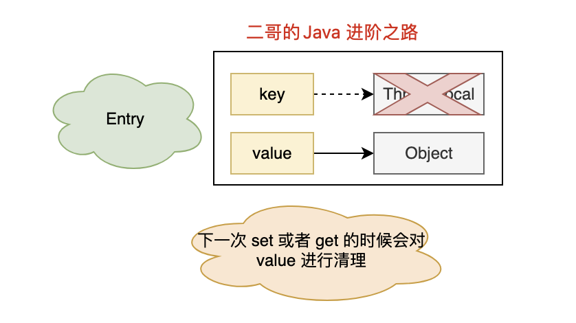

总结一下，在 ThreadLocal 被垃圾收集后，下一次访问 ThreadLocalMap 时，Java 会自动清理那些键为 null 的 entry，这个过程会在执行 `get()`、`set()`、`remove()`时触发。

## Java内存模型

### 20.⭐️说说对Java内存模型的理解

推荐阅读：[说说 Java 的内存模型](https://javabetter.cn/thread/jmm.html)

Java内存模型是Java虚拟机规范中定义的一个抽象模型，用来描述多线程环境中共享变量的内存可见性。

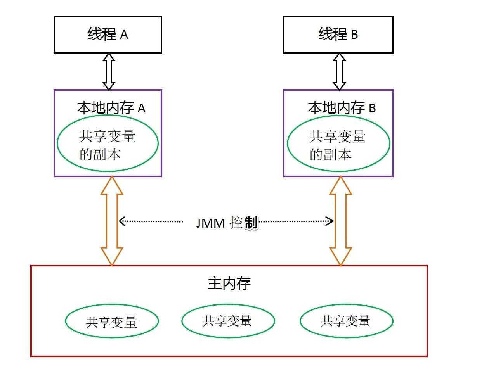

共享变量存储在`主内存`中，每个线程都有一个私有的`本地内存`，存储了共享变量的副本。

- 当一个线程更改了本地内存中共享变量的副本，它需要 JVM 刷新到主内存中，以确保其他线程可以看到这些更改。
- 当一个线程需要读取共享变量时，它一般会从本地内存中读取。如果本地内存中的副本是过时的，JVM 会将主内存中的共享变量最新值刷新到本地内存中。

#### [为什么线程要用自己的内存？](https://javabetter.cn/sidebar/sanfene/javathread.html#为什么线程要用自己的内存)

线程从主内存拷贝变量到工作内存，可以减少 CPU 访问 RAM 的开销。

每个线程都有自己的变量副本，可以避免多个线程同时修改共享变量导致的数据冲突

> **主内存、本地内存（工作内存）是 JMM 的抽象概念！**
>
> **它们并不真实存在**，不是 JVM 单独开辟的两块内存区域。
>
> **真正对应的物理硬件是：**
>
> - **主内存 = 计算机内存条（RAM）**
> - **本地内存 = CPU 寄存器 + CPU 高速缓存（L1/L2/L3）**
>
> **1. 为什么 JMM 要抽象出 “主内存 + 本地内存”？**
>
> 因为 Java 要**跨平台**！
>
> - 不同电脑 CPU 架构不一样
> - 缓存结构不一样
> - 寄存器不一样
>
> Java 不能直接面向硬件编程，所以**抽象一层**：
>
> - 不管你底层是什么 CPU，**统一用：主内存 + 本地内存** 来描述并发可见性问题。
>
> **JMM 是一个模型，不是真实内存布局！**

### 25.⭐️volatile了解吗

volatile关键字是用于保证变量可见性的，线程修改volatile变量后，其他线程能立即看到最新值；此外，volatile还可以防止指令重排，**volatile变量的写入不会被重排序到它之前的代码；不能把读操作，重排序到它后面的代码**

volatile 底层靠**内存屏障**实现：

1. volatile 写后→ 插入写屏障

   前面所有操作必须先完成，不能往后跑

2. volatile 读前 → 插入读屏障

   后面所有操作不能提前，不能往前跑

#### volatile怎么保证可见性？

当线程对 volatile 变量进行写操作时，JVM 会在这个变量写入之后插入一个写屏障指令，这个指令会**强制将本地内存中的变量值刷新到主内存中**，**而读屏障（lfence）保证在该屏障之后，对共享变量的读取，加载的是主存中最新数据。**

#### volatile怎么保证有序性的

JVM会在volatile变量读写前后插入“内存屏障”，以约束CPU和编译器的优化行为：

> - StoreStore 屏障可以禁止普通写操作与 volatile 写操作的重排
> - StoreLoad 屏障会禁止 volatile 写与 volatile 读重排
> - LoadLoad 屏障会禁止 volatile 读与后续普通读操作重排
> - LoadStore 屏障会禁止 volatile 读与后续普通写操作重排

写屏障会确保**指令重排序**时，不会将写屏障之前的代码排在写屏障之后

读屏障会确保**指令重排序**时，不会将读屏障之后的代码排在读屏障之前

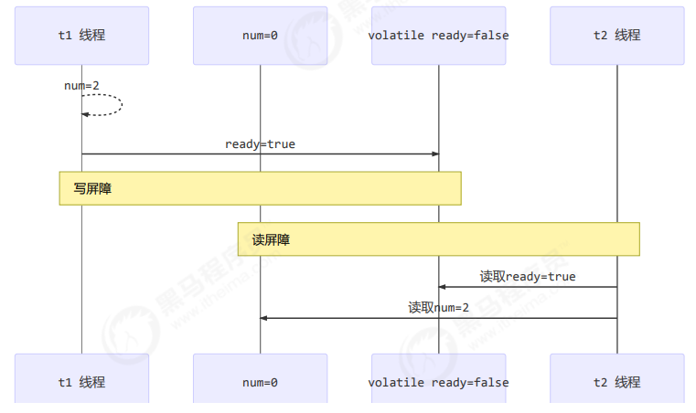

还是那句话，**不能解决指令交错**： 

- 写屏障仅仅是保证之后的读能够读到最新的结果，但不能保证读跑到它前面去 
- 而有序性的保证也只是保证了本线程内相关代码不被重排序
- 所以**volatile只能适用于一个线程写，多个线程读的场景**，否则就是这种情况，**原子性保证不了**

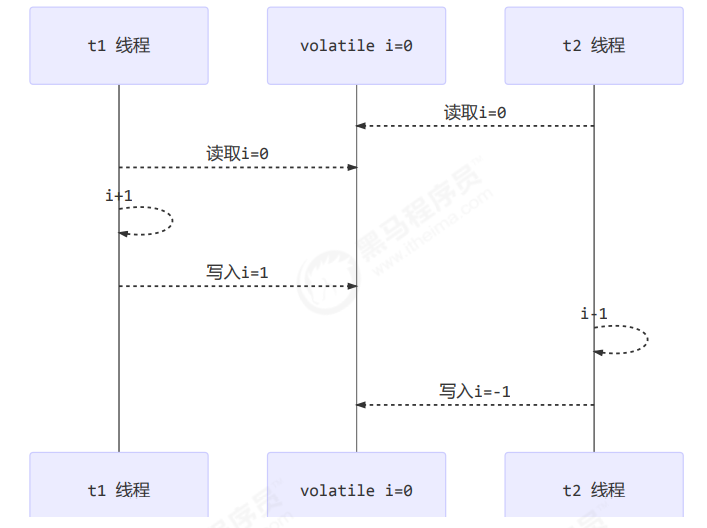

##### double-checked locking 问题 

以著名的 double-checked locking 单例模式为例

```java
public final class Singleton {
    private Singleton() { }
    private static Singleton INSTANCE = null;
    public static Singleton getInstance() { 
        if(INSTANCE == null) { // t2
            // 首次访问会同步，而之后的使用没有 synchronized
            synchronized(Singleton.class) {
                if (INSTANCE == null) { // t1
                    INSTANCE = new Singleton();
                } 
            }
        }
        return INSTANCE;
    }
}
```

以上的实现特点是： 

- 懒惰实例化 
- 首次使用 getInstance() 才使用 synchronized 加锁，后续使用时无需加锁 
- 有隐含的，但很关键的一点：第一个 if 使用了 INSTANCE 变量，是在同步块之外

但在多线程环境下，上面的代码是有问题的，getInstance 方法对应的字节码为：

```sh
0: getstatic #2 // Field INSTANCE:Lcn/itcast/n5/Singleton;
3: ifnonnull 37
6: ldc #3 // class cn/itcast/n5/Singleton
8: dup
9: astore_0
10: monitorenter
11: getstatic #2 // Field INSTANCE:Lcn/itcast/n5/Singleton;
14: ifnonnull 27
17: new #3 // class cn/itcast/n5/Singleton
20: dup
21: invokespecial #4 // Method "<init>":()V
24: putstatic #2 // Field INSTANCE:Lcn/itcast/n5/Singleton;
27: aload_0
28: monitorexit
29: goto 37
32: astore_1
33: aload_0
34: monitorexit
35: aload_1
36: athrow
37: getstatic #2 // Field INSTANCE:Lcn/itcast/n5/Singleton;
40: areturn
```

其中 

- 17 表示创建对象，将对象引用入栈 // new Singleton 
- 20 表示复制一份对象引用 // 引用地址 
- 21 表示利用一个对象引用，调用构造方法 
- 24 表示利用一个对象引用，赋值给 static INSTANCE 

也许 jvm 会优化为：先执行 24，再执行 21。如果两个线程 t1，t2 按如下时间序列执行：

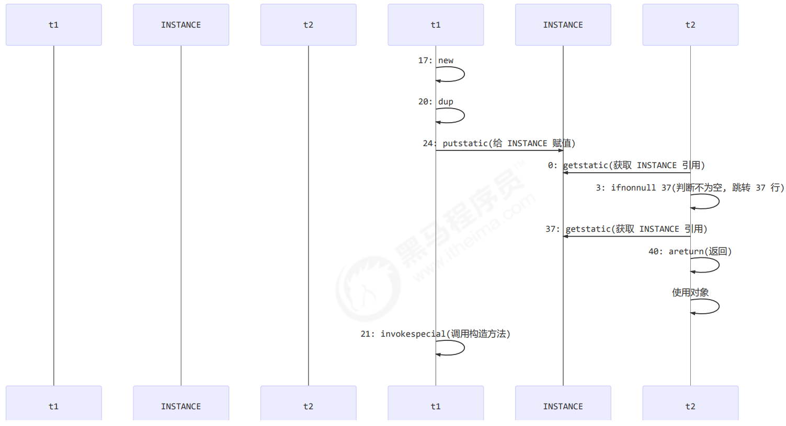

关键在于 0: getstatic 这行代码在 monitor 控制之外，它就像之前举例中不守规则的人，可以越过 monitor 读取 INSTANCE 变量的值 

这时 t1 还未完全将构造方法执行完毕，如果在构造方法中要执行很多初始化操作，那么 t2 拿到的是将是一个未初 始化完毕的单例 

对 INSTANCE 使用 volatile 修饰即可，可以禁用指令重排，但要注意在 JDK 5 以上的版本的 volatile 才会真正有效


##### double-checked locking 解决

```java
public final class Singleton {
    private Singleton() { }
    private static volatile Singleton INSTANCE = null;
    public static Singleton getInstance() {
        // 实例没创建，才会进入内部的 synchronized代码块
        if (INSTANCE == null) { 
            synchronized (Singleton.class) { // t2
                // 也许有其它线程已经创建实例，所以再判断一次
                if (INSTANCE == null) { // t1
                    INSTANCE = new Singleton();
                }
            }
        }
        return INSTANCE;
    }
}
```

字节码上看不出来 volatile 指令的效果

```sh
// -------------------------------------> 加入对 INSTANCE 变量的读屏障
0: getstatic #2 // Field INSTANCE:Lcn/itcast/n5/Singleton;
3: ifnonnull 37
6: ldc #3 // class cn/itcast/n5/Singleton
8: dup
9: astore_0
10: monitorenter -----------------------> 保证原子性、可见性
11: getstatic #2 // Field INSTANCE:Lcn/itcast/n5/Singleton;
14: ifnonnull 27
17: new #3 // class cn/itcast/n5/Singleton
20: dup
21: invokespecial #4 // Method "<init>":()V
24: putstatic #2 // Field INSTANCE:Lcn/itcast/n5/Singleton;
// -------------------------------------> 加入对 INSTANCE 变量的写屏障
27: aload_0
28: monitorexit ------------------------> 保证原子性、可见性
29: goto 37
32: astore_1
33: aload_0
34: monitorexit
35: aload_1
36: athrow
37: getstatic #2 // Field INSTANCE:Lcn/itcast/n5/Singleton;
40: areturn
```

如上面的注释内容所示，读写 volatile 变量时会加入内存屏障（Memory Barrier（Memory Fence）），保证下面 两点：

- 可见性 
  - 写屏障（sfence）保证在该屏障之前的 t1 对共享变量的改动，都同步到主存当中 
  - 而读屏障（lfence）保证在该屏障之后 t2 对共享变量的读取，加载的是主存中最新数据 
- 有序性 
  - 写屏障会确保指令重排序时，不会将写屏障之前的代码排在写屏障之后 
  - 读屏障会确保指令重排序时，不会将读屏障之后的代码排在读屏障之前 
- 更底层是读写变量时使用 lock 指令来多核 CPU 之间的可见性与有序性

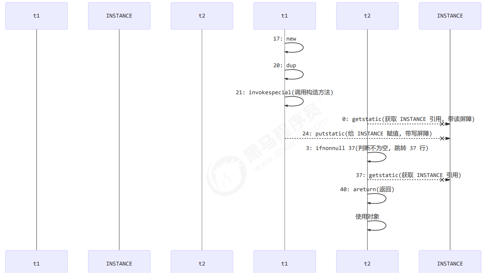


#### volatile和synchronized的区别

volatile关键字用于修饰变量，确保该变量的更新操作对所有线程可见，即一旦某个线程修改了 volatile 变量，其他线程会立即看到最新的值。

synchronized 关键字用于修饰方法或代码块，确保同一时刻只有一个线程能够执行该方法或代码块，从而实现互斥访问。

#### volatile加在基本类型和对象上的区别

当 `volatile` 用于基本数据类型时，能确保该变量的读写操作是直接从主内存中读取或写入的。

当 `volatile` 用于引用类型时，能确保引用本身的可见性，即确保引用指向的对象地址是最新的。

但是，`volatile` 并不能保证引用对象内部状态的线程安全

```java
private volatile SomeObject obj = new SomeObject();
```

虽然 `volatile` 确保了 `obj` 引用的可见性，但对 `obj` 引用的 `new SomeObject()` 对象并不受 `volatile` 保护。

如果需要保证引用对象内部状态的线程安全，需要使用 `synchronized` 或 `ReentrantLock` 等锁机制

## 锁

### 29.⭐️synchronized锁升级了解吗

#### 详细说说锁升级的过程

整个升级路径是无锁-偏向锁-轻量级锁-重量级锁，这是一个单向过程，只能升级不能降级。

这个机制的核心在于对象头中的Mark Word，它会根据锁状态存储不同的信息，通过锁的标志位来表示当前锁处于什么状态。

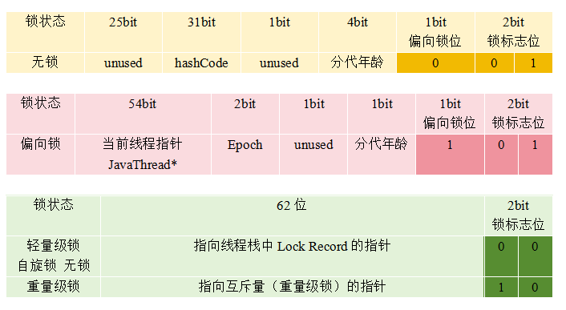

##### 无锁阶段

首先是无锁状态。当对象刚被创建出来时，没有任何线程访问，此时Mark Word中存储的是对象的HashCode、分代年龄等信息，锁的标志位是01，偏向标志位是0，这是锁的初始状态，没有设计任何的同步操作。值得注意的是，一旦对象调用过hashCode方法，他就无法进入偏向锁状态，因为偏向锁需要用MarkWord空间存储线程ID，而hashCode也要占用这部分空间，二者冲突。

##### 偏向锁阶段

当第一线程进入同步代码块时，锁会升级到偏向锁。此时会通过CAS操作将对象头的Mark Word中记录该线程ID，锁标志位保持01，但是偏向标志位变为1.之后这个线程再次进入同步块时，只需简单判断Mark Word中线程ID是否是自己，如果是就直接进入，完全不需要加锁解锁操作，极大优化了单线程反复进入同步块的场景。

但一旦有第二个线程尝试获取这个锁，说明出现了竞争，偏向锁会被撤销，撤销过程需要等到线程到达安全点，暂停持有偏向锁的线程，检查该线程是否还在执行同步代码，然后清楚偏向标记。

- 如果**原线程已经退出同步代码块**

  撤销偏向锁，对象恢复**无锁状态**，新线程重新正常抢锁；

- 如果**原线程还在同步块里运行**

  直接**撤销偏向锁，升级为轻量级锁**，原线程继续持锁运行。

##### 轻量级锁阶段

撤销偏向锁之后就进入轻量级锁阶段，此时JVM会在当前线程的栈帧中创建锁记录空间（Lock Record），把对象头的Mark Word复制进入，然后通过CAS操作尝试将对象头的Mark Word更新为指向锁记录的指针，锁标志位变为00。如果CAS成功，说明获取轻量级锁成功。如果失败，说明还有其他线程竞争，这时线程会进行CAS自旋，不断重试CAS操作，期望在短时间内持有锁的线程能释放锁。线程的本质是用CPU时间换取避免线程阻塞的开销，因此只适合锁持有时间很短的场景。

当线程自旋多次失败，或者出现第三个线程来竞争锁时，轻量级锁就会膨胀为重量级锁。

##### 重量级锁阶段

重量级锁是传统是synchronized实现，它依赖操作系统的互斥量mutex实现，锁标志位变为10，Mark Word指向Monitor对象。未获取锁的线程会被阻塞，进入Monitor的等待队列，这个过程需要用户态切换到内核态，由操作系统调度线程的阻塞和唤醒，开销非常大。但在竞争激烈、持锁时间长的场景下，阻塞线程反而比自旋更节省PCU资源，这就是为什么要升级为重量级锁。

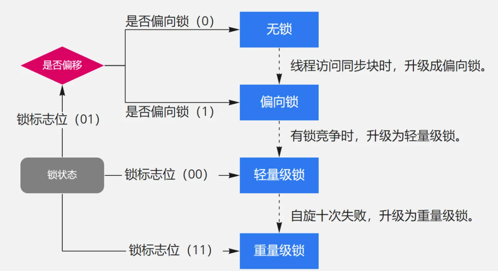

整个升级过程的设计思想就是用空间换时间，用复杂度换性能。通过在对象头中维护锁状态，根据实际竞争情况选择最合适的同步策略，让synchronized在各种场景下都能有不错的表现，这也是为什么JDK1.6之后synchronized重新获得青睐的原因。 

> 需要特别注意的是：偏向锁从 JDK 15 起已通过 JEP 374 被默认禁用并标记为 deprecated，JDK 18 已 obsolete 偏向锁的实现，JDK 21 相关命令行选项（如 -XX:+UseBiasedLocking）也已 deprecated。官方废弃偏向锁的主要原因是它让 JVM 实现过于复杂，而现代应用（尤其是 lambda、record、虚拟线程大行其道的场景）很少再从偏向锁中获益。所以在 JDK 15+ 下，synchronized 的实际升级路径已经简化为 无锁 → 轻量级锁 → 重量级锁，面试时可以补充说明这个变化。

#### synchronized做了哪些优化

jdk1.6之前，synchronized是直接调用ObjectMonitor的enter和exit指令实现的，这种锁与也叫重量级锁，性能较差。

随着 JDK 版本的更新，synchronized 的性能得到了极大的优化：

1. 偏向锁：同一个线程可以多次获得同一把锁，无需重复加锁
2. 轻量级锁：当有锁竞争时，通过CAS自旋等待锁，避免直接进入阻塞。

#### 二哥回答

> [synchronized到底锁的什么？偏向锁、轻量级锁、重量级锁到底是什么？ | 二哥的Java进阶之路](https://javabetter.cn/thread/synchronized.html#对象的锁放在什么地方)

jdk1.6时，为了提高synchronized的性能，引入了锁升级机制，从低开销的锁可以最大程度减少锁的竞争。

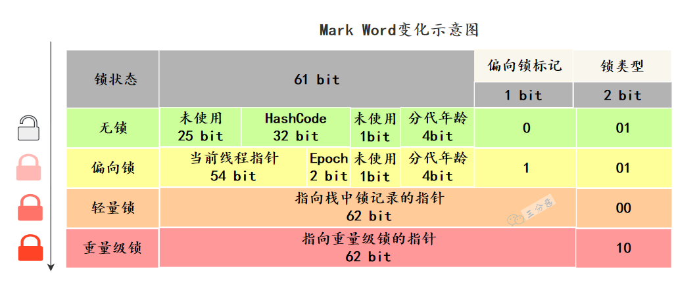

当没有线程竞争时，使用低开销的“偏向锁”，此时没有额外的CAS操作。

轻度竞争指多个线程在不同时间段交替轮流访问偏向锁、虽有线程切换但不存在同一时刻争抢，此时升级为“轻量级锁”，依赖CAS操作进行加锁与解锁，全程在用户态运行，不用把线程挂起阻塞。当同一时刻有多线程竞争时，采用CAS自旋，避免线程阻塞，自旋失败线程立即阻塞，轻量级锁膨胀为重量级；

只有在重度竞争（线程阻塞）时，才使用“重量级锁”，由Monitor机制实现，需要线程阻塞。

#### 为什么synchronized没有锁降级

我认为主要原因是降级的收益不大。因为降级不是简单的改一下标志位，重量级锁涉及到操作系统的互斥量（mutex），还有等待队列、阻塞线程。要降级，就要确保：

- 没有线程在等待队列中
- 当前没有竞争发生
- 要安全的释放系统资源
- 要重新初始化轻量级锁的状态

这一套检查和操作下来，开销不小。而且什么时候检查？每次释放锁都检查？性能损耗太大了

#### 了解synchronized四种锁状态吗

synchronized四种锁状态分为：无锁、偏向锁、轻量级锁、重量级锁

1. 无锁状态：对象未被锁定，Markdown存储对象的哈希码等信息

2. 偏向锁：当线程第一次获取锁时，会进入偏向锁状态。**Markword会记录该线程ID**，后续同一线程再次获取锁时，可以直接进入synchronized加锁的代码，无需额外加锁

3. 轻量级锁：当多个线程在不同时段获取同一把锁，即不存在锁竞争的情况时，JVM会采用轻量级锁来避免线程阻塞。当同一时刻有锁竞争时，**未持有锁的线程会通过CAS自旋等待锁释放，避免进入阻塞状态。**

   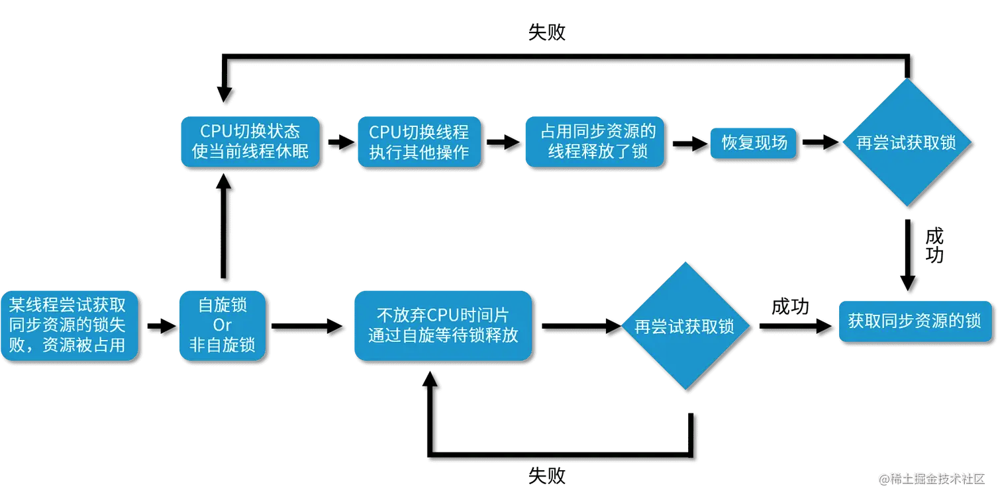

   **无竞争**：轻量级锁 线程直接**直接 CAS 获锁，不自旋**

   **有竞争**：轻量级锁 线程**先 CAS 自旋**等待锁，抢不到再阻塞挂起，锁膨胀为重量级锁

   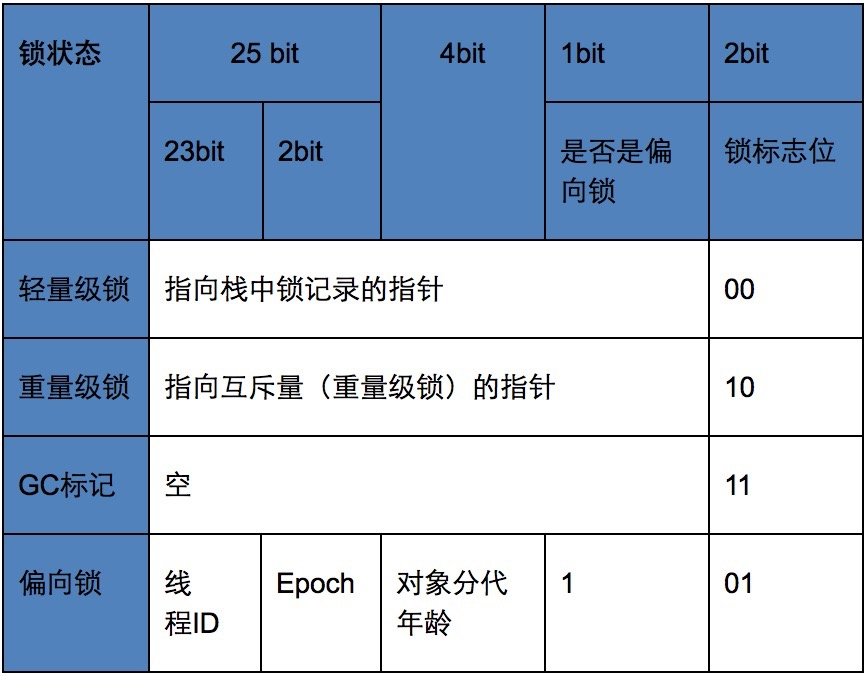

   

   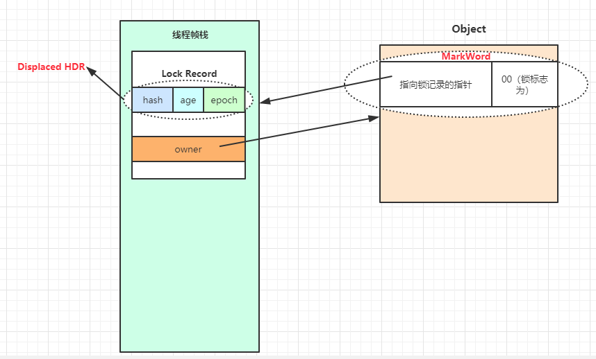

   

4. 重量级锁：如果自旋超过一定的次数，或者一个线程持有锁，一个自旋，又有第三个线程进入synchronized加锁的代码时，轻量级锁就会升级为重量级锁。

   此时，对象头的锁类型会更新为“10”，MarkWord会存储指向Monitor对象的指针，其他等待锁的线程都会进入阻塞状态。重量级锁也可以进行自旋重试。

对象头格式：

```
|--------------------------------------------------------------------|--------------------|
|                          Mark Word (64 bits)                       |        State       |
|--------------------------------------------------------------------|--------------------|
| unused:25 | hashcode:31 | unused:1 | age:4 | biased_lock:0 |  01   |        Normal      |
|--------------------------------------------------------------------|--------------------|
| thread:54 |   epoch:2   | unused:1 | age:4 | biased_lock:1 |  01   |        Biased      |
|--------------------------------------------------------------------|--------------------|
|                    ptr_to_lock_record:62                   |  00   | Lightweight Locked |
|--------------------------------------------------------------------|--------------------|
|                 ptr_to_heavyweight_monitor:62              |  10   | Heavyweight Locked |
|--------------------------------------------------------------------|--------------------|
|                                                            |  11   |    Marked for GC   |
|--------------------------------------------------------------------|--------------------|
```


> 偏向锁升级为轻量级锁时，**原来持有偏向锁的线程会发生什么变化**
>
> - 线程 A **已经拿到偏向锁**（对象头存着 A 的线程 ID）
> - 线程 B 现在也来抢同一个对象锁
> - JVM 发现：偏向的不是 B，是别人
> - 触发 **偏向锁撤销 → 直接升级成轻量级锁**
>
> 1. **线程 A 不会被阻塞、不会被挂起**
> 2. **线程 A 继续正常执行同步代码块，完全不受影响**
> 3. JVM 会**把线程 A 当前栈里的锁记录完善**，把对象头改成**轻量级锁格式**（指向 A 的 Lock Record 指针）
> 4. 相当于：**把 A 的偏向锁，原地 “转正” 成轻量级锁**
>
> 
>
> 1. 对象本来是**偏向锁**，偏向线程 A
>
> 2. 线程 B 来抢锁，发现偏向的不是自己
>
> 3. JVM **暂停线程 A（安全点）**
>
> 4. 检查线程 A：
>
>    是否还在执行同步代码块
>
>    - 如果 A
>
>      还在锁里
>
>      ：
>
>      - 在 A 的栈帧中建立 **Lock Record 锁记录**
>      - 把对象头原始 MarkWord 拷贝进 LockRecord
>      - 对象头改成**指向 A 的 LockRecord 指针**，锁标记改成 **00 轻量级锁**
>      - **线程 A 继续正常运行，毫无感知**
>
>      
>
>    - 如果 A
>
>      已经退出同步代码块
>
>      ：
>
>      - 直接撤销偏向，变回无锁，B 重新竞争
>
>      
>
>    
>
> **偏向锁升级轻量级锁时，原持有线程 A 只是被 JVM 在安全点里 “补做一遍轻量级锁入栈布局”，本身不阻塞、不停止、业务代码继续跑。**

### 30.⭐️synchronized和ReentrantLock的区别了解吗

简要回答：synchronized是由JVM内部的Monitor机制实现的，而ReentrantLock是基于AQS实现的。

synchronized可以自动加锁和解锁，而ReentrantLock需要手动lock()和unlock()。

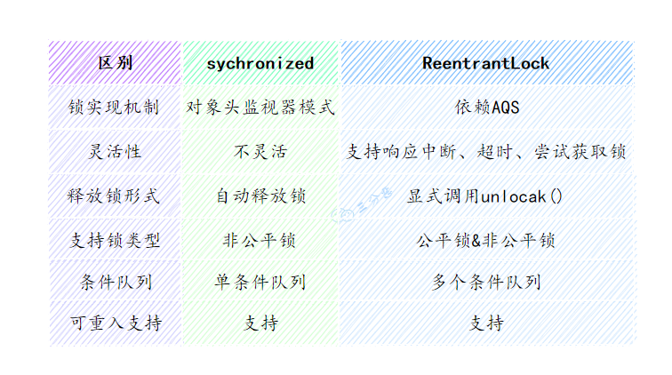

继续回答：

1. ReentrantLock可以实现多路选择通知，绑定多个Condition，而synchronized只能通过wait和notify唤醒，属于单路通知。
2. synchronized可以在方法和代码块上加锁，而ReentrantLock只能在代码块上加锁，但可以指定是公平锁还是非公平锁。
3. ReentrantLock提供了一种能够中断等待锁的线程机制，通过lock.lockInterruptibly()实现

```java
ReentrantLock lock = new ReentrantLock();
try {
    lock.lockInterruptibly();
} catch (InterruptedException e) {
    // 处理中断异常
}
```

#### 并发量大的情况下，使用synchronized还是ReentrantLock

我倾向于ReentrantLock，因为：

- ReentrantLock提供了超时和公平锁等特性，可以应对更复杂的并发场景
- ReentrantLock允许更细粒度的锁控制，能有效减少锁竞争
- ReentrantLock支持条件变量Condition，可以实现比synchronized更友好的线程间通信机制

#### Lock了解吗

Lock是JUC中的一个接口，最常用的实现类包括可重入锁ReentrantLock、读写锁ReentrantReadWriteLock等

#### [ReentrantLock 的 lock() 方法实现逻辑了解吗？](https://javabetter.cn/sidebar/sanfene/javathread.html#reentrantlock-的-lock-方法实现逻辑了解吗)

lock 方法的具体实现由 ReentrantLock 内部的 Sync 类来实现，涉及到线程的自旋、阻塞队列、CAS、AQS 等。


lock方法会首先尝试通过CAS获取锁，如果当前锁没有被持有，会将锁状态设为1，表示锁已被占用，否则，会将当前线程加到AQS等待队列中。

```java
final void lock() {
    if (compareAndSetState(0, 1))  // 尝试直接获取锁
        setExclusiveOwnerThread(Thread.currentThread());
    else
        acquire(1);  // 如果获取失败，进入AQS队列等待
}
```

### [31.AQS 了解多少？](https://javabetter.cn/sidebar/sanfene/javathread.html#_31-aqs-了解多少)

推荐阅读：[到底什么是 AQS?](https://javabetter.cn/thread/aqs.html)

AQS 是一个抽象类，它维护了**一个共享变量 state 和一个线程等待队列**，为 ReentrantLock 等类提供底层支持。

> **AQS**是`AbstractQueuedSynchronizer`的简称，即`抽象队列同步器`，从字面上可以这样理解:
>
> - 抽象：抽象类，只实现一些主要逻辑，有些方法由子类实现；
> - 队列：使用先进先出（FIFO）的队列存储数据；
> - 同步：实现了同步的功能。
>
> 那 AQS 有什么用呢？
>
> **AQS 是一个用来构建锁和同步器的框架，使用 AQS 能简单且高效地构造出应用广泛的同步器**，比如我们后面会细讲的 [ReentrantLock](https://javabetter.cn/thread/reentrantLock.html)，Semaphore，[ReentrantReadWriteLock](https://javabetter.cn/thread/ReentrantReadWriteLock.html)，SynchronousQueue，[FutureTask](https://javabetter.cn/thread/callable-future-futuretask.html) 等等，都是基于 AQS 的。
>
> 当然了，我们也可以利用 AQS 轻松定制专属的同步器，只要实现它的几个`protected`方法就可以了。

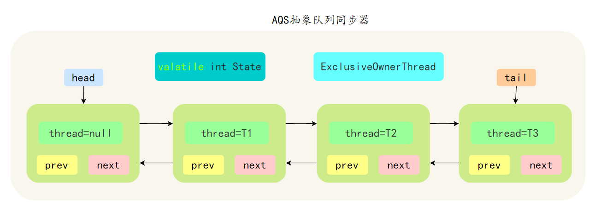

AQS 的思想是，如果被请求的共享资源处于空闲状态，则当前线程成功获取锁；否则，将当前线程加入到等待队列中，当其他线程释放锁时，从等待队列中挑选一个线程，把锁分配给它。

#### [AQS 的源码阅读过吗？](https://javabetter.cn/sidebar/sanfene/javathread.html#aqs-的源码阅读过吗)

有研究过。

第一，**状态 state 由 volatile 变量修饰，用于保证多线程之间的可见性**；


```java
private volatile int state;
```

②、同步队列由内部定义的 Node 类实现，每个 Node 包含了等待状态、前后节点、线程的引用等，是一个先进先出的双向链表。


```java
static final class Node {
    static final int CANCELLED =  1;
    static final int SIGNAL    = -1;
    static final int CONDITION = -2;
    static final int PROPAGATE = -3;

    volatile Node prev;

    volatile Node next;

    volatile Thread thread;
}
```

AQS 支持两种同步方式：

- 独占模式下：每次只能有一个线程持有锁，例如 ReentrantLock。
- 共享模式下：多个线程可以同时获取锁，例如 Semaphore 和 CountDownLatch。

核心方法包括：

- `acquire`：获取锁，失败进入等待队列；
- `release`：释放锁，唤醒等待队列中的线程；
- `acquireShared`：共享模式获取锁；
- `releaseShared`：共享模式释放锁。

AQS 使用一个 CLH 队列来维护等待线程，CLH 是三个作者 Craig、Landin 和 Hagersten 的首字母缩写，是一种基于链表的自旋锁。

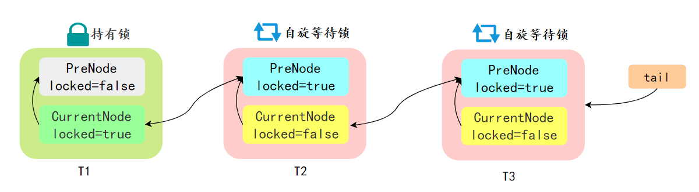三分恶面渣逆袭：CLH队列

在 CLH 中，当一个线程尝试获取锁失败后，会被添加到队列的尾部并自旋，等待前一个节点的线程释放锁。

三分恶面渣逆袭：AQS变种CLH队列

CLH 的优点是，假设有 100 个线程在等待锁，锁释放之后，只会通知队列中的第一个线程去竞争锁。避免同时唤醒大量线程，浪费 CPU 资源

> ## AQS 中线程抢锁失败后，大致流程是
>
> ```
> 线程尝试获取锁失败
>         ↓
> 加入 AQS 等待队列尾部
>         ↓
> 判断自己是否应该阻塞
>         ↓
> 调用 LockSupport.park() 挂起线程
>         ↓
> 等待前驱节点释放锁后 unpark 唤醒
>         ↓
> 再次尝试获取锁
> ```
>
> 也就是说，线程进入 AQS 队列后，**大部分时间不是自旋，而是被挂起了**。
>
> 挂起后线程不再占用 CPU 执行。
>
> 区别可以一句话概括：
>
> **AQS 的等待队列是 Java 层自己维护的队列；`synchronized` 的等待队列是 JVM Monitor 机制维护的队列。**
>
> 它们都能让线程“抢不到锁就排队等待”，但**队列在哪里、怎么排、谁来唤醒、能不能中断/超时/公平控制**都不一样。
>
> ------
>
> ## 1. synchronized 的等待队列在 JVM Monitor 里
>
> 比如：
>
> ```java
> synchronized (obj) {
>     // 临界区
> }
> ```
>
> 线程抢 `obj` 的对象锁失败后，会进入 JVM 管理的 Monitor 竞争队列中。
>
> 大致可以理解为：
>
> ```text
> 对象 obj
>   ↓
> ObjectMonitor
>   ↓
> 竞争锁的线程队列
> ```
>
> 在 HotSpot JVM 中，Monitor 里面大致会有这些结构：
>
> ```text
> ObjectMonitor
>  ├── Owner       当前持有锁的线程
>  ├── EntryList   等待进入 synchronized 的线程
>  ├── WaitSet     调用了 wait() 后等待的线程
> ```
>
> 注意：`EntryList`、`WaitSet` 是 HotSpot JVM 的实现细节，不是 Java 语法层面直接暴露给你的东西。
>
> ------
>
> ## 2. AQS 的等待队列在 Java 对象里
>
> 比如：
>
> ```java
> ReentrantLock lock = new ReentrantLock();
> 
> lock.lock();
> try {
>     // 临界区
> } finally {
>     lock.unlock();
> }
> ```
>
> `ReentrantLock` 底层基于 AQS。
>
> AQS 自己维护一个队列，大概是：
>
> ```text
> AQS
>  ├── state        锁状态
>  ├── head         等待队列头节点
>  └── tail         等待队列尾节点
> ```
>
> 线程抢锁失败后，会被封装成一个 `Node`，加入 AQS 的同步队列：
>
> ```text
> head -> Node(Thread-B) -> Node(Thread-C) -> Node(Thread-D)
> ```
>
> 所以 AQS 的队列是 **Java 并发包代码自己维护的双向队列**。
>
> ------
>
> ## 3. 最大区别：synchronized 队列你控制不了，AQS 队列可以被工具类设计者控制
>
> `synchronized` 的排队、阻塞、唤醒都由 JVM 管。
>
> 你只能写：
>
> ```java
> synchronized (obj) {
>     // ...
> }
> ```
>
> 你不能控制：
>
> ```text
> 能不能公平排队
> 能不能尝试获取锁
> 能不能等待 3 秒后放弃
> 等待锁时能不能响应中断
> 唤醒哪个线程
> 队列如何维护
> ```
>
> 而 AQS 是给并发工具类用的框架，`ReentrantLock`、`Semaphore`、`CountDownLatch` 可以基于它定制不同的同步语义。
>
> 比如 `ReentrantLock` 可以：
>
> ```java
> lock.tryLock();
> lock.tryLock(3, TimeUnit.SECONDS);
> lock.lockInterruptibly();
> ```
>
> 这些能力本质上都和 AQS 队列管理有关。
>
> ------
>
> ## 4. synchronized 有一个 WaitSet，AQS 有 Condition 队列
>
> `synchronized` 配合线程通信时，用的是：
>
> ```java
> obj.wait();
> obj.notify();
> obj.notifyAll();
> ```
>
> 例如：
>
> ```java
> synchronized (obj) {
>     obj.wait();
> }
> ```
>
> 调用 `wait()` 的线程会进入这个对象 Monitor 的 `WaitSet`。
>
> 大概是：
>
> ```text
> ObjectMonitor
>  ├── EntryList：等待抢 synchronized 锁的线程
>  └── WaitSet：调用 wait() 后等待通知的线程
> ```
>
> 而 `ReentrantLock` 配合 `Condition` 使用：
>
> ```java
> Condition notEmpty = lock.newCondition();
> Condition notFull = lock.newCondition();
> ```
>
> AQS 支持多个 Condition 队列：
>
> ```text
> AQS 同步队列：
> head -> Thread-A -> Thread-B
> 
> Condition 队列 notEmpty：
> Thread-C -> Thread-D
> 
> Condition 队列 notFull：
> Thread-E -> Thread-F
> ```
>
> 这就是为什么说 `Condition` 比 `wait/notify` 更灵活。
>
> `synchronized` 一个对象只有一个 `WaitSet`，而 `ReentrantLock` 可以创建多个 `Condition` 队列，把不同等待原因的线程分开管理。
>
> ------
>
> ## 5. 举个生产者消费者例子
>
> 用 `synchronized`：
>
> ```java
> synchronized (queue) {
>     while (queue.isEmpty()) {
>         queue.wait();
>     }
>     queue.poll();
>     queue.notifyAll();
> }
> ```
>
> 这里只有一个 `WaitSet`。
>
> 消费者因为“队列空”而等待，生产者因为“队列满”而等待，理论上都可能在同一个等待集合里。
>
> 所以通常要用：
>
> ```java
> notifyAll();
> ```
>
> 防止唤醒错类型线程。
>
> ------
>
> 用 `ReentrantLock + Condition`：
>
> ```java
> ReentrantLock lock = new ReentrantLock();
> 
> Condition notEmpty = lock.newCondition();
> Condition notFull = lock.newCondition();
> ```
>
> 可以把线程分成两个队列：
>
> ```text
> notEmpty：等待队列非空的消费者
> notFull ：等待队列未满的生产者
> ```
>
> 消费者等待：
>
> ```java
> while (queue.isEmpty()) {
>     notEmpty.await();
> }
> ```
>
> 生产者等待：
>
> ```java
> while (queue.isFull()) {
>     notFull.await();
> }
> ```
>
> 生产者放入元素后，只需要唤醒消费者：
>
> ```java
> notEmpty.signal();
> ```
>
> 消费者取出元素后，只需要唤醒生产者：
>
> ```java
> notFull.signal();
> ```
>
> 这比 `notifyAll()` 更精准。
>
> 这也是 AQS 队列机制更灵活的体现。
>
> ------
>
> ## 6. synchronized 和 AQS 入队后的状态也不一样
>
> ### synchronized 抢锁失败
>
> ```text
> 线程尝试进入 synchronized
>         ↓
> 抢不到 Monitor
>         ↓
> 进入 JVM 管理的 EntryList / 竞争队列
>         ↓
> 阻塞等待 JVM 唤醒
> ```
>
> ### AQS 抢锁失败
>
> ```text
> 线程调用 lock()
>         ↓
> CAS 修改 state 失败
>         ↓
> 封装成 Node 加入 AQS 同步队列
>         ↓
> LockSupport.park() 挂起
>         ↓
> 前驱释放锁后 unpark 唤醒
>         ↓
> 再次尝试获取锁
> ```
>
> 所以它们的入队逻辑不在一个层次上：
>
> ```text
> synchronized：JVM Monitor 入队
> 
> AQS：Java 对象中的同步队列入队，然后通过 LockSupport 调用 JVM 能力阻塞/唤醒
> ```
>
> ------
>
> ## 7. 对比总结
>
> | 对比点             | synchronized                     | AQS                                  |
> | ------------------ | -------------------------------- | ------------------------------------ |
> | 队列维护位置       | JVM Monitor 内部                 | Java 层 AQS 对象内部                 |
> | 是否能直接控制     | 基本不能                         | 可以由同步器设计者控制               |
> | 抢锁失败后         | 进入 Monitor 竞争队列            | 进入 AQS 同步队列                    |
> | 线程通信队列       | `wait/notify` 对应一个 `WaitSet` | 每个 `Condition` 都有自己的等待队列  |
> | 是否支持公平策略   | 不能手动指定                     | `ReentrantLock(true)` 可以指定公平锁 |
> | 是否支持超时抢锁   | 不支持                           | 支持 `tryLock(timeout)`              |
> | 是否支持中断等待锁 | 不支持                           | 支持 `lockInterruptibly()`           |
> | 唤醒方式           | JVM Monitor 负责                 | AQS + `LockSupport.park/unpark`      |
> | 灵活性             | 简单、自动                       | 更灵活、可扩展                       |
>
> ------
>
> ## 8. 最好这样理解
>
> `synchronized` 像是 JVM 提供的内置锁：
>
> ```text
> 你只管进 synchronized 代码块，排队和唤醒 JVM 管。
> ```
>
> AQS 像是 Java 并发包提供的锁框架：
>
> ```text
> 它自己维护 state 和等待队列，再借助 JVM 的 park/unpark 完成阻塞和唤醒。
> ```
>
> 所以：
>
> **两者都有等待队列，但 synchronized 的队列是 JVM Monitor 内部机制；AQS 的队列是 Java 层同步框架自己维护的队列。AQS 因为队列逻辑暴露给并发工具类设计，所以可以实现公平锁、超时等待、中断等待、多个 Condition 等更灵活的功能。**

### 32.⭐️说说ReentrantLock的实现原理

ReentrantLock是基于AQS实现的可重入排它锁，使用CAS获取锁，失败的话会进入阻塞队列，支持公平锁、非公平锁、超时等待、中断、条件队列。

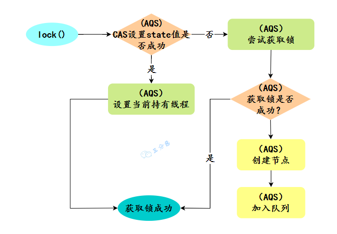

内部通过一个计数器state跟踪锁的状态的持有次数，当线程调用lock()方法获取锁时，ReentrantLock会检查state的值，如果为0，说明锁未被持有，通过CAS操作修改为1，表示成功加锁。否则根据当前线程的公平性策略，加入到等待队列中。

线程首次获取锁时，state 值设为 1；如果同一个线程再次获取锁时，state 加 1；每释放一次锁，state 减 1。

当线程调用 `unlock()` 方法时，ReentrantLock 会将持有锁的 state 减 1，如果 `state = 0`，则释放锁，并唤醒等待队列中的线程来竞争锁。

```java
class CounterWithLock {
    private int count = 0;
    private final Lock lock = new ReentrantLock();

    public void increment() {
        lock.lock();  // 获取锁
        try {
            count++;
        } finally {
            lock.unlock();  // 释放锁
        }
    }

    public int getCount() {
        return count;
    }
}
```

`new ReentrantLock()` 默认创建的是非公平锁 NonfairSync。**在非公平锁模式下，锁可能会授予刚刚请求它的线程，而不考虑等待时间**。当切换到公平锁模式下，锁会授予等待时间最长的线程。

### 34.⭐️CAS了解吗

CAS 是一种乐观锁，用于比较一个变量的当前值是否等于预期值，如果相等，则更新值，否则重试。

在 CAS 中，有三个值：

- V：要更新的变量(var)
- E：预期值(expected)
- N：新值(new)

先判断 V 是否等于 E，如果等于，将 V 的值设置为 N；如果不等，说明已经有其它线程更新了 V，当前线程就放弃更新。

这个比较和替换的操作需要是原子的，不可中断的。Java 中的 CAS 是由 Unsafe 类实现的。

AtomicInteger 类的 compareAndSet 就是一个 CAS 方法：

```java
AtomicInteger atomicInteger = new AtomicInteger(0);
int expect = 0;
int update = 1;
atomicInteger.compareAndSet(expect, update);
```

它调用的是 Unsafe 的 compareAndSwapInt。

#### 如何保证CAS的原子性

CPU会发出一个LOCK指令进行总线锁定，阻止其他处理器对内存地址进行操作，直到当前指令执行完成。

```tex
lock cmpxchg [esi], eax  ; 比较 esi 地址中的值与 eax，如果相等则替换
```

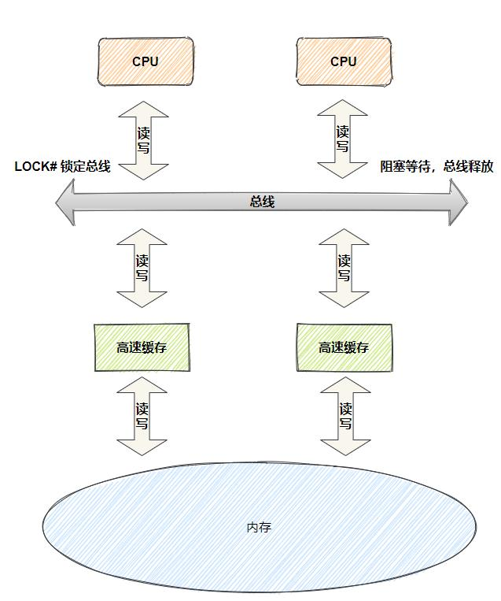

### 35.⭐️CAS有什么问题

CAS存在三个经典问题，ABA问题、自旋开销大、只能操作一个变量等。

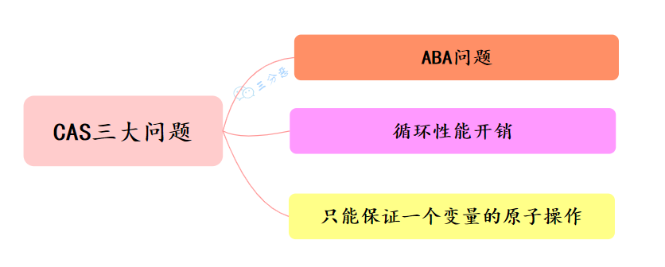

#### ABA问题

ABA 问题指的是，一个值原来是 A，后来被改为 B，再后来又被改回 A，这时 CAS 会误认为这个值没有发生变化。

可以使用版本号/时间戳的方式来解决 ABA 问题。

比如说，每次变量更新时，不仅更新变量的值，还更新一个版本号。CAS 操作时，不仅比较变量的值，还比较版本号。

#### 自旋开销大怎么解决

CAS 失败时会不断自旋重试，如果一直不成功，会给 CPU 带来非常大的执行开销。

可以加一个自旋次数的限制，超过一定次数，就切换到 synchronized 挂起线程。

```java
int MAX_RETRIES = 10;
int retries = 0;
while (!atomicInt.compareAndSet(expect, update)) {
    retries++;
    if (retries > MAX_RETRIES) {
        synchronized (this) { // 超过次数，使用 synchronized 处理
            if (atomicInt.get() == expect) {
                atomicInt.set(update);
            }
        }
        break;
    }
}
```

#### 涉及到多个变量同时更新怎么办

可以将多个变量封装为一个对象，使用 AtomicReference 进行 CAS 更新。

```java
class Account {
    static class Balance {
        final int money;
        final int points;

        Balance(int money, int points) {
            this.money = money;
            this.points = points;
        }
    }

    private AtomicReference<Balance> balance = new AtomicReference<>(new Balance(100, 10));

    public void update(int newMoney, int newPoints) {
        Balance oldBalance, newBalance;
        do {
            oldBalance = balance.get();
            newBalance = new Balance(newMoney, newPoints);
        } while (!balance.compareAndSet(oldBalance, newBalance));
    }
}
```

### 40.⭐️死锁问题怎么排查

首先从系统级别排查，比如在linux生产环境中使用top、ps等命令查看进程状态，看看是否有进程占用太多资源。

接着，使用 JDK 自带的一些性能监控工具进行排查，比如说 使用 `jps -l` 查看当前进程，然后使用 `jstack 进程号` 查看当前进程的线程堆栈信息，看看是否有线程在等待锁资源。

也可以使用一些可视化的性能监控工具，比如说 JConsole、VisualVM 等，查看线程的运行状态、锁的竞争情况等。

编码时，尽量使用 `tryLock()` 代替 `lock()`，`tryLock()` 可以设置超时时间，避免线程一直等待。

同时，尽量避免一个线程同时获取多个锁，如果需要多个锁，可以按照固定的顺序获取。

### 42.⭐️乐观锁和悲观锁

悲观锁认为每次访问共享资源都会发生冲突，所以操作之前需要先加锁，防止其他线程修改数据。

乐观锁认为冲突不会总是发生，所以操作前不加锁，而是在更新数据的时候检查是否有线程修改了数据，如果数据被修改了，就重试。

## 并发工具类

### 48.⭐️能说一下ConcurrentHashMap的实现吗

ConcurrentHashMap是HashMap的线程安全版本。

jdk7采用的是分段锁，整个Map会被分为若干段，每个段都可以独立加锁，不同的线程可以同时操作不同的段，从而实现并发。

jdk8采用的是更细粒度的锁——桶锁，再配合CAS+synchronized代码块控制并发写入，最大程度减少锁竞争。

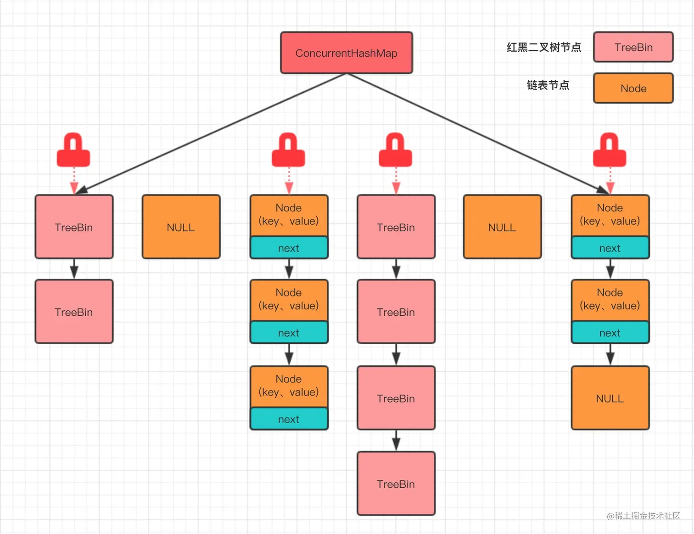

对于读操作，ConcurrentHashMap使用了volatile变量保证**内存可见性**（一个线程修改了共享变量，其他线程能立刻看到这个修改）

对于写操作，ConcurrentHashMap优先使用CAS尝试插入，如果成功就直接返回；否则使用synchronized代码块进行加锁处理。

#### [说一下 JDK 7 中 ConcurrentHashMap 的实现原理？](https://javabetter.cn/sidebar/sanfene/javathread.html#说一下-jdk-7-中-concurrenthashmap-的实现原理)

好的。

JDK 7 的 ConcurrentHashMap 采用的是分段锁，整个 Map 会被分为若干段，每个段都可以独立加锁，每个段类似一个 Hashtable。

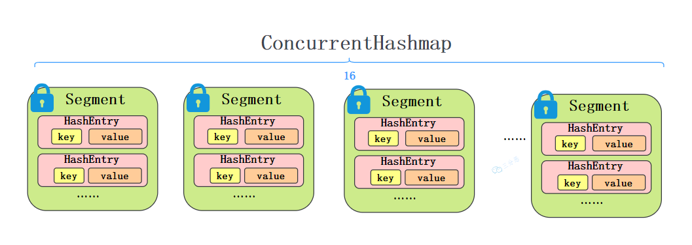三分恶面渣逆袭：ConcurrentHashMap示意图

每个段维护一个键值对数组 `HashEntry<K, V>[] table`，HashEntry 是一个单项链表。


```java
static final class HashEntry<K,V> {
    final int hash;
    final K key;
    volatile V value;
    final HashEntry<K,V> next;
}
```

段继承了 ReentrantLock，所以每个段都是一个可重入锁，不同的线程可以同时操作不同的段，从而实现并发。


```java
static final class Segment<K,V> extends ReentrantLock {
    transient volatile HashEntry<K,V>[] table;
    transient int count;
}
```

#### [说一下 JDK 7 中 ConcurrentHashMap 的 put 流程？](https://javabetter.cn/sidebar/sanfene/javathread.html#说一下-jdk-7-中-concurrenthashmap-的-put-流程)

put 流程和 HashMap 非常类似，只不过是先定位到具体的段，再通过 ReentrantLock 去操作而已。一共可以分为 4 个步骤：

第一步，计算 key 的 hash，定位到段，段如果是空就先初始化；

第二步，使用 ReentrantLock 进行加锁，如果加锁失败就自旋，自旋超过次数就阻塞，保证一定能获取到锁；

第三步，遍历段中的键值对 HashEntry，key 相同直接替换，key 不存在就插入。

第四步，释放锁。

三分恶面渣逆袭：JDK7 put 流程

#### [说一下 JDK 7 中 ConcurrentHashMap 的 get 流程？](https://javabetter.cn/sidebar/sanfene/javathread.html#说一下-jdk-7-中-concurrenthashmap-的-get-流程)

get 就更简单了，先计算 key 的 hash 找到段，再遍历段中的键值对，找到就直接返回 value。

get 不用加锁，因为是 value 是 [volatile](https://javabetter.cn/thread/volatile.html) 的，所以线程读取 value 时不会出现可见性问题

#### jdk8中ConcurrentHashMap的实现原理

JDK 8 中的 ConcurrentHashMap 取消了分段锁，采用CAS+synchronized实现更细粒度的桶锁，并且使用红黑树优化链表提高哈希冲突时的查询效率，性能对比jdk7有了很大提升。

#### jdk8中ConcurrentHashMap的put流程


第一步：计算key的哈希值，确定桶在数组中的位置。如果数组为空，CAS的方式初始化数组，确保只有一个线程初始化数组。

```java
// 计算 hash
int hash = spread(key.hashCode());

// 初始化数组
if (tab == null || (n = tab.length) == 0)
    tab = initTable();

// 计算桶的位置
int i = (n - 1) & hash;
```

第二步：如果桶为空，直接CAS插入节点，如果CAS失败，就退化为synchronized代码块插入节点。

```java
// CAS 插入节点
if (tabAt(tab, i) == null) {
    if (casTabAt(tab, i, null, new Node<K,V>(hash, key, value, null)))
        break;
}

// 否则，使用 synchronized 代码块插入节点
else {
    synchronized (f) {  // **只锁当前桶**
        if (tabAt(tab, i) == f) { // 确保未被其他线程修改
            if (f.hash >= 0) { // 链表处理
                for (Node<K,V> e = f;;) {
                    K ek;
                    if (e.hash == hash && ((ek = e.key) == key || (key != null && key.equals(ek)))) {
                        e.val = value;
                        break;
                    }
                    e = e.next;
                }
            } else if (f instanceof TreeBin) { // **红黑树处理**
                ((TreeBin<K,V>) f).putTreeVal(hash, key, value);
            }
        }
    }
}
```

插入的过程中会判断桶的哈希是否小于 0（`f.hash >= 0`），小于 0 说明是红黑树，大于等于 0 说明是链表。

这里补充一点：在 ConcurrentHashMap 的实现中，红黑树节点 TreeBin 的 hash 值固定为 -2

> **桶不为空时：**
>
> 直接进入 **synchronized (头节点)** 代码块，
>
> 然后判断是**链表、红黑树、还是扩容中**，分别执行插入 / 覆盖 / 协助扩容。
>
> **桶不为空一定上锁**，但只锁当前桶，性能极高
>
> 链表长度 ≥8 会变成红黑树
>
> 遇到扩容，当前线程会**主动帮忙扩容**，不等待
>
> JDK8 放弃了分段锁，用 **CAS + synchronized** 实现高性能并发

第三步：如果链表长度超过8，转化为红黑树

第四步：插入新节点后，调`addCount()`方法检查是否需要扩容

#### jdk8中ConcurrentHashMap的get流程

get 也是通过 key 的 hash 进行定位，如果桶的头节点的key相同，则直接返回值。

如果节点的哈希为负数，说明是个特殊节点，比如说如树节点或者正在迁移的节点，就调用`find`方法查找。

否则遍历链表查找匹配的键，如果都没找到，返回null。

#### 项目中如何使用ConcurrentHashMap的

在[技术派实战项目](https://javabetter.cn/zhishixingqiu/paicoding.html)中，很多地方都用到了 ConcurrentHashMap，比如说在异步工具类 AsyncUtil 中，就使用了 ConcurrentHashMap 来存储任务的名称和它们的运行时间，以便观察和分析任务的执行情况

> 可以这样简单说：
>
> `ConcurrentHashMap` 可以用在 RAG 项目里，但**不是用来存知识库数据的**。
>
> RAG 的核心数据，比如：
>
> ```text
> 文档内容
> 文本切片
> 向量数据
> 知识库数据
> 长期会话记录
> ```
>
> 这些不适合放在 `ConcurrentHashMap` 里，应该放在数据库、Redis、pgvector 或向量数据库中。
>
> `ConcurrentHashMap` 更适合用来存一些**临时状态**。
>
> 比如文档上传后，要经过：
>
> ```text
> 解析文档
> 切分文本
> 生成向量
> 存入向量库
> ```
>
> 这些步骤通常是异步执行的。为了让前端知道文档处理到哪一步，可以用 `ConcurrentHashMap` 临时保存任务进度。
>
> 例如：
>
> ```java
> private final ConcurrentHashMap<Long, String> taskStatusMap = new ConcurrentHashMap<>();
> ```
>
> 上传文档后：
>
> ```java
> taskStatusMap.put(documentId, "解析中");
> ```
>
> 解析完成后：
>
> ```java
> taskStatusMap.put(documentId, "向量化中");
> ```
>
> 全部完成后：
>
> ```java
> taskStatusMap.put(documentId, "处理完成");
> ```
>
> 前端查询进度时：
>
> ```java
> String status = taskStatusMap.get(documentId);
> ```
>
> 它还可以用来防止重复提交任务。比如同一个文档正在处理中，用户又点了一次上传，就可以用 `putIfAbsent()` 判断这个任务是不是已经在执行了：
>
> ```java
> private final ConcurrentHashMap<Long, Boolean> runningMap = new ConcurrentHashMap<>();
> 
> public void submitTask(Long documentId) {
>     if (runningMap.putIfAbsent(documentId, true) != null) {
>         throw new RuntimeException("该文档正在处理中，请勿重复提交");
>     }
> 
>     try {
>         processDocument(documentId);
>     } finally {
>         runningMap.remove(documentId);
>     }
> }
> ```
>
> 面试可以这样说：
>
> 在 RAG 项目中，我不会用 `ConcurrentHashMap` 存储文档、文本切片或向量数据，因为这些属于核心数据，需要持久化和检索，应该放在数据库或向量库中。
>
> 我主要会把 `ConcurrentHashMap` 用在一些临时状态管理上，比如记录文档解析、切分、向量化的处理进度，或者用 `putIfAbsent()` 防止同一个文档被重复提交处理。它适合做单机内存中的临时缓存和任务状态管理。
>
> **为什么不用hashmap？**
>
> 因为这个场景是**多线程并发访问**，而 `HashMap` 不是线程安全的。
>
> 在 RAG 项目里，文档上传后通常会异步处理，比如：
>
> ```
> 线程 A：解析文档
> 线程 B：更新任务状态
> 线程 C：前端查询任务进度
> 线程 D：防止重复提交任务
> ```
>
> 这些线程可能同时读写同一个 Map。

#### ConcurrentHashMap对HashMap的改进

首先是 hash 的计算方法上，ConcurrentHashMap 的 spread 方法接收一个已经计算好的 hashCode，然后将这个哈希码的高 16 位与自身进行异或运算。

```java
static final int spread(int h) {
    return (h ^ (h >>> 16)) & HASH_BITS;
}
```

比 HashMap 的 hash 计算多了一个 `& HASH_BITS` 的操作。这里的 HASH_BITS 是一个常数，值为 0x7fffffff，它确保结果是一个非负整数。

```java
static final int hash(Object key) {
    int h;
    return (key == null) ? 0 : (h = key.hashCode()) ^ (h >>> 16);
}
```

另外，ConcurrentHashMap 对节点 Node 做了进一步的封装，比如说用 Forwarding Node 来表示正在进行扩容的节点。

```java
static final class ForwardingNode<K,V> extends Node<K,V> {
    final Node<K,V>[] nextTable;
    ForwardingNode(Node<K,V>[] tab) {
        super(MOVED, null, null, null);
        this.nextTable = tab;
    }
}
```

最后就是 put 方法，通过 CAS + synchronized 代码块来进行并发写入。

> 是的，`HashMap` 也要保证**数组下标不能是负数**，但它不是通过让 `hash` 本身非负来保证的，而是通过**计算下标时使用位运算**保证的。
>
> `HashMap` 的 hash 方法是：
>
> ```java
> static final int hash(Object key) {
>     int h;
>     return (key == null) ? 0 : (h = key.hashCode()) ^ (h >>> 16);
> }
> ```
>
> 这个结果**可能是负数**。
>
> 但是 `HashMap` 真正定位数组下标时，一般是这样：
>
> ```java
> index = (n - 1) & hash;
> ```
>
> 其中 `n` 是数组长度，而且 `n` 通常是 2 的幂。
>
> 因为 `(n - 1)` 是一个正数，比如数组长度是 16：
>
> ```text
> n - 1 = 15
> 二进制：0000 1111
> ```
>
> 然后和 hash 做 `&` 运算：
>
> ```text
> index = (n - 1) & hash
> ```
>
> 最终结果只会落在：
>
> ```text
> 0 ~ n - 1
> ```
>
> 所以即使 `hash` 是负数，最终数组下标也不会是负数。
>
> 举个例子：
>
> ```java
> int hash = -123456;
> int index = (16 - 1) & hash;
> ```
>
> 最终 `index` 仍然会在 `0 ~ 15` 之间。
>
> 所以 `HashMap` 不需要在 `hash()` 方法里强制把 hash 变成非负数。
>
> ------
>
> 那为什么 `ConcurrentHashMap` 要多做一步？
>
> ```java
> static final int spread(int h) {
>     return (h ^ (h >>> 16)) & HASH_BITS;
> }
> ```
>
> 其中：
>
> ```java
> static final int HASH_BITS = 0x7fffffff;
> ```
>
> `0x7fffffff` 的作用是把最高符号位清掉，让结果变成非负数。
>
> 原因是：
>
> **ConcurrentHashMap 里负数 hash 有特殊含义。**
>
> 在 `ConcurrentHashMap` 中，节点的 `hash` 字段不仅仅用来表示普通 key 的 hash，还会用一些特殊的负数值表示特殊节点，比如：
>
> ```java
> static final int MOVED     = -1; // 表示正在扩容
> static final int TREEBIN   = -2; // 表示红黑树根节点
> static final int RESERVED  = -3; // 表示临时占位节点
> ```
>
> 所以 `ConcurrentHashMap` 需要保证普通 key 计算出来的 hash 是非负数。
>
> 这样它就可以通过 `hash` 的正负来快速判断节点类型：
>
> ```text
> hash >= 0：普通节点
> hash < 0 ：特殊节点，比如扩容节点、树节点、占位节点
> ```
>
> 也就是说，`ConcurrentHashMap` 加上：
>
> ```java
> & HASH_BITS
> ```
>
> 不是为了防止数组下标为负，而是为了避免普通 key 的 hash 和内部特殊节点的负数标记冲突。
>
> ------
>
> 简单总结：
>
> ```text
> HashMap：
> hash 可以是负数，因为计算数组下标时用 (n - 1) & hash，最终下标不会越界。
> 
> ConcurrentHashMap：
> hash 要变成非负数，因为它内部用负数 hash 表示特殊节点，比如扩容节点、树节点、占位节点。
> ```
>
> 所以重点是：
>
> `HashMap` 不需要保证 hash 本身非负，只需要保证最终数组下标合法；
> `ConcurrentHashMap` 需要保证普通 hash 非负，因为负数 hash 被它拿来做特殊标记了。


#### 为什么ConcurrentHashMap在jdk1.7中要使用ReentrantLock，而在jdk1.8中使用synchronized

JDK 1.7 的 `ConcurrentHashMap` 使用 Segment 分段锁，每个 Segment 继承 `ReentrantLock`，写操作时锁住对应的 Segment。这样虽然比锁整个 Map 好，但锁粒度仍然比较大，一个 Segment 中包含多个桶，并发度也受 Segment 数量限制。

JDK 1.8 取消了 Segment，改成数组、链表、红黑树结构，并结合 CAS 和 `synchronized`。如果桶为空，就通过 CAS 直接插入；如果桶不为空，才使用 `synchronized` 锁住当前桶的头节点。这样锁粒度从 Segment 级别细化到了桶级别，不同桶之间可以并发操作，竞争更小。

另外，JDK 1.6 之后 `synchronized` 已经经过很多优化，性能不再像早期那么重。而 `ConcurrentHashMap` 的桶锁场景不需要 `ReentrantLock` 的公平锁、可中断、超时等待等高级功能，所以 JDK 1.8 使用 `synchronized` 更简单，也减少了额外锁对象的开销。

## 线程池

### 53.什么是线程池

线程池是用来管理和复用线程的工具，它可以减少线程的创建和销毁开销。

在Java中，ThreadPoolExecutor是线程池的核心实现，它通过核心线程数、最大线程数、任务队列和拒绝策略来控制线程的创建和执行。

线程池的任务队列是阻塞队列。

### 55.线程池的工作流程

可以简单总结为：

任务提交、核心线程执行、任务队列缓存、非核心线程执行、拒绝策略处理

第一步，创建线程池

第二步，调用线程池的execute方法，准备执行任务

- 如果正在运行的线程数小于核心线程数，那么线程池会创建一个新的线程执行这个任务
- 如果正在运行的线程数大于等于核心线程数，线程池会把这个任务放入任务队列中
- 如果任务队列满了，而且正在运行的线程数量小于 maximumPoolSize，那么线程池会创建新的线程来执行这个任务；
- 如果等待队列满了，而且正在运行的线程数量大于或等于 maximumPoolSize，那么线程池会执行拒绝策略。


第三步，线程执行完毕后，不会立即销毁，而是继续保持在线程池汇总等待下一个任务

第四步，当线程空闲时间超过指定时间，且当前线程数量大于核心线程数时，线程会被回收

### 56.线程池的主要参数有哪些

线程池有七个参数，需要重点关注的有核心线程数、最大线程数、等待队列、拒绝策略

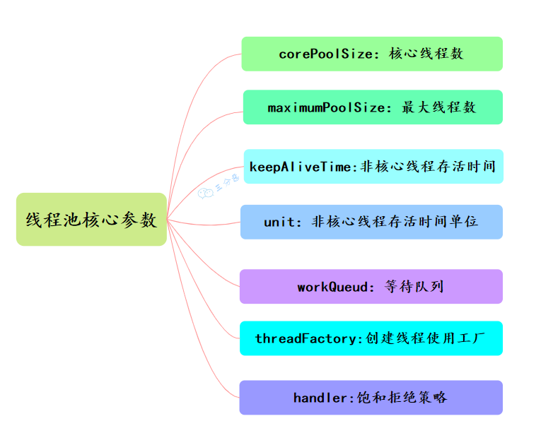

**①、corePoolSize**：核心线程数，长期存活，执行任务的主力。

**②、maximumPoolSize**：线程池允许的最大线程数。

**③、workQueue**：任务队列，存储等待执行的任务。

**④、handler**：拒绝策略，任务超载时的处理方式。也就是线程数达到 maximumPoolSize，任务队列也满了的时候，就会触发拒绝策略。

**⑤、threadFactory**：线程工厂，用于创建线程，可自定义线程名。

**⑥、keepAliveTime**：非核心线程的存活时间，空闲时间超过该值就销毁。

**⑦、unit**：keepAliveTime 参数的时间单位：

- TimeUnit.DAYS; 天
- TimeUnit.HOURS; 小时
- TimeUnit.MINUTES; 分钟
- TimeUnit.SECONDS; 秒
- TimeUnit.MILLISECONDS; 毫秒
- TimeUnit.MICROSECONDS; 微秒
- TimeUnit.NANOSECONDS; 纳秒

#### 能简单说一下参数之间的关系吗

一句话：任务优先使用核心线程执行，满了进入等待队列，队列满了启用非核心线程备用，线程池达到最大线程数量后触发拒绝策略，非核心线程的空闲时间超过存活时间就被回收。

#### [举个例子说一下这些参数的变化？](https://javabetter.cn/sidebar/sanfene/javathread.html#举个例子说一下这些参数的变化)

假设一个场景，线程池的配置如下：


```java
corePoolSize = 5
maximumPoolSize = 10
keepAliveTime = 60秒
workQueue = LinkedBlockingQueue（容量为100）
handler = ThreadPoolExecutor.AbortPolicy()
```

**场景一**：当系统启动后，有 10 个任务提交到线程池。

- 前 5 个任务会立即执行，因为核心线程数足够容纳它们。
- 随后的 5 个任务会被放入等待队列。

**场景二**：如果此时再有 100 个任务提交到线程池。

- 工作队列已满，线程池会创建额外的线程来执行这些任务，直到线程总数达到 10。
- 如果任务继续增加，超过了工作队列+最大线程数的限制，新来的任务会被 AbortPolicy 拒绝，抛出 RejectedExecutionException 异常。

**场景三**：如果任务突然减少：

核心线程会一直运行，而超出核心线程数的线程，会在 60 秒后回收。

### 57.线程池的拒绝策略有哪些

有四种：

- AbortPolicy：默认的拒绝策略，会抛 RejectedExecutionException 异常。
- CallerRunsPolicy：让提交任务的线程自己来执行这个任务，也就是调用 execute 方法的线程。
- DiscardOldestPolicy：等待队列会丢弃队列中最老的一个任务，也就是队列中等待最久的任务，然后尝试重新提交被拒绝的任务。
- DiscardPolicy：丢弃被拒绝的任务，不做任何处理也不抛出异常。

### 67.线程池调优了解吗

> 2024 年 03 月 16 日增补，推荐阅读：[Java线程池实现原理及其在美团业务中的实践](https://tech.meituan.com/2020/04/02/java-pooling-pratice-in-meituan.html)

线程池的配置优化是针对多线程应用性能调优的关键环节。


线程池调优主要从**任务类型、参数配置、动态调整、监控告警**四个方面做：

1. **根据任务类型设置线程数**

   - CPU密集型：线程数设置为CPU核心数或+1，减少线程切换
   - IO密集型：线程数设置为CPU核心数*5~8，因为IO阻塞时CPU空闲，需要多线程提高吞吐量

2. **合理设置队列长度**

   不使用无界队列，避免OOM；根据压测设置队列长度，达到长度就告警

3. **使用动态线程池**

   项目中使用DynamicTp实现线程池参数热更新，流量波动时自动调整核心线程，最大线程，不用重启服务

4. **完善监控与告警**

   监控活跃线程、队列积压、任务耗时、拒绝策略，队列过长自动告警，提前发现线程池满负载风险

### 69.你能设计实现一个线程池吗

线程池的主要目的是为了避免频繁地创建和销毁线程。


```java
@Slf4j(topic = "c.ThreadPool")
class ThreadPool {
    // 任务队列
    private final BlockingQueue<Runnable> taskQueue;
    // 线程集合
    private final HashSet<Worker> workers = new HashSet<>();

    // 核心线程数
    private final int coreSize;
    
    // 获取任务超时时间
    private final long timeout;
    private final TimeUnit timeUnit;
    
    //拒绝策略
    private RejectPolicy<Runnable> rejectPolicy;

    public ThreadPool(int coreSize, long timeout, TimeUnit timeUnit, int queueCapacity, RejectPolicy<Runnable> rejectPolicy) {
        this.coreSize = coreSize;
        this.timeout = timeout;
        this.timeUnit = timeUnit;
        this.taskQueue = new BlockingQueue<>(queueCapacity);
        this.rejectPolicy = rejectPolicy;
    }

    // 执行任务
    public void execute(Runnable task) {
        synchronized (workers) {
            //当线程数大于等于coreSize的时候，将任务放入阻塞队列
            //当线程数小于coreSize的时候，新建一个Worker放入workers
            //注意workers类不是线程安全的， 需要加锁
            if (workers.size() < coreSize) {
                Worker worker = new Worker(task);
                log.debug("新增worker{}", worker);
                workers.add(worker);
                worker.start();
            } else {
                // taskQueue.put(task);
                // 队列满了的情况
                // 1.死等
                // 2.超时等待
                // 3.放弃任务执行
                // 4.抛出异常
                // 5.调用者自己执行任务
                taskQueue.tryPut(rejectPolicy, task);
            }
        }
    }

    class Worker extends Thread {
        private Runnable task;

        public Worker(Runnable task) {
            this.task = task;
        }

        @Override
        public void run() {
            // 执行任务
            // 1.当task不为空，执行任务
            // 2.当task执行完，再接着从任务队列获取任务并执行
            // while (task != null || (task = taskQueue.take()) != null) {
            while (task != null || (task = taskQueue.poll(timeout, timeUnit)) != null) {
                try {
                    log.debug("正在执行任务{}", task);
                    task.run();
                } catch (Exception e) {
                    e.printStackTrace();
                } finally {
                    task = null;
                }
            }
            synchronized (workers) {
                log.debug("移除worker{}", this);
                workers.remove(this);
            }
        }
    }
}
```

不需要手写任务队列

```java
@Slf4j(topic = "c.TestPool")
public class TestPool {
    public static void main(String[] args) {

        log.debug("开始");
        ThreadPool threadPool = new ThreadPool(2, 1000, TimeUnit.MILLISECONDS, 10, (queue, task)->{
            // 1.死等
            // queue.put(task);
            // 2.带超时等待
            queue.offer(task, 500, TimeUnit.MILLISECONDS);
            // 3.调用者放弃任务
            // log.debug("放弃任务{}", task);
            // 4.调用者抛出异常
            // throw new RuntimeException("任务执行失败"+task);
            // 5.调用者自己执行任务
            task.run();
        });
        for (int i = 0; i < 15; i++) {
            int j = i;
            log.debug("主线程第{}次任务", j);
            threadPool.execute(() -> {   // 阻塞添加的话，任务队列满的话主线程会卡住
                try {
                    Thread.sleep(10000);
                } catch (InterruptedException e) {
                    throw new RuntimeException(e);
                }
                log.debug("{}", j);
            });
        }
    }
}

@FunctionalInterface  // 拒绝策略
interface RejectPolicy<T> {
    void reject(BlockingQueue<T> queue, T task);
    
}


@Slf4j(topic = "c.BlockingQueue")
class BlockingQueue<T> {
    // 1.任务队列
    private final Deque<T> queue = new ArrayDeque<>();

    // 2.锁
    private final ReentrantLock lock = new ReentrantLock();

    // 3.生产者条件变量
    private final Condition fullWaitSet = lock.newCondition();
    // 4.消费者条件变量
    private final Condition emptyWaitSet = lock.newCondition();

    // 5.容量
    private final int capacity;

    public BlockingQueue(int capacity) {
        this.capacity = capacity;
    }

    // 带超时的阻塞获取
    public T poll(long timeout, TimeUnit timeUnit) {
        lock.lock();
        try {
            // 将timeunit统一转化为纳秒
            long nanos = timeUnit.toNanos(timeout);
            while (queue.isEmpty()) {
                try {
                    // 返回的是剩余时间，避免虚假唤醒
                    if (nanos <= 0) {
                        return null;
                    }
                    nanos = emptyWaitSet.awaitNanos(nanos);
                } catch (InterruptedException e) {
                    throw new RuntimeException(e);
                }
            }
            T t = queue.removeFirst();
            fullWaitSet.signal();
            return t;
        } finally {
            lock.unlock();
        }
    }

    // 阻塞获取
    public T take() {
        lock.lock();
        try {
            while (queue.isEmpty()) {
                try {
                    emptyWaitSet.await();
                } catch (InterruptedException e) {
                    throw new RuntimeException(e);
                }
            }
            T t = queue.removeFirst();
            fullWaitSet.signal();
            return t;
        } finally {
            lock.unlock();
        }
    }

    // 阻塞添加
    public void put(T element) {
        lock.lock();
        try {
            while (queue.size() == capacity) {
                try {
                    log.debug("等待加入任务队列");
                    fullWaitSet.await();
                } catch (InterruptedException e) {
                    throw new RuntimeException(e);
                }
            }
            log.debug("加入任务队列");
            queue.addLast(element);
            emptyWaitSet.signal();
        } finally {
            lock.unlock();
        }
    }

    public int size() {
        lock.lock();
        try {
            return queue.size();
        } finally {
            lock.unlock();
        }
    }

    // 带超时时间的阻塞添加
    public boolean offer(T task, long timeout, TimeUnit timeUnit){
        lock.lock();
        try {
            long nanos = timeUnit.toNanos(timeout);
            while (queue.size() == capacity) {
                try {
                    log.debug("等待加入任务队列{}...", task);
                    if(nanos<=0) return false;
                    fullWaitSet.awaitNanos(nanos);
                } catch (InterruptedException e) {
                    throw new RuntimeException(e);
                }
            }
            log.debug("加入任务队列");
            queue.addLast(task);
            emptyWaitSet.signal();
            return true;
        } finally {
            lock.unlock();
        }
    }
    
    // 带拒绝策略的添加
    public void tryPut(RejectPolicy<T> rejectPolicy, T task) {
        lock.lock();
        try {
            // 判断队列是否已满
            if(queue.size() == capacity){
                rejectPolicy.reject(this, task);
            }else{
                log.debug("加入任务队列");
                queue.addLast(task);
                emptyWaitSet.signal();
            }
        
        }finally {
            lock.unlock();
        }
    }
}


```

> 就算核心线程有空闲，只要【当前线程数 ≥ 核心线程数】，新任务也一定先入队列！
>
> 绝对不会直接分配给空闲线程！
>
> 线程池**根本不关心线程闲不闲**，它只看：
>
> **当前线程数量有没有达到 corePoolSize**
>
> 达到了 → **一律进队列**
>
> 二、**完整流程**
>
> 线程池执行任务 **永远按 3 步走**：
>
> 1. 当前线程数 < coreSize
>
>    
>
>    → 
>
>    新建核心线程
>
>    执行
>
> 2. 当前线程数 ≥ coreSize
>
>    
>
>    → 
>
>    先加入队列
>
>    （不管有没有空闲线程）
>
> 3. 队列满了
>
>    
>
>    → 才创建
>
>    非核心线程
>
> 4. max 也满了
>
>    
>
>    → 拒绝策略

#### 手写一个数据库连接池

数据库连接池主要是为了避免每次操作数据库时都去创建连接，因为这样很浪费资源。所以我打算在初始化时预先创建好固定数量的连接，把它们放在一个线程安全的容器中，后续有请求就从队列中那，用完再归还到队列中。

```java
// 手写一个数据库连接池
@Slf4j
public class SimpleConnectionPool {
    // 配置
    private String jdbcUrl;
    private String username;
    private String password;
    private int maxConnections;
    private BlockingQueue<Connection> connectionPool;
    
    public SimpleConnectionPool(String jdbcUrl, String username, String password, int maxConnections) throws SQLException {
        this.jdbcUrl = jdbcUrl;
        this.username = username;
        this.password = password;
        this.maxConnections = maxConnections;
        this.connectionPool = new ArrayBlockingQueue<>(maxConnections);
        
        // 初始化连接池
        for (int i = 0; i < maxConnections; i++) {
            connectionPool.add(createNewConnection());
        }
    }
    
    // 创建新连接
    private Connection createNewConnection() throws SQLException {
        return DriverManager.getConnection(jdbcUrl, username, password);
    }
    
    // 获取连接
    public Connection getConnection(long timeout, TimeUnit timeUnit) throws SQLException, InterruptedException {
        Connection connection = connectionPool.poll(timeout, timeUnit);
        if(connection == null){
            throw new SQLException("Timeout: Unable to acquire a connection");
        }
        return connection;
    }
    
    //归还连接
    public void releaseConnection(Connection connection) throws SQLException{
        if(connection != null){
            if(connection.isClosed()){
                // 如果连接已关闭，创建一个新连接补充道池中
                connectionPool.add(createNewConnection());
            }else{
                connectionPool.add(connection);
            }
        }
    }
    
    // 关闭所有连接
    public void closeAllConnectons() throws SQLException {
        for(Connection connection: connectionPool){
            if(!connection.isClosed()){
                connection.close();
            }
        }
    }
    
    // 测试用例
    public static void main(String[] args) {
        try {
            SimpleConnectionPool pool = new SimpleConnectionPool(
                    "jdbc:mysql://127.0.0.1:3306/hmdp", "root", "root",5
            );
            for (int i = 0; i < 10; i++) {
                int taskId = i;
                Thread thread = new Thread(()->{
                    log.debug("尝试获取数据库连接");
                    
                    // 从数据库连接池获取连接
                    try {
                        Connection conn = pool.getConnection(5, TimeUnit.SECONDS);
                        log.debug("获取连接成功");
                        Thread.sleep(20000);
                        pool.releaseConnection(conn);
                        log.debug("归还连接");
                    }catch (Exception e){
                        e.printStackTrace();
                    }
                }, "task"+taskId);
                thread.start();
            }
            
        }catch (Exception e){
            e.printStackTrace();
        }
        
    }
}
```

